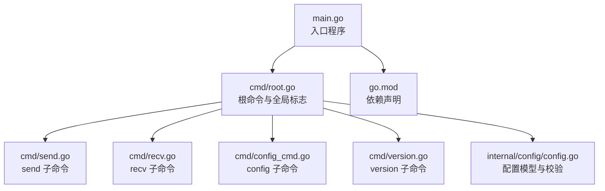
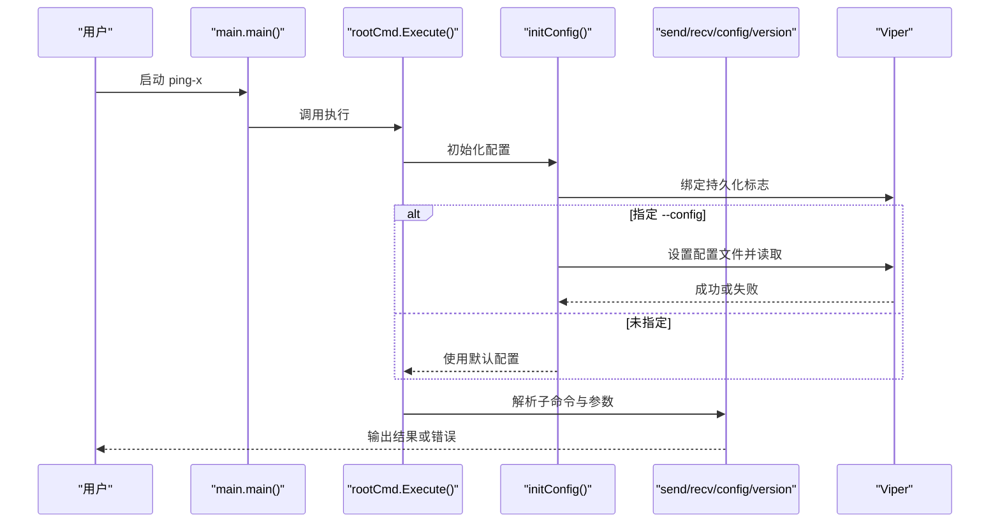
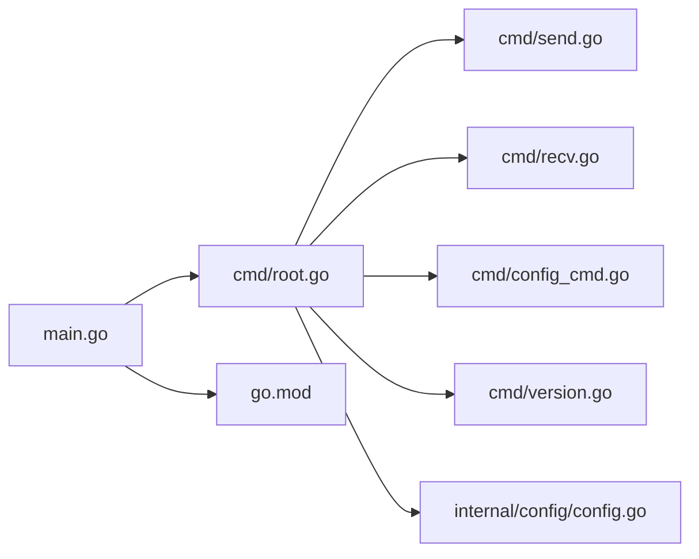

# CLI 命令参考

<cite>
**本文引用的文件**
- [main.go](file://main.go)
- [root.go](file://cmd/root.go)
- [send.go](file://cmd/send.go)
- [recv.go](file://cmd/recv.go)
- [config_cmd.go](file://cmd/config_cmd.go)
- [version.go](file://cmd/version.go)
- [config.go](file://internal/config/config.go)
- [go.mod](file://go.mod)
</cite>

## 目录
1. [简介](#简介)
2. [项目结构](#项目结构)
3. [核心组件](#核心组件)
4. [架构总览](#架构总览)
5. [详细组件分析](#详细组件分析)
6. [依赖关系分析](#依赖关系分析)
7. [性能与行为特性](#性能与行为特性)
8. [故障排查指南](#故障排查指南)
9. [结论](#结论)
10. [附录：命令行使用示例](#附录命令行使用示例)

## 简介
本文件为 Ping-X 的 CLI 命令系统提供权威参考，覆盖根命令及其子命令的全部可用选项与标志，解释全局标志（如配置文件与详细输出）与各子命令的参数语义、默认值与典型使用场景。文档同时给出参数解析流程、错误处理策略与调试建议，并提供丰富的命令行示例帮助用户快速上手。

## 项目结构
Ping-X 采用 Cobra 命令框架组织 CLI，入口程序负责初始化版本并执行根命令；根命令注册若干子命令（发送、接收、配置生成、版本），并通过 Viper 绑定持久化标志以支持配置文件与环境变量等来源。

图表来源
- [main.go:1-11](file://main.go#L1-L11)
- [root.go:1-54](file://cmd/root.go#L1-L54)
- [send.go:1-92](file://cmd/send.go#L1-L92)
- [recv.go:1-73](file://cmd/recv.go#L1-L73)
- [config_cmd.go:1-101](file://cmd/config_cmd.go#L1-L101)
- [version.go:1-20](file://cmd/version.go#L1-L20)
- [config.go:1-125](file://internal/config/config.go#L1-L125)
- [go.mod:1-25](file://go.mod#L1-L25)

章节来源
- [main.go:1-11](file://main.go#L1-L11)
- [root.go:1-54](file://cmd/root.go#L1-L54)
- [go.mod:1-25](file://go.mod#L1-L25)

## 核心组件
- 根命令与全局标志
  - 全局标志：
    - --config, -c：配置文件路径（字符串）。用于加载 YAML 配置文件，若指定则优先从文件读取测试配置。
    - --verbose, -v：详细输出模式（布尔）。当前实现中通过 Viper 绑定但未在根命令逻辑中直接使用。
  - 初始化流程：Cobra 在执行前调用初始化函数，绑定持久化标志并尝试读取配置文件（读取失败不中断执行）。
- 子命令
  - send：发送模式，向目标地址或组播/SSM 发送探测包。
  - recv：接收模式，监听端口或多播组，接收探测包并回显确认。
  - config：生成示例 YAML 配置文件，可输出到标准输出或指定文件。
  - version：打印当前版本号。

章节来源
- [root.go:32-53](file://cmd/root.go#L32-L53)
- [send.go:11-32](file://cmd/send.go#L11-L32)
- [recv.go:11-27](file://cmd/recv.go#L11-L27)
- [config_cmd.go:10-20](file://cmd/config_cmd.go#L10-L20)
- [version.go:9-15](file://cmd/version.go#L9-L15)

## 架构总览
Cobra 命令树与参数解析流程如下：

图表来源
- [main.go:7-10](file://main.go#L7-L10)
- [root.go:22-53](file://cmd/root.go#L22-L53)
- [send.go:34-91](file://cmd/send.go#L34-L91)
- [recv.go:29-72](file://cmd/recv.go#L29-L72)
- [config_cmd.go:87-100](file://cmd/config_cmd.go#L87-L100)

## 详细组件分析

### 根命令与全局标志
- 名称与描述：根命令名为 ping-x，提供简短与长描述，用于帮助信息。
- 全局标志
  - --config, -c：字符串。指定 YAML 配置文件路径。若提供，Cobra 初始化阶段会设置并读取该配置文件；读取失败不会导致命令退出，仅记录错误。
  - --verbose, -v：布尔。当前通过 Viper 绑定，但未在根命令逻辑中直接消费。
- 版本注入：主程序在启动前调用 SetVersion 注入版本号，供 version 子命令使用。

章节来源
- [root.go:14-20](file://cmd/root.go#L14-L20)
- [root.go:35-42](file://cmd/root.go#L35-L42)
- [root.go:44-53](file://cmd/root.go#L44-L53)
- [main.go:5-10](file://main.go#L5-L10)

### send 子命令
- 功能：以发送者模式运行，按协议向目标地址或组播/SSM 发送探测包。
- 参数与默认值
  - --proto, -p：协议类型，默认 tcp；可选值：tcp、udp、multicast、ssm。
  - --target, -t：目标地址（tcp/udp 必填）。
  - --group, -g：多播组地址（multicast/ssm 必填）。
  - --port：目标端口（必填）。
  - --bind, -b：本地绑定地址，默认 0.0.0.0。
  - --iface, -i：网络接口名（多播时使用）。
  - --count, -n：发送次数，默认 0（表示持续发送）。
  - --interval：发送间隔，默认 1s。
  - --timeout：单包超时时间，默认 3s。
  - --size, -s：探测包大小（字节），默认 64。
  - --ttl：TTL，默认 0（自动选择：unicast=64，multicast=16）。
- 参数解析与优先级
  - 若指定 --config，则从配置文件加载测试项（仅 mode 为 send 的条目），逐条校验后输出信息。
  - 若未指定 --config，则从命令行参数构建单个 TestConfig 并校验。
- 校验规则（来自配置模型）
  - 协议必须为 tcp、udp、multicast 或 ssm。
  - mode 必须为 send 或 recv。
  - 端口范围 1-65535。
  - send 模式下：
    - tcp/udp：需要指定 target。
    - multicast/ssm：需要指定 group。
  - recv 模式下：
    - multicast/ssm：需要指定 group。
  - interval 与 timeout 必须是合法的时间格式。
  - 未设置时，interval 默认 1s，timeout 默认 3s。
- 输出行为
  - 当从配置文件读取时，对每条 send 测试输出解析信息。
  - 当从命令行参数构建时，输出解析后的关键字段。

章节来源
- [send.go:11-32](file://cmd/send.go#L11-L32)
- [send.go:34-91](file://cmd/send.go#L34-L91)
- [config.go:49-100](file://internal/config/config.go#L49-L100)
- [config.go:102-124](file://internal/config/config.go#L102-L124)

### recv 子命令
- 功能：以接收者模式运行，监听端口或多播组，接收探测包并回显确认。
- 参数与默认值
  - --proto, -p：协议类型，默认 tcp；可选值：tcp、udp、multicast、ssm。
  - --bind, -b：监听绑定地址，默认 0.0.0.0。
  - --port：监听端口（必填）。
  - --group, -g：多播组地址（multicast/ssm 必填）。
  - --source：SSM 源地址（ssm 必填）。
  - --iface, -i：网络接口名（多播时使用）。
- 参数解析与优先级
  - 若指定 --config，则从配置文件加载测试项（仅 mode 为 recv 的条目），逐条校验后输出信息。
  - 若未指定 --config，则从命令行参数构建单个 TestConfig 并校验。
- 校验规则（来自配置模型）
  - 协议必须为 tcp、udp、multicast 或 ssm。
  - mode 必须为 send 或 recv。
  - 端口范围 1-65535。
  - recv 模式下：
    - multicast/ssm：需要指定 group。
  - interval 与 timeout 必须是合法的时间格式。
  - 未设置时，interval 默认 1s，timeout 默认 3s。
- 输出行为
  - 当从配置文件读取时，对每条 recv 测试输出解析信息。
  - 当从命令行参数构建时，输出解析后的关键字段。

章节来源
- [recv.go:11-27](file://cmd/recv.go#L11-L27)
- [recv.go:29-72](file://cmd/recv.go#L29-L72)
- [config.go:49-100](file://internal/config/config.go#L49-L100)
- [config.go:102-124](file://internal/config/config.go#L102-L124)

### config 子命令
- 功能：生成示例 YAML 配置文件，可输出到标准输出或写入指定文件。
- 参数
  - --output, -o：输出文件路径（默认输出到标准输出）。
- 输出内容
  - 包含多个测试条目，涵盖 tcp/udp 多播与 SSM 的 send/recv 场景，便于快速开始。
- 行为
  - 未指定输出文件时，直接打印示例配置。
  - 指定输出文件时，写入文件并提示成功信息；写入失败返回错误。

章节来源
- [config_cmd.go:10-20](file://cmd/config_cmd.go#L10-L20)
- [config_cmd.go:87-100](file://cmd/config_cmd.go#L87-L100)

### version 子命令
- 功能：打印当前版本号。
- 行为：从全局版本变量读取并输出。

章节来源
- [version.go:9-15](file://cmd/version.go#L9-L15)
- [main.go:5-10](file://main.go#L5-L10)

### 配置文件结构与校验
- 配置文件结构
  - tests：测试条目数组，每个条目包含名称、协议、模式、目标、组、源、端口、绑定、接口、次数、间隔、超时、包大小、TTL 等字段。
- 校验逻辑
  - 协议与模式合法性检查。
  - 端口范围检查。
  - send/recv 模式下的必要字段检查。
  - 时间格式校验（interval/timeout）。
  - 未设置时的默认值处理（interval 默认 1s，timeout 默认 3s）。

章节来源
- [config.go:11-32](file://internal/config/config.go#L11-L32)
- [config.go:49-100](file://internal/config/config.go#L49-L100)
- [config.go:102-124](file://internal/config/config.go#L102-L124)

## 依赖关系分析
- 外部依赖
  - cobra：命令框架，提供命令树、标志解析与帮助信息。
  - viper：配置管理，支持文件、环境变量与标志绑定。
- 内部模块
  - internal/config：定义配置数据结构与校验逻辑。
- 依赖图

图表来源
- [main.go:1-11](file://main.go#L1-L11)
- [root.go:1-54](file://cmd/root.go#L1-L54)
- [send.go:1-92](file://cmd/send.go#L1-L92)
- [recv.go:1-73](file://cmd/recv.go#L1-L73)
- [config_cmd.go:1-101](file://cmd/config_cmd.go#L1-L101)
- [version.go:1-20](file://cmd/version.go#L1-L20)
- [config.go:1-125](file://internal/config/config.go#L1-L125)
- [go.mod:1-25](file://go.mod#L1-L25)

章节来源
- [go.mod:1-25](file://go.mod#L1-L25)

## 性能与行为特性
- 参数解析与校验
  - send/recv 子命令在解析参数后立即进行校验，避免无效配置进入后续流程。
  - 配置文件加载与校验采用逐条处理，便于定位具体问题。
- 默认值与容错
  - 未设置时间类参数时采用合理默认值，减少用户输入负担。
  - 配置文件读取失败不中断执行，保证命令可用性。
- 输出行为
  - 在解析成功后输出关键参数摘要，便于用户确认配置是否符合预期。

[本节为通用讨论，无需列出章节来源]

## 故障排查指南
- 常见错误与定位
  - 配置文件读取失败：检查文件路径与权限；确认文件格式正确。
  - 参数校验失败：核对协议、模式、端口、必要字段（如 send 模式的 target/group，recv 模式的 group）。
  - 时间格式错误：确保 interval/timeout 符合 Go 的 duration 语法（如 1s、300ms）。
- 调试建议
  - 使用 --verbose 观察详细输出（尽管当前未直接消费该标志，但可配合其他输出使用）。
  - 优先使用 --config 加载复杂配置，逐步缩小问题范围。
  - 对于 send/recv，先单独验证单个条目，再合并到完整配置文件。

章节来源
- [root.go:44-53](file://cmd/root.go#L44-L53)
- [send.go:34-91](file://cmd/send.go#L34-L91)
- [recv.go:29-72](file://cmd/recv.go#L29-L72)
- [config.go:49-100](file://internal/config/config.go#L49-L100)

## 结论
Ping-X 的 CLI 采用清晰的命令树设计，根命令提供全局标志与初始化流程，子命令聚焦于发送/接收/配置生成/版本查询等核心能力。通过 Viper 绑定与配置文件支持，用户可在命令行与配置文件之间灵活切换；严格的参数校验与合理的默认值提升了易用性与健壮性。建议在生产环境中优先使用配置文件，并结合示例模板快速构建测试方案。

[本节为总结性内容，无需列出章节来源]

## 附录：命令行使用示例
以下示例展示常见用法与组合效果，帮助快速上手。为避免泄露具体代码片段，示例均以“命令+参数”的形式呈现。

- 查看帮助
  - ping-x
  - ping-x send --help
  - ping-x recv --help
  - ping-x config --help
  - ping-x version

- 显示版本
  - ping-x version

- 生成示例配置文件
  - ping-x config
  - ping-x config --output ./sample.yaml

- 使用配置文件运行 send/recv
  - ping-x --config ./sample.yaml send
  - ping-x --config ./sample.yaml recv

- 直接使用命令行参数运行 send/recv
  - ping-x send --proto tcp --target 192.168.1.100 --port 9000 --count 100
  - ping-x send --proto udp --target 192.168.1.100 --port 9001 --interval 1s
  - ping-x recv --proto multicast --group 239.1.1.1 --port 9002 --iface eth0
  - ping-x recv --proto ssm --group 232.1.1.1 --source 10.0.0.50 --port 9003 --iface eth0

- 组合使用全局标志
  - ping-x --config ./sample.yaml --verbose send
  - ping-x --config ./sample.yaml --verbose recv

- 高级参数示例
  - ping-x send --proto tcp --target 192.168.1.100 --port 9000 --bind 0.0.0.0 --count 50 --interval 2s --timeout 5s --size 128 --ttl 64
  - ping-x recv --proto udp --bind 0.0.0.0 --port 9001 --iface eth0

[本节为示例集合，无需列出章节来源]