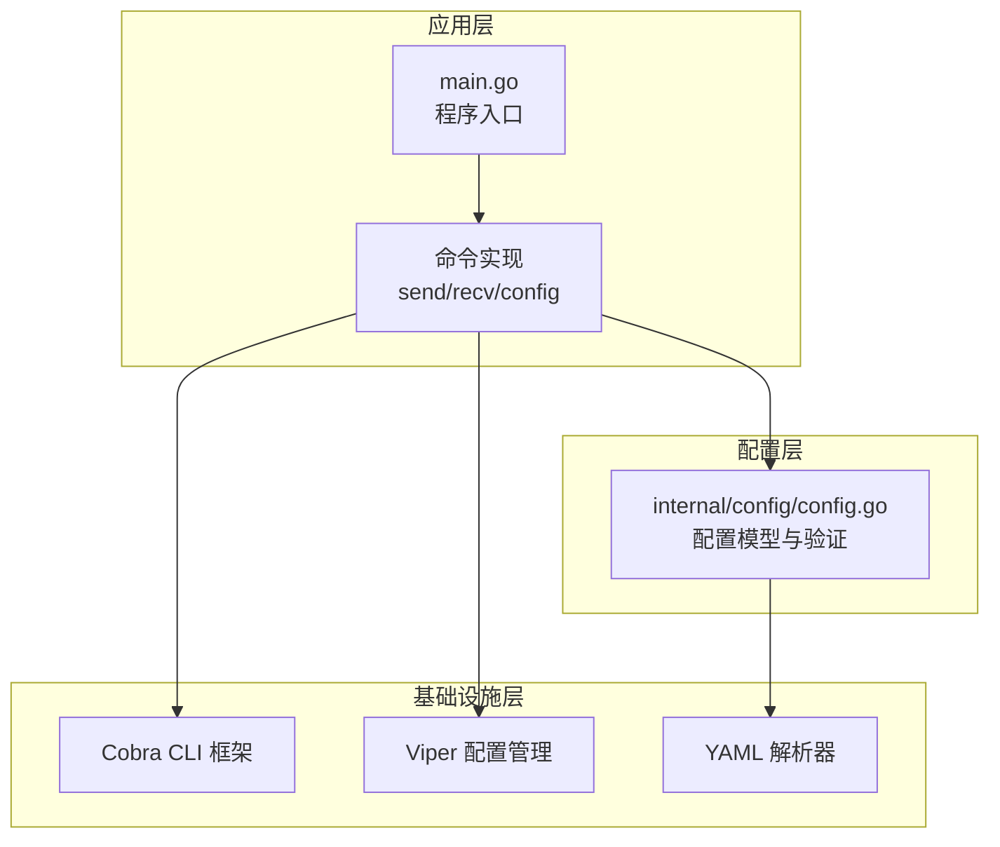
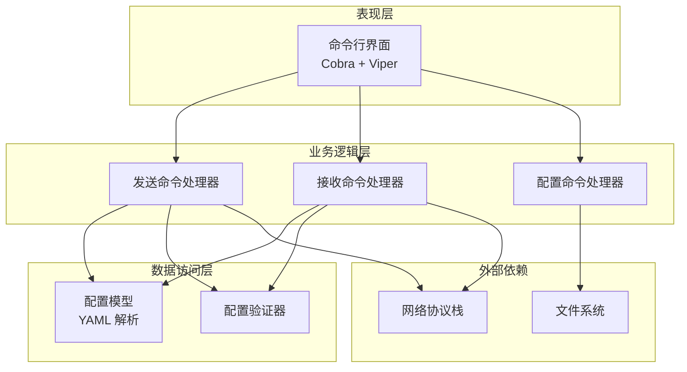
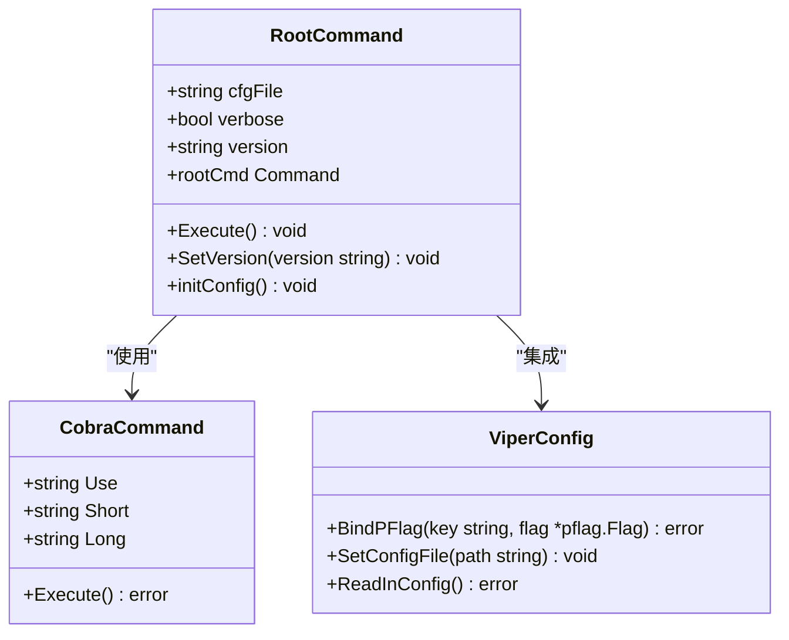
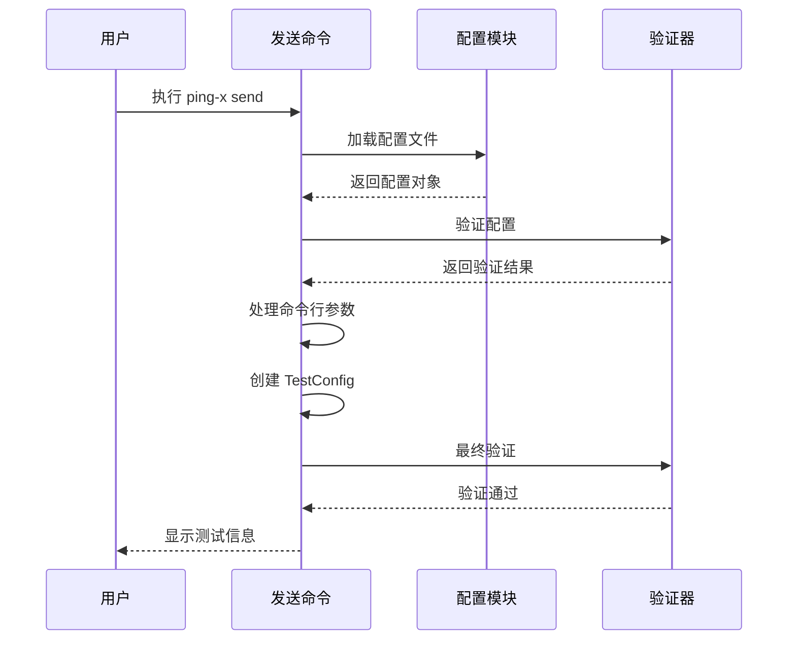
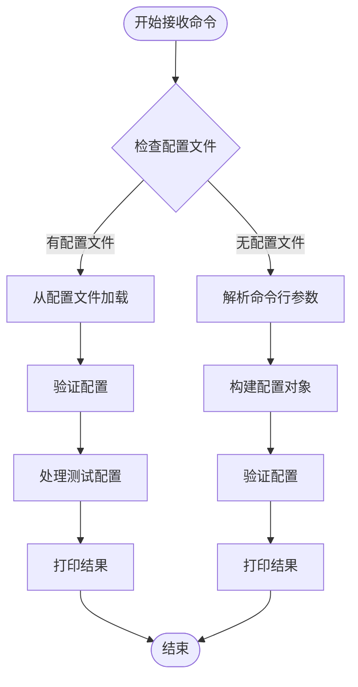
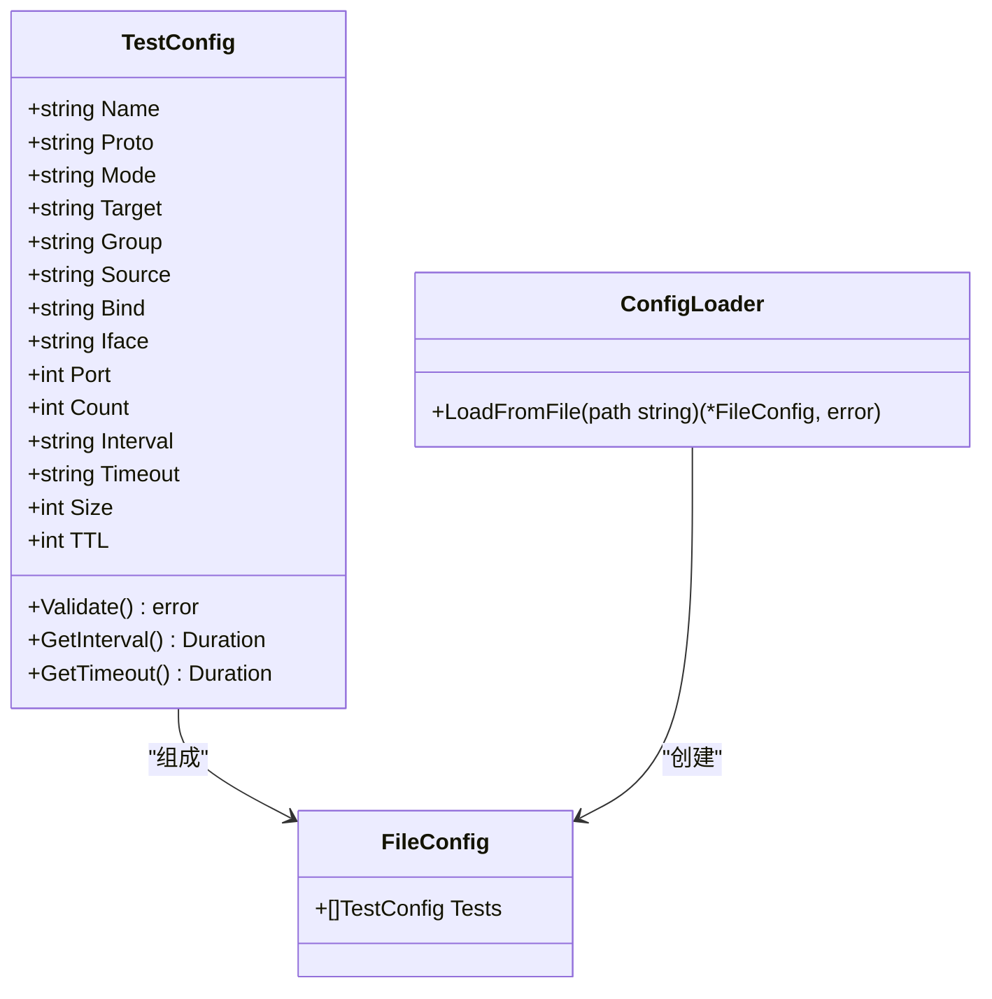
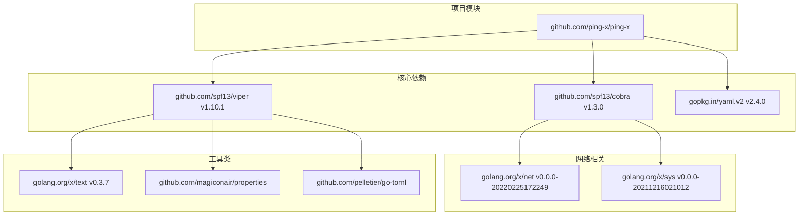
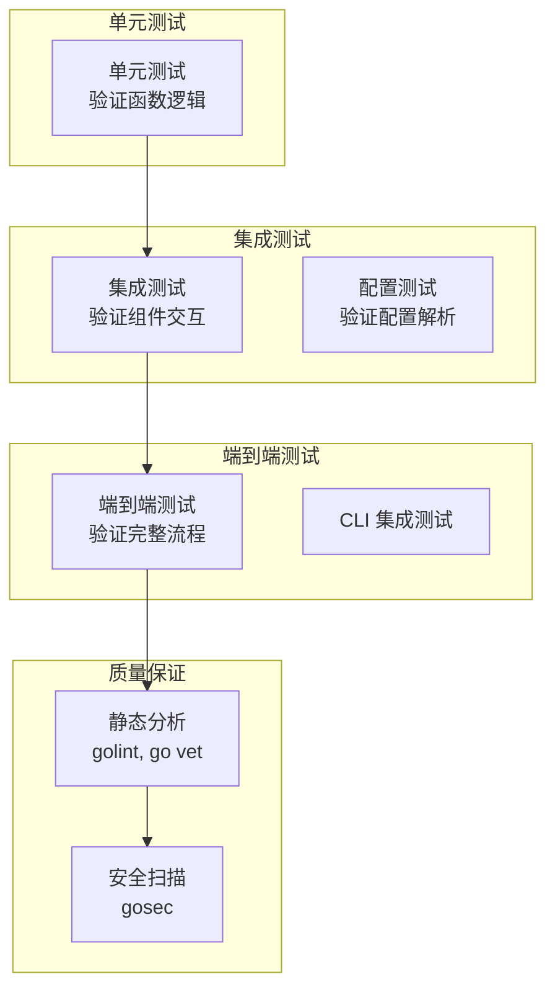

# 开发者指南

<cite>
**本文档引用的文件**
- [main.go](file://main.go)
- [cmd/root.go](file://cmd/root.go)
- [cmd/send.go](file://cmd/send.go)
- [cmd/recv.go](file://cmd/recv.go)
- [cmd/config_cmd.go](file://cmd/config_cmd.go)
- [internal/config/config.go](file://internal/config/config.go)
- [go.mod](file://go.mod)
- [go.sum](file://go.sum)
</cite>

## 目录
1. [简介](#简介)
2. [项目结构](#项目结构)
3. [核心组件](#核心组件)
4. [架构概览](#架构概览)
5. [详细组件分析](#详细组件分析)
6. [依赖分析](#依赖分析)
7. [开发环境搭建](#开发环境搭建)
8. [代码贡献流程](#代码贡献流程)
9. [测试策略](#测试策略)
10. [性能考虑](#性能考虑)
11. [故障排除指南](#故障排除指南)
12. [扩展开发指导](#扩展开发指导)
13. [结论](#结论)

## 简介

Ping-X 是一个跨平台网络协议联通检测工具，支持 TCP、UDP、组播（Multicast）和 SSM（Source Specific Multicast）等多种协议的连通性测试。该项目采用模块化设计，基于 Cobra 命令行框架构建，提供了灵活的配置管理和强大的网络测试能力。

## 项目结构

项目采用清晰的分层架构，主要分为以下几个层次：



**图表来源**
- [main.go:1-11](file://main.go#L1-L11)
- [cmd/root.go:1-54](file://cmd/root.go#L1-L54)
- [internal/config/config.go:1-125](file://internal/config/config.go#L1-L125)

**章节来源**
- [main.go:1-11](file://main.go#L1-L11)
- [cmd/root.go:1-54](file://cmd/root.go#L1-L54)
- [internal/config/config.go:1-125](file://internal/config/config.go#L1-L125)

## 核心组件

### 应用入口点
应用程序通过 `main.go` 启动，设置版本信息并调用命令执行器。

### 命令系统
基于 Cobra 框架构建的命令系统，包含：
- 根命令：提供全局配置和帮助信息
- 子命令：send（发送模式）、recv（接收模式）、config（配置生成）

### 配置管理系统
独立的配置模块，负责：
- YAML 配置文件解析
- 配置验证和格式化
- 默认值处理

**章节来源**
- [main.go:5-10](file://main.go#L5-L10)
- [cmd/root.go:14-25](file://cmd/root.go#L14-L25)
- [internal/config/config.go:34-47](file://internal/config/config.go#L34-L47)

## 架构概览

Ping-X 采用了典型的分层架构设计，确保了良好的关注点分离和可维护性：



**图表来源**
- [cmd/send.go:11-16](file://cmd/send.go#L11-L16)
- [cmd/recv.go:11-16](file://cmd/recv.go#L11-L16)
- [cmd/config_cmd.go:10-15](file://cmd/config_cmd.go#L10-L15)
- [internal/config/config.go:11-32](file://internal/config/config.go#L11-L32)

## 详细组件分析

### 根命令组件

根命令负责初始化全局配置和提供基础功能：



**图表来源**
- [cmd/root.go:8-12](file://cmd/root.go#L8-L12)
- [cmd/root.go:15-20](file://cmd/root.go#L15-L20)
- [cmd/root.go:45-53](file://cmd/root.go#L45-L53)

**章节来源**
- [cmd/root.go:1-54](file://cmd/root.go#L1-L54)

### 发送命令组件

发送命令处理发送模式的网络测试：



**图表来源**
- [cmd/send.go:34-91](file://cmd/send.go#L34-L91)
- [internal/config/config.go:49-100](file://internal/config/config.go#L49-L100)

**章节来源**
- [cmd/send.go:1-92](file://cmd/send.go#L1-L92)

### 接收命令组件

接收命令处理接收模式的网络测试：



**图表来源**
- [cmd/recv.go:29-72](file://cmd/recv.go#L29-L72)
- [internal/config/config.go:49-100](file://internal/config/config.go#L49-L100)

**章节来源**
- [cmd/recv.go:1-73](file://cmd/recv.go#L1-L73)

### 配置管理组件

配置管理模块提供了完整的配置解析和验证功能：



**图表来源**
- [internal/config/config.go:11-32](file://internal/config/config.go#L11-L32)
- [internal/config/config.go:34-47](file://internal/config/config.go#L34-L47)

**章节来源**
- [internal/config/config.go:1-125](file://internal/config/config.go#L1-L125)

## 依赖分析

项目使用 Go 模块系统进行依赖管理，主要依赖包括：



**图表来源**
- [go.mod:5-24](file://go.mod#L5-L24)

**章节来源**
- [go.mod:1-25](file://go.mod#L1-L25)
- [go.sum:1-777](file://go.sum#L1-L777)

### 依赖管理策略

项目采用以下依赖管理策略：
- 使用 Go 1.17+ 版本确保兼容性和新特性支持
- 通过 go.mod 明确声明直接依赖
- 通过 go.sum 锁定具体版本，确保构建一致性
- 使用语义化版本控制，避免破坏性更新

## 开发环境搭建

### 系统要求
- Go 1.17 或更高版本
- Git 版本控制系统
- Linux/macOS/Windows 操作系统

### 环境准备步骤

1. **克隆项目**
```bash
git clone https://github.com/ping-x/ping-x.git
cd ping-x
```

2. **安装依赖**
```bash
go mod download
```

3. **编译项目**
```bash
go build -o ping-x .
```

4. **运行测试**
```bash
go test ./...
```

### 开发工作流程

1. **代码修改**
   - 在相应模块中添加或修改功能
   - 确保遵循现有的代码风格和命名约定

2. **单元测试**
   - 为新功能编写单元测试
   - 运行现有测试确保不破坏现有功能

3. **集成测试**
   - 测试命令行接口的正确性
   - 验证配置文件解析功能

4. **代码审查**
   - 提交 Pull Request
   - 等待其他开发者审查

**章节来源**
- [go.mod:3](file://go.mod#L3)

## 代码贡献流程

### 贡献指南

1. **Fork 项目**
   - 访问 GitHub 仓库并 Fork 项目

2. **创建分支**
   ```bash
   git checkout -b feature/your-feature-name
   ```

3. **开发规范**
   - 遵循 Go 语言编码规范
   - 编写清晰的注释和文档
   - 包含相应的测试用例

4. **提交规范**
   ```
   feat: 添加新的网络协议支持
   
   - 新增 TCP/UDP 协议支持
   - 更新配置验证逻辑
   - 添加单元测试
   ```

5. **Pull Request**
   - 提交 PR 到主分支
   - 等待代码审查
   - 根据反馈进行修改

### 代码风格要求

- 使用 gofmt 格式化代码
- 函数和变量使用驼峰命名法
- 错误处理使用标准 Go 模式
- 文档字符串使用 GoDoc 格式

## 测试策略

### 测试层次



### 测试覆盖范围

1. **配置验证测试**
   - 验证不同协议的配置
   - 测试边界条件和异常情况
   - 确保默认值正确设置

2. **命令行接口测试**
   - 测试各种命令组合
   - 验证参数解析
   - 测试错误处理

3. **配置文件测试**
   - YAML 格式验证
   - 配置合并逻辑
   - 文件读取错误处理

### 测试执行

```bash
# 运行所有测试
go test ./...

# 运行带覆盖率的测试
go test -coverprofile=coverage.out ./...
go tool cover -html=coverage.out

# 运行特定包的测试
go test -v ./cmd
```

**章节来源**
- [internal/config/config.go:49-100](file://internal/config/config.go#L49-L100)

## 性能考虑

### 内存管理
- 使用结构体池减少内存分配
- 及时释放大对象和连接资源
- 避免不必要的字符串复制

### 并发安全
- 确保配置访问的线程安全
- 使用互斥锁保护共享状态
- 避免竞态条件

### 网络优化
- 合理设置超时和重试机制
- 使用连接复用减少开销
- 优化缓冲区大小

## 故障排除指南

### 常见问题

1. **配置文件解析错误**
   - 检查 YAML 格式是否正确
   - 验证字段名称拼写
   - 确认数据类型匹配

2. **命令行参数错误**
   - 使用 `--help` 查看可用选项
   - 检查必需参数是否提供
   - 验证参数值范围

3. **网络连接问题**
   - 检查防火墙设置
   - 验证目标地址可达性
   - 确认端口未被占用

### 调试技巧

```bash
# 启用详细输出模式
./ping-x --verbose send -p tcp -t 192.168.1.100 -P 9000

# 检查配置文件内容
cat config.yaml | yaml2json

# 使用 strace 跟踪系统调用
strace -e trace=network ./ping-x send ...
```

**章节来源**
- [cmd/root.go:36-41](file://cmd/root.go#L36-L41)

## 扩展开发指导

### 设计模式

1. **工厂模式**
   - 用于创建不同协议的测试实例
   - 支持动态协议注册

2. **策略模式**
   - 不同协议的实现策略
   - 可插拔的网络传输层

3. **观察者模式**
   - 用于测试结果的事件通知
   - 支持实时监控

### 扩展点

1. **新协议支持**
   - 在配置验证中添加协议检查
   - 实现对应的网络传输逻辑
   - 添加相应的命令行参数

2. **新测试模式**
   - 扩展现有的配置模型
   - 实现新的命令处理器
   - 添加配置验证规则

3. **报告格式**
   - 支持 JSON 输出格式
   - 添加自定义报告模板
   - 实现导出功能

### 最佳实践

1. **保持向后兼容**
   - 不破坏现有配置格式
   - 逐步引入新功能

2. **错误处理**
   - 提供有意义的错误信息
   - 区分可恢复和不可恢复错误

3. **日志记录**
   - 使用结构化日志
   - 支持不同日志级别

## 结论

Ping-X 项目展示了现代 Go 应用程序的良好实践，包括清晰的分层架构、模块化的依赖管理、完善的测试策略和详细的文档。项目为网络协议测试提供了一个强大而灵活的工具，同时为开发者提供了清晰的扩展路径。

通过遵循本文档中的开发指南和最佳实践，开发者可以有效地参与项目贡献，添加新功能，并确保代码质量和系统稳定性。项目的模块化设计使得扩展新协议和支持新测试模式变得相对简单，同时保持了整体架构的一致性和可维护性。