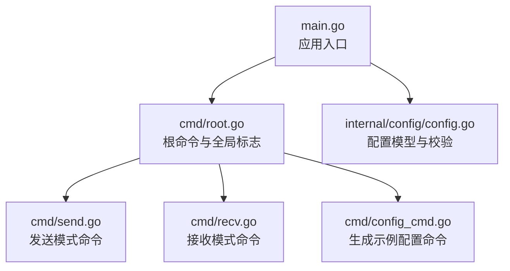
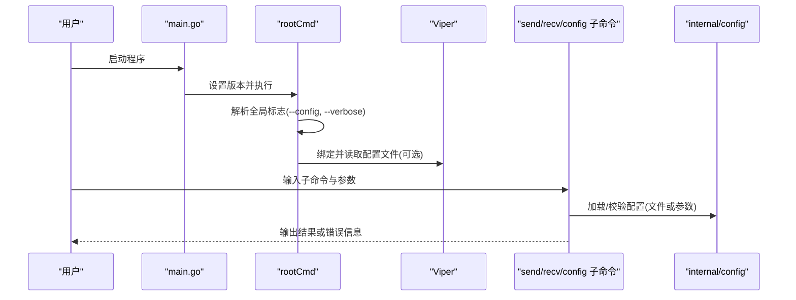

# 快速开始

<cite>
**本文引用的文件**
- [main.go](file://main.go)
- [cmd/root.go](file://cmd/root.go)
- [cmd/config_cmd.go](file://cmd/config_cmd.go)
- [cmd/send.go](file://cmd/send.go)
- [cmd/recv.go](file://cmd/recv.go)
- [internal/config/config.go](file://internal/config/config.go)
- [go.mod](file://go.mod)
</cite>

## 目录
1. [简介](#简介)
2. [项目结构](#项目结构)
3. [核心组件](#核心组件)
4. [架构总览](#架构总览)
5. [详细组件分析](#详细组件分析)
6. [依赖分析](#依赖分析)
7. [性能考虑](#性能考虑)
8. [故障排除指南](#故障排除指南)
9. [结论](#结论)
10. [附录](#附录)

## 简介
Ping-X 是一个跨平台网络协议联通检测工具，支持 TCP、UDP、组播（Multicast）和 SSM 等多种协议的连通性测试。本快速开始指南将帮助你完成安装与首次使用，涵盖从源码编译与二进制下载两种方式、基础使用示例、YAML 配置文件示例、常用命令行标志说明，以及常见问题排查建议。

## 项目结构
该项目采用模块化设计，入口程序负责初始化版本与命令分发，子命令通过 Cobra 提供 CLI 能力；配置解析由独立的内部包处理，支持从 YAML 文件加载测试任务。

图表来源
- [main.go:1-11](file://main.go#L1-L11)
- [cmd/root.go:14-42](file://cmd/root.go#L14-L42)
- [cmd/send.go:11-32](file://cmd/send.go#L11-L32)
- [cmd/recv.go:11-27](file://cmd/recv.go#L11-L27)
- [cmd/config_cmd.go:10-20](file://cmd/config_cmd.go#L10-L20)
- [internal/config/config.go:11-32](file://internal/config/config.go#L11-L32)

章节来源
- [main.go:1-11](file://main.go#L1-L11)
- [cmd/root.go:14-42](file://cmd/root.go#L14-L42)
- [internal/config/config.go:11-32](file://internal/config/config.go#L11-L32)

## 核心组件
- 应用入口：设置版本并启动根命令。
- 根命令：定义全局标志（如配置文件路径、详细输出），初始化配置加载。
- 子命令：
  - 发送模式：用于按协议向目标发送探测包。
  - 接收模式：用于监听端口或多播组，接收探测包。
  - 配置命令：生成示例 YAML 配置文件。
- 配置模型：定义测试项字段、YAML 解析与校验逻辑。

章节来源
- [main.go:5-10](file://main.go#L5-L10)
- [cmd/root.go:15-42](file://cmd/root.go#L15-L42)
- [cmd/send.go:11-32](file://cmd/send.go#L11-L32)
- [cmd/recv.go:11-27](file://cmd/recv.go#L11-L27)
- [cmd/config_cmd.go:10-20](file://cmd/config_cmd.go#L10-L20)
- [internal/config/config.go:11-32](file://internal/config/config.go#L11-L32)

## 架构总览
下面的序列图展示了从用户输入到命令执行的整体流程，包括配置文件加载与命令参数解析。

图表来源
- [main.go:7-10](file://main.go#L7-L10)
- [cmd/root.go:32-53](file://cmd/root.go#L32-L53)
- [cmd/send.go:34-91](file://cmd/send.go#L34-L91)
- [cmd/recv.go:29-72](file://cmd/recv.go#L29-L72)
- [cmd/config_cmd.go:87-100](file://cmd/config_cmd.go#L87-L100)
- [internal/config/config.go:34-47](file://internal/config/config.go#L34-L47)

## 详细组件分析

### 根命令与全局标志
- 功能：定义应用名称、简短与长描述；注册全局标志（--config/-c、--verbose/-v）；初始化配置加载。
- 关键点：
  - 支持从指定路径读取配置文件。
  - 将标志绑定到 Viper，便于后续读取。
  - 配置文件读取失败不会导致命令退出，仅记录错误。

章节来源
- [cmd/root.go:14-42](file://cmd/root.go#L14-L42)
- [cmd/root.go:44-53](file://cmd/root.go#L44-L53)

### 发送模式命令（send）
- 功能：以发送者模式运行，按协议向目标发送探测包。
- 支持的标志（部分）：
  - --proto/-p：协议类型（tcp/udp/multicast/ssm）
  - --target/-t：目标地址（tcp/udp 必填）
  - --group/-g：多播组地址（multicast/ssm 必填）
  - --port：目标端口（必填）
  - --bind/-b：本地绑定地址
  - --iface/-i：网络接口名（多播时使用）
  - --count/-n：发送次数（0=持续发送）
  - --interval：发送间隔
  - --timeout：单包超时时间
  - --size/-s：探测包大小（字节）
  - --ttl：TTL（0=自动选择）
- 行为：
  - 若提供配置文件，则从文件加载所有发送任务并逐一校验。
  - 否则从命令行参数构造单个测试配置并校验。
  - 校验通过后打印当前任务信息（占位，实际协议调用待实现）。

章节来源
- [cmd/send.go:11-32](file://cmd/send.go#L11-L32)
- [cmd/send.go:34-91](file://cmd/send.go#L34-L91)

### 接收模式命令（recv）
- 功能：以接收者模式运行，监听端口或多播组，接收探测包。
- 支持的标志（部分）：
  - --proto/-p：协议类型（tcp/udp/multicast/ssm）
  - --bind/-b：监听绑定地址
  - --port：监听端口（必填）
  - --group/-g：多播组地址（multicast/ssm 必填）
  - --source：SSM 源地址（ssm 必填）
  - --iface/-i：网络接口名（多播时使用）
- 行为：
  - 与发送模式类似，优先从配置文件加载接收任务，否则从命令行参数构造。
  - 校验通过后打印当前任务信息（占位）。

章节来源
- [cmd/recv.go:11-27](file://cmd/recv.go#L11-L27)
- [cmd/recv.go:29-72](file://cmd/recv.go#L29-L72)

### 配置命令（config）
- 功能：生成示例 YAML 配置文件，可输出到标准输出或写入指定文件。
- 支持的标志：
  - --output/-o：输出文件路径（默认输出到标准输出）

章节来源
- [cmd/config_cmd.go:10-20](file://cmd/config_cmd.go#L10-L20)
- [cmd/config_cmd.go:87-100](file://cmd/config_cmd.go#L87-L100)

### 配置模型与校验（internal/config）
- 数据结构：
  - 单个测试配置（TestConfig）：包含名称、协议、模式、目标、组、源、端口、绑定、接口、计数、间隔、超时、大小、TTL 等字段。
  - 文件配置（FileConfig）：包含多个测试配置组成的切片。
- 校验规则：
  - 协议必须为 tcp、udp、multicast 或 ssm。
  - 模式必须为 send 或 recv。
  - 端口范围 1-65535。
  - send 模式下：
    - tcp/udp 需要目标地址。
    - multicast/ssm 需要组地址。
  - recv 模式下：
    - multicast/ssm 需要组地址。
  - 间隔与超时需为合法的时间格式。
- 默认值：
  - 间隔默认 1 秒。
  - 超时默认 3 秒。

章节来源
- [internal/config/config.go:11-32](file://internal/config/config.go#L11-L32)
- [internal/config/config.go:49-100](file://internal/config/config.go#L49-L100)
- [internal/config/config.go:102-124](file://internal/config/config.go#L102-L124)

## 依赖分析
- Go 版本要求：1.17
- 主要外部依赖（间接）：Cobra（命令行框架）、Viper（配置管理）、YAML 解析等。

章节来源
- [go.mod:1-25](file://go.mod#L1-L25)

## 性能考虑
- 发送间隔与超时：合理设置间隔与超时可平衡探测频率与资源占用。
- TTL：对于多播场景，TTL 影响数据包传播范围，建议按网络拓扑选择合适值。
- 包大小：增大包大小会增加带宽占用，建议按实际网络环境调整。
- 并发与持续发送：当 count 为 0 时将持续发送，注意控制资源消耗。

## 故障排除指南
- 配置文件读取失败：
  - 现象：启动时出现配置文件读取错误但命令仍继续执行。
  - 处理：检查配置文件路径是否正确，确保文件存在且可读。
- 配置校验失败：
  - 现象：提示无效协议、模式、端口或缺少必要字段。
  - 处理：对照配置模型字段修正，确保 send 模式下的必要字段齐全。
- 时间格式错误：
  - 现象：间隔或超时格式不合法。
  - 处理：使用合法的时间字符串（如 1s、2m、300ms）。
- 权限问题（多播/接口）：
  - 现象：无法绑定多播组或指定网络接口。
  - 处理：以管理员权限运行，确认网络接口名称正确且可用。

章节来源
- [cmd/root.go:44-53](file://cmd/root.go#L44-L53)
- [internal/config/config.go:49-100](file://internal/config/config.go#L49-L100)

## 结论
通过本快速开始指南，你可以完成 Ping-X 的安装与首次使用，掌握基本的命令行用法与 YAML 配置方法。随着后续实现完善，该工具将支持更丰富的网络协议测试场景。

## 附录

### 安装与首次运行

- 方式一：从源码编译
  - 准备：确保已安装 Go 1.17+。
  - 步骤：
    1) 获取代码：克隆仓库到本地。
    2) 进入目录并编译：执行构建命令生成可执行文件。
    3) 运行：直接运行生成的可执行文件，或将其加入系统 PATH。
  - 参考入口与模块信息：
    - [main.go:1-11](file://main.go#L1-L11)
    - [go.mod:1-25](file://go.mod#L1-L25)

- 方式二：下载二进制
  - 步骤：
    1) 访问项目发布页面，下载适用于你的系统的二进制包。
    2) 解压并放置到合适位置，或将目录加入系统 PATH。
    3) 在终端中直接运行命令进行测试。

### 基本使用示例

- 查看帮助与版本：
  - 使用根命令查看帮助与版本信息。
  - 参考：[cmd/root.go:15-20](file://cmd/root.go#L15-L20)

- 生成示例配置文件：
  - 将示例配置输出到标准输出或写入文件。
  - 参考：[cmd/config_cmd.go:87-100](file://cmd/config_cmd.go#L87-L100)

- 发送模式示例（命令行参数）：
  - 以 TCP 发送模式向目标主机的指定端口发送探测包。
  - 参考：[cmd/send.go:34-91](file://cmd/send.go#L34-L91)

- 接收模式示例（命令行参数）：
  - 以接收模式监听指定端口或多播组。
  - 参考：[cmd/recv.go:29-72](file://cmd/recv.go#L29-L72)

- 使用配置文件运行：
  - 先生成示例配置文件，再使用 --config 指定路径运行发送或接收命令。
  - 参考：[cmd/root.go:36-41](file://cmd/root.go#L36-L41)、[cmd/send.go:35-53](file://cmd/send.go#L35-L53)、[cmd/recv.go:30-46](file://cmd/recv.go#L30-L46)

### YAML 配置示例（基于内置示例）
以下示例展示了如何配置 TCP、UDP、组播与 SSM 的发送与接收任务。请将以下内容保存为 YAML 文件并在运行时通过 --config 指定。

- 示例片段路径：
  - [cmd/config_cmd.go:22-85](file://cmd/config_cmd.go#L22-L85)

- 字段说明（来自配置模型）：
  - name：测试任务名称
  - proto：协议（tcp/udp/multicast/ssm）
  - mode：模式（send/recv）
  - target：目标地址（tcp/udp 必填）
  - group：多播组地址（multicast/ssm 必填）
  - source：SSM 源地址（ssm 必填）
  - port：端口（必填）
  - bind：本地绑定地址
  - iface：网络接口名（多播时使用）
  - count：发送次数（0=持续发送）
  - interval：发送间隔
  - timeout：单包超时时间
  - size：探测包大小（字节）
  - ttl：TTL（0=自动选择）

章节来源
- [cmd/config_cmd.go:22-85](file://cmd/config_cmd.go#L22-L85)
- [internal/config/config.go:11-32](file://internal/config/config.go#L11-L32)

### 常用命令行标志说明
- --config/-c：指定配置文件路径（可选）
- --verbose/-v：启用详细输出模式（可选）
- 发送模式（send）：
  - --proto/-p：协议类型（tcp/udp/multicast/ssm）
  - --target/-t：目标地址（tcp/udp 必填）
  - --group/-g：多播组地址（multicast/ssm 必填）
  - --port：目标端口（必填）
  - --bind/-b：本地绑定地址
  - --iface/-i：网络接口名（多播时使用）
  - --count/-n：发送次数（0=持续发送）
  - --interval：发送间隔
  - --timeout：单包超时时间
  - --size/-s：探测包大小（字节）
  - --ttl：TTL（0=自动选择）
- 接收模式（recv）：
  - --proto/-p：协议类型（tcp/udp/multicast/ssm）
  - --bind/-b：监听绑定地址
  - --port：监听端口（必填）
  - --group/-g：多播组地址（multicast/ssm 必填）
  - --source：SSM 源地址（ssm 必填）
  - --iface/-i：网络接口名（多播时使用）

章节来源
- [cmd/root.go:36-41](file://cmd/root.go#L36-L41)
- [cmd/send.go:21-32](file://cmd/send.go#L21-L32)
- [cmd/recv.go:21-27](file://cmd/recv.go#L21-L27)