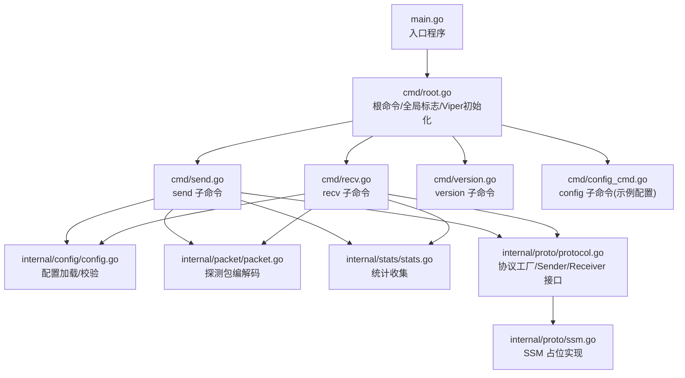
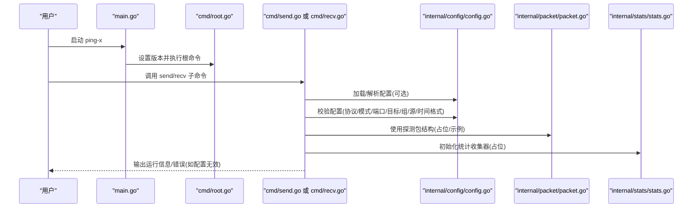
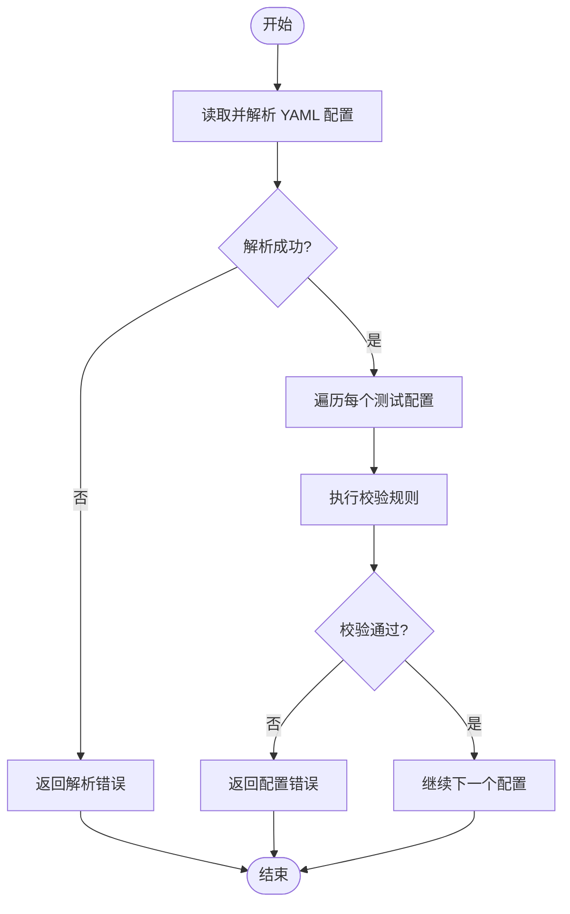
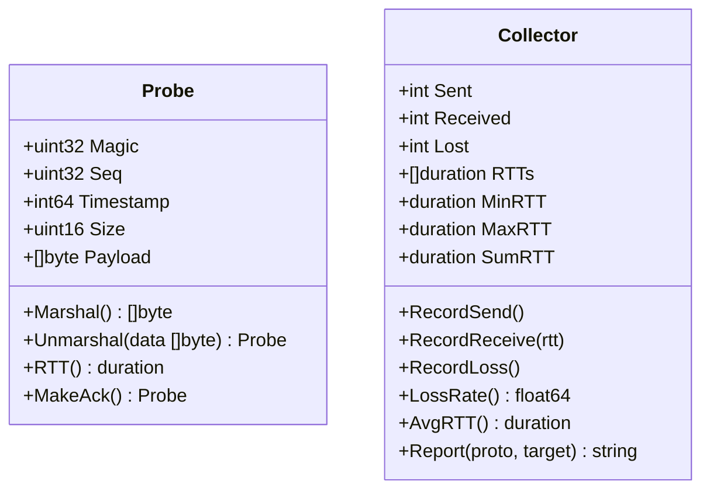
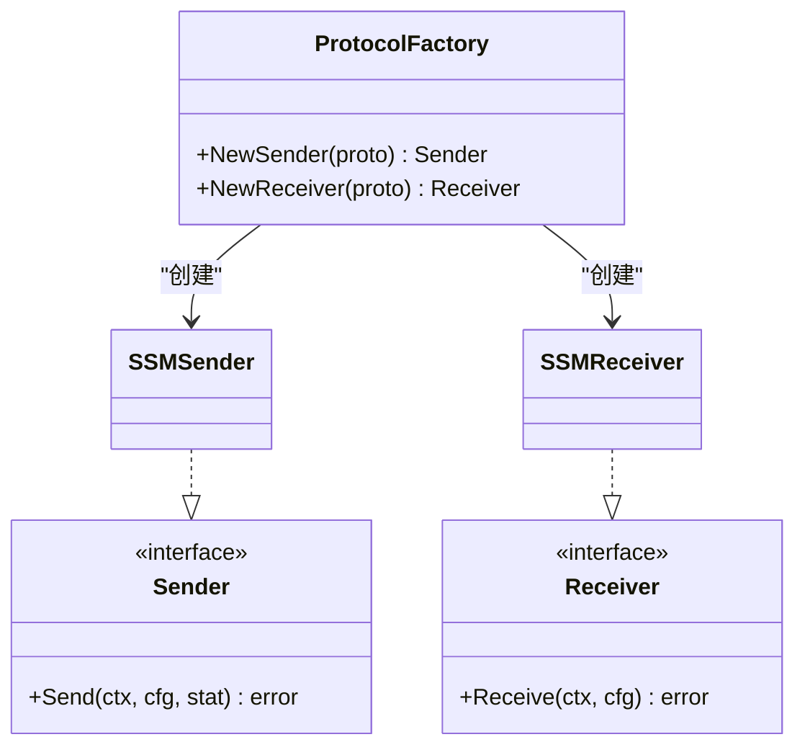
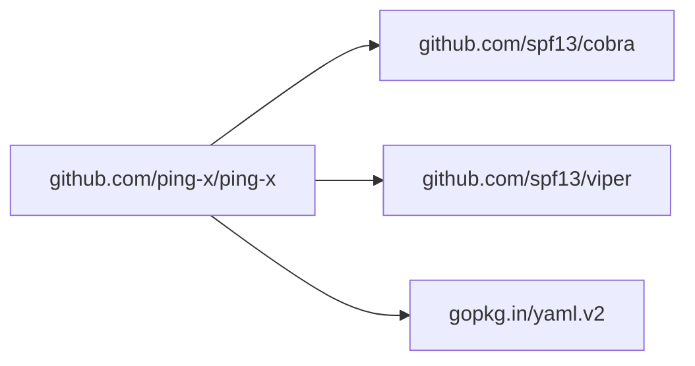
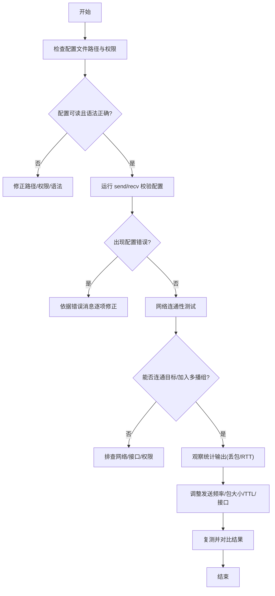

# 故障排除

<cite>
**本文引用的文件**
- [main.go](file://main.go)
- [cmd/root.go](file://cmd/root.go)
- [cmd/version.go](file://cmd/version.go)
- [cmd/send.go](file://cmd/send.go)
- [cmd/recv.go](file://cmd/recv.go)
- [cmd/config_cmd.go](file://cmd/config_cmd.go)
- [internal/config/config.go](file://internal/config/config.go)
- [internal/packet/packet.go](file://internal/packet/packet.go)
- [internal/stats/stats.go](file://internal/stats/stats.go)
- [internal/proto/protocol.go](file://internal/proto/protocol.go)
- [internal/proto/ssm.go](file://internal/proto/ssm.go)
- [go.mod](file://go.mod)
</cite>

## 目录
1. [简介](#简介)
2. [项目结构](#项目结构)
3. [核心组件](#核心组件)
4. [架构总览](#架构总览)
5. [详细组件分析](#详细组件分析)
6. [依赖分析](#依赖分析)
7. [性能考虑](#性能考虑)
8. [故障排除指南](#故障排除指南)
9. [结论](#结论)
10. [附录](#附录)

## 简介
本指南面向使用 Ping-X 工具进行跨平台网络协议连通性检测的用户与管理员，聚焦“常见问题—诊断流程—解决方案—性能优化—日志与定位”的闭环实践。Ping-X 当前提供命令行入口与配置文件驱动能力，支持 TCP、UDP、组播（Multicast）与 SSM 协议的发送/接收模式；协议具体实现处于开发中阶段，当前命令会完成参数解析与配置校验，并提示后续任务实现。

## 项目结构
- 入口程序负责设置版本并启动命令框架
- 命令层通过 Cobra 提供 send/recv/version/config 等子命令
- 配置层提供 YAML 配置加载与校验
- 数据包与统计模块提供探测包结构与统计收集
- 协议层提供 Sender/Receiver 接口与工厂函数，当前 SSM 尚未实现

图表来源
- [main.go:1-11](file://main.go#L1-L11)
- [cmd/root.go:1-54](file://cmd/root.go#L1-L54)
- [cmd/send.go:1-91](file://cmd/send.go#L1-L91)
- [cmd/recv.go:1-72](file://cmd/recv.go#L1-L72)
- [cmd/version.go:1-19](file://cmd/version.go#L1-L19)
- [cmd/config_cmd.go:1-100](file://cmd/config_cmd.go#L1-L100)
- [internal/config/config.go:1-125](file://internal/config/config.go#L1-L125)
- [internal/packet/packet.go:1-89](file://internal/packet/packet.go#L1-L89)
- [internal/stats/stats.go:1-109](file://internal/stats/stats.go#L1-L109)
- [internal/proto/protocol.go:1-51](file://internal/proto/protocol.go#L1-L51)
- [internal/proto/ssm.go:1-20](file://internal/proto/ssm.go#L1-L20)

章节来源
- [main.go:1-11](file://main.go#L1-L11)
- [cmd/root.go:1-54](file://cmd/root.go#L1-L54)
- [go.mod:1-25](file://go.mod#L1-L25)

## 核心组件
- 命令与入口
  - 入口设置版本并调用命令执行
  - 根命令注册全局标志（配置文件路径、详细输出），并绑定 Viper
  - 子命令：send/recv/version/config
- 配置系统
  - YAML 配置加载与解析
  - 配置项校验（协议、模式、端口、目标/组/源、时间格式等）
- 数据包与统计
  - 探测包结构与编解码
  - 统计收集器（发送/接收/丢包/RTT）
- 协议抽象
  - Sender/Receiver 接口与工厂函数
  - SSM 当前未实现，返回占位错误

章节来源
- [cmd/root.go:1-54](file://cmd/root.go#L1-L54)
- [cmd/send.go:1-91](file://cmd/send.go#L1-L91)
- [cmd/recv.go:1-72](file://cmd/recv.go#L1-L72)
- [cmd/config_cmd.go:1-100](file://cmd/config_cmd.go#L1-L100)
- [internal/config/config.go:1-125](file://internal/config/config.go#L1-L125)
- [internal/packet/packet.go:1-89](file://internal/packet/packet.go#L1-L89)
- [internal/stats/stats.go:1-109](file://internal/stats/stats.go#L1-L109)
- [internal/proto/protocol.go:1-51](file://internal/proto/protocol.go#L1-L51)
- [internal/proto/ssm.go:1-20](file://internal/proto/ssm.go#L1-L20)

## 架构总览
以下序列图展示命令执行与配置校验的关键流程，帮助快速定位问题环节。

图表来源
- [main.go:1-11](file://main.go#L1-L11)
- [cmd/root.go:1-54](file://cmd/root.go#L1-L54)
- [cmd/send.go:1-91](file://cmd/send.go#L1-L91)
- [cmd/recv.go:1-72](file://cmd/recv.go#L1-L72)
- [internal/config/config.go:1-125](file://internal/config/config.go#L1-L125)
- [internal/packet/packet.go:1-89](file://internal/packet/packet.go#L1-L89)
- [internal/stats/stats.go:1-109](file://internal/stats/stats.go#L1-L109)

## 详细组件分析

### 命令与入口
- 入口程序设置版本后交由命令框架执行
- 根命令注册全局标志并绑定 Viper，支持从配置文件读取
- 子命令 send/recv 支持从配置文件或命令行参数构建测试配置
- config 子命令可输出示例配置到标准输出或文件

章节来源
- [main.go:1-11](file://main.go#L1-L11)
- [cmd/root.go:1-54](file://cmd/root.go#L1-L54)
- [cmd/send.go:1-91](file://cmd/send.go#L1-L91)
- [cmd/recv.go:1-72](file://cmd/recv.go#L1-L72)
- [cmd/config_cmd.go:1-100](file://cmd/config_cmd.go#L1-L100)

### 配置加载与校验
- YAML 配置加载：读取文件并反序列化为结构体
- 校验规则：
  - 协议必须为 tcp/udp/multicast/ssm
  - 模式必须为 send/recv
  - 端口范围 1–65535
  - send 模式：
    - tcp/udp 需要目标地址
    - multicast/ssm 需要组地址
  - recv 模式：
    - multicast/ssm 需要组地址
  - interval/timeout 必须是合法的时间格式

图表来源
- [internal/config/config.go:34-100](file://internal/config/config.go#L34-L100)

章节来源
- [internal/config/config.go:1-125](file://internal/config/config.go#L1-L125)

### 数据包结构与统计
- 探测包包含魔数、序号、时间戳、负载长度与负载
- 编解码采用大端序，提供序列化与反序列化
- 统计收集器记录发送/接收/丢包与 RTT 并生成报告

图表来源
- [internal/packet/packet.go:17-88](file://internal/packet/packet.go#L17-L88)
- [internal/stats/stats.go:10-109](file://internal/stats/stats.go#L10-L109)

章节来源
- [internal/packet/packet.go:1-89](file://internal/packet/packet.go#L1-L89)
- [internal/stats/stats.go:1-109](file://internal/stats/stats.go#L1-L109)

### 协议抽象与 SSM 占位
- Sender/Receiver 接口与工厂函数按协议类型创建实例
- SSM 当前返回“尚未实现”的占位错误

图表来源
- [internal/proto/protocol.go:11-51](file://internal/proto/protocol.go#L11-L51)
- [internal/proto/ssm.go:11-20](file://internal/proto/ssm.go#L11-L20)

章节来源
- [internal/proto/protocol.go:1-51](file://internal/proto/protocol.go#L1-L51)
- [internal/proto/ssm.go:1-20](file://internal/proto/ssm.go#L1-L20)

## 依赖分析
- Go 版本要求：1.17
- 主要依赖：Cobra（命令行）、Viper（配置）、YAML 解析等
- 依赖关系以模块方式声明，未发现循环依赖迹象

图表来源
- [go.mod:1-25](file://go.mod#L1-L25)

章节来源
- [go.mod:1-25](file://go.mod#L1-L25)

## 性能考虑
- 探测包大小与发送频率
  - 建议根据网络环境调整探测包大小与发送间隔，避免过大开销或过密流量
- 统计维度
  - 利用统计收集器的最小/最大/平均 RTT 与丢包率评估链路质量
- 并发与资源
  - 当前统计收集器内部使用互斥锁保护，注意在高并发场景下的锁竞争影响
- TTL 与多播接口
  - 多播场景下合理设置 TTL 与网络接口，避免路由或 IGMP 限制导致收包异常

## 故障排除指南

### 一、配置错误类
- 症状
  - 运行时报“配置加载失败”“配置验证失败”
- 可能原因
  - 配置文件路径不正确或不可读
  - YAML 语法错误或字段类型不匹配
  - 协议/模式/端口非法
  - send/recv 模式缺少必要字段（如 tcp/udp 缺少目标、multicast/ssm 缺少组）
  - interval/timeout 时间格式不合法
- 诊断步骤
  - 使用 config 子命令生成示例配置，核对字段与类型
  - 使用 verbose 模式（若启用）查看更详细输出
  - 分步校验：先校验 YAML 语法，再逐步注释掉复杂段落定位问题
- 解决方案
  - 修正配置文件路径或权限
  - 修复 YAML 语法与字段类型
  - 补齐 send/recv 必填字段
  - 使用合法时间格式（如 1s、200ms）

章节来源
- [cmd/config_cmd.go:1-100](file://cmd/config_cmd.go#L1-L100)
- [internal/config/config.go:34-100](file://internal/config/config.go#L34-L100)

### 二、网络连接问题
- 症状
  - 发送/接收无法建立连接或无响应
- 可能原因
  - 目标主机/端口不可达
  - 多播组未加入或 IGMP 不可用
  - SSM 源/组配置不一致或未订阅
  - 接口/绑定地址不正确
- 诊断步骤
  - 使用基础连通性工具（如 telnet/nc）验证目标端口
  - 在接收端检查是否正确加入多播组与绑定接口
  - 对 SSM 场景，确认源地址与组地址一致且订阅成功
  - 核查 bind 与 iface 是否指向正确的网卡
- 解决方案
  - 修正目标地址/端口
  - 确保多播/IGMP 正常，必要时手动加入组
  - 修正 SSM 源/组配置并重新订阅
  - 使用正确的本地绑定地址与网络接口

### 三、权限问题
- 症状
  - 无法绑定特权端口（1–1023）
  - 多播/IGMP 操作被拒绝
- 可能原因
  - 以普通用户运行但尝试使用特权端口
  - 操作系统对多播/IGMP 的权限限制
- 诊断步骤
  - 尝试使用非特权端口（>1023）
  - 在 Linux 上检查内核多播/IGMP 参数
- 解决方案
  - 使用非特权端口或以具备相应权限的用户运行
  - 调整系统多播/IGMP 参数（视环境策略而定）

### 四、协议实现相关问题
- 症状
  - SSM 模式报“尚未实现”
- 可能原因
  - SSM 功能尚未完成
- 诊断步骤
  - 查看协议工厂与 SSM 实现
- 解决方案
  - 等待后续实现，或改用其他协议进行验证

章节来源
- [internal/proto/protocol.go:21-51](file://internal/proto/protocol.go#L21-L51)
- [internal/proto/ssm.go:14-20](file://internal/proto/ssm.go#L14-L20)

### 五、日志与问题定位
- 日志来源
  - 命令行输出：send/recv 子命令打印当前运行的协议与关键参数
  - 配置错误：明确指出“加载配置失败/配置验证失败”及具体原因
- 定位技巧
  - 优先检查配置文件路径与权限
  - 使用最小化配置复现问题，逐步增加复杂度
  - 结合统计输出观察丢包与 RTT 变化趋势
- 建议
  - 在生产环境开启详细输出（若可用）以便采集更多信息

章节来源
- [cmd/send.go:34-91](file://cmd/send.go#L34-L91)
- [cmd/recv.go:29-72](file://cmd/recv.go#L29-L72)
- [internal/config/config.go:34-100](file://internal/config/config.go#L34-L100)

### 六、性能优化与资源使用
- 调整发送频率与探测包大小，避免对网络造成压力
- 合理设置超时与统计采样周期，减少 CPU 开销
- 多播场景下控制 TTL 与接口，降低不必要的广播/组播扩散
- 注意统计收集器的锁竞争，避免在高频路径上重复加锁

## 结论
本指南提供了从配置、网络、权限到协议实现的系统化排障思路与实操建议。当前版本重点在于配置与参数校验、命令行交互与统计占位，协议具体实现仍在完善中。建议用户优先确保配置正确与网络可达，再结合统计指标进行深入分析。

## 附录

### A. 常见错误消息与含义
- “加载配置文件失败”
  - 含义：无法读取或解析配置文件
  - 处理：检查路径、权限与 YAML 语法
- “配置验证失败”
  - 含义：协议/模式/端口/目标/组/源/时间格式等不符合约束
  - 处理：对照校验规则逐项修正
- “SSM sender/receiver not implemented yet”
  - 含义：SSM 功能尚未实现
  - 处理：等待后续版本或改用其他协议

章节来源
- [cmd/send.go:34-91](file://cmd/send.go#L34-L91)
- [cmd/recv.go:29-72](file://cmd/recv.go#L29-L72)
- [internal/config/config.go:50-100](file://internal/config/config.go#L50-L100)
- [internal/proto/ssm.go:14-20](file://internal/proto/ssm.go#L14-L20)

### B. 建议的诊断流程图
