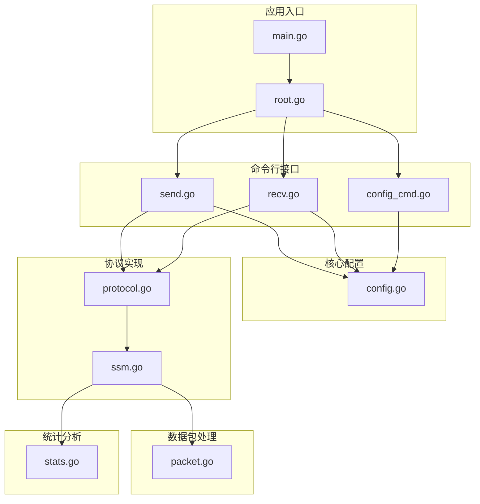
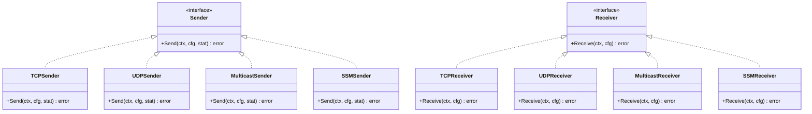
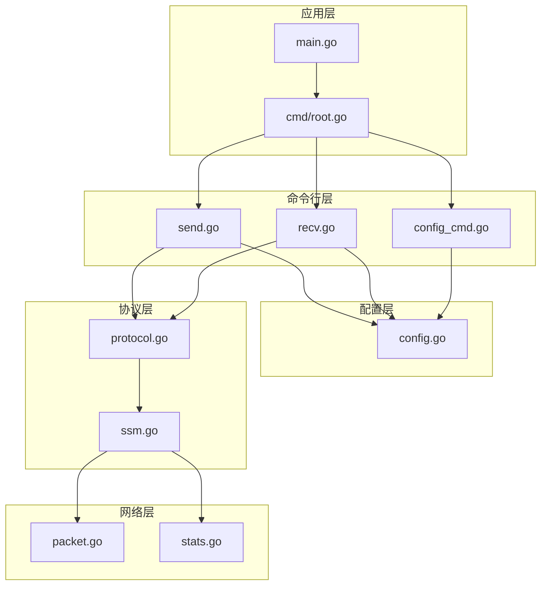
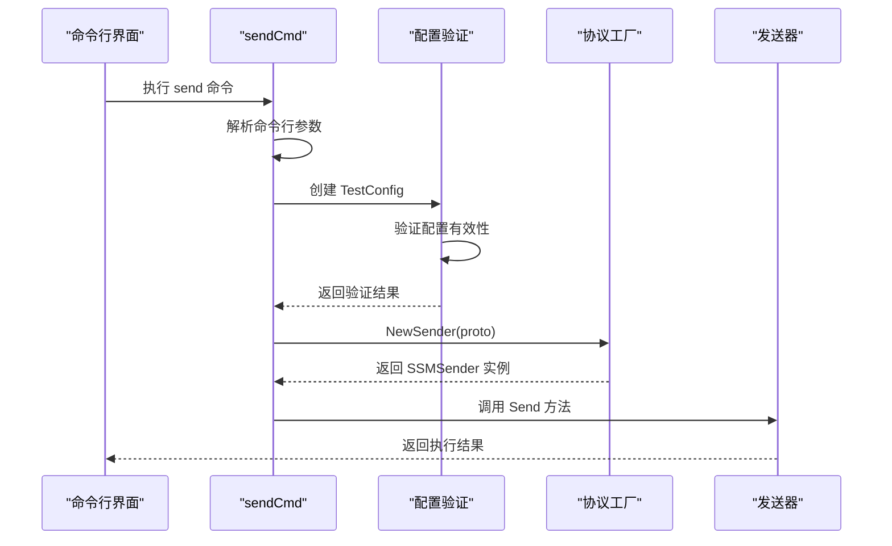
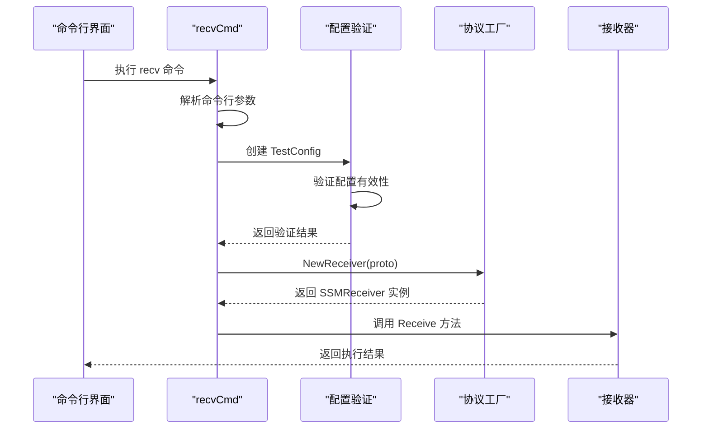
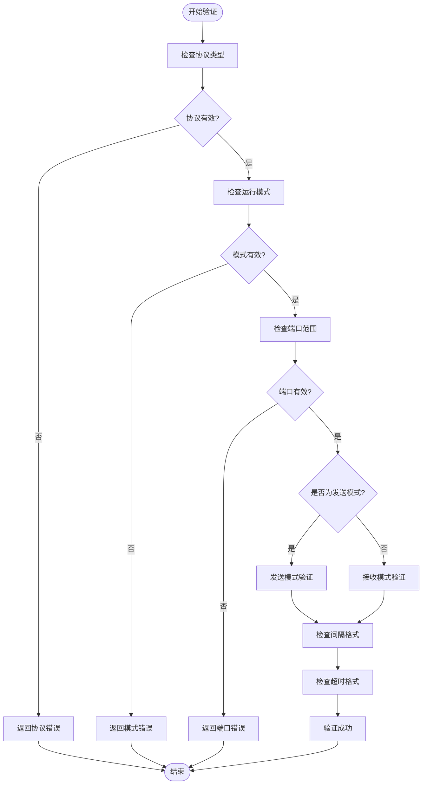
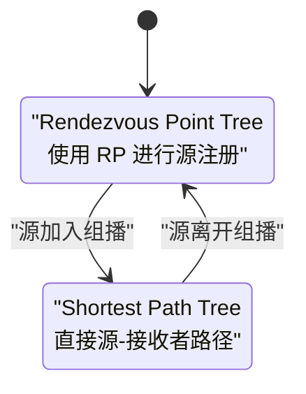

# SSM 协议测试

<cite>
**本文档引用的文件**
- [main.go](file://main.go)
- [root.go](file://cmd/root.go)
- [config.go](file://internal/config/config.go)
- [protocol.go](file://internal/proto/protocol.go)
- [ssm.go](file://internal/proto/ssm.go)
- [recv.go](file://cmd/recv.go)
- [send.go](file://cmd/send.go)
- [config_cmd.go](file://cmd/config_cmd.go)
- [packet.go](file://internal/packet/packet.go)
- [stats.go](file://internal/stats/stats.go)
- [go.mod](file://go.mod)
</cite>

## 目录
1. [简介](#简介)
2. [项目结构](#项目结构)
3. [核心组件](#核心组件)
4. [架构概览](#架构概览)
5. [详细组件分析](#详细组件分析)
6. [SSM 协议详解](#ssm-协议详解)
7. [配置选项详解](#配置选项详解)
8. [使用场景与示例](#使用场景与示例)
9. [性能考虑](#性能考虑)
10. [故障排除指南](#故障排除指南)
11. [结论](#结论)

## 简介

Ping-X 是一个跨平台网络协议连通性检测工具，支持 TCP、UDP、组播（Multicast）和 SSM（Source-Specific Multicast）等多种协议的连通性测试。本文档专注于 SSM 协议测试功能的详细技术说明，深入解释 SSM 协议的工作原理以及 Ping-X 中的实现机制。

SSM（Source-Specific Multicast，源特定组播）是 Internet 组管理协议（IGMP）v3 和多播转发协议（PIM）中引入的一种高级组播模式。与传统的 ASM（Any-Source Multicast，任意源组播）不同，SSM 允许接收者精确指定希望接收的源地址，从而实现更精细的组播控制和更高的安全性。

## 项目结构

Ping-X 采用模块化的 Go 项目结构，主要包含以下核心目录：



**图表来源**
- [main.go:1-11](file://main.go#L1-L11)
- [root.go:1-54](file://cmd/root.go#L1-L54)
- [config.go:1-125](file://internal/config/config.go#L1-L125)
- [protocol.go:1-52](file://internal/proto/protocol.go#L1-L52)
- [ssm.go:1-21](file://internal/proto/ssm.go#L1-L21)

**章节来源**
- [main.go:1-11](file://main.go#L1-L11)
- [root.go:1-54](file://cmd/root.go#L1-L54)
- [go.mod:1-25](file://go.mod#L1-L25)

## 核心组件

### 配置管理系统

Ping-X 的配置系统采用 YAML 格式，支持灵活的测试配置定义。每个测试配置包含以下关键字段：

- **name**: 测试任务名称
- **proto**: 协议类型（tcp、udp、multicast、ssm）
- **mode**: 运行模式（send、recv）
- **target**: 目标地址（TCP/UDP 必需）
- **group**: 多播组地址（多播/SSM 必需）
- **source**: SSM 源地址（SSM 特有）
- **port**: 端口号
- **bind**: 绑定地址
- **iface**: 网络接口
- **count**: 发送次数
- **interval**: 发送间隔
- **timeout**: 超时时间
- **size**: 数据包大小
- **ttl**: TTL 值

### 协议抽象层

系统采用接口驱动的设计模式，通过统一的 Sender 和 Receiver 接口抽象不同协议的实现：



**图表来源**
- [protocol.go:11-51](file://internal/proto/protocol.go#L11-L51)
- [ssm.go:11-20](file://internal/proto/ssm.go#L11-L20)

**章节来源**
- [config.go:11-27](file://internal/config/config.go#L11-L27)
- [protocol.go:11-51](file://internal/proto/protocol.go#L11-L51)
- [ssm.go:11-20](file://internal/proto/ssm.go#L11-L20)

## 架构概览

Ping-X 的整体架构采用分层设计，从上到下分别为应用层、命令行层、配置层、协议层和网络层：



**图表来源**
- [main.go:1-11](file://main.go#L1-L11)
- [root.go:14-25](file://cmd/root.go#L14-L25)
- [protocol.go:21-51](file://internal/proto/protocol.go#L21-L51)

## 详细组件分析

### 命令行接口组件

#### 发送端命令（send）

发送端命令支持多种协议的发送模式，包括 TCP、UDP、多播和 SSM：



**图表来源**
- [send.go:34-91](file://cmd/send.go#L34-L91)
- [protocol.go:22-35](file://internal/proto/protocol.go#L22-L35)
- [ssm.go:14-16](file://internal/proto/ssm.go#L14-L16)

#### 接收端命令（recv）

接收端命令负责监听和响应探测包：



**图表来源**
- [recv.go:29-72](file://cmd/recv.go#L29-L72)
- [protocol.go:38-51](file://internal/proto/protocol.go#L38-L51)
- [ssm.go:18-20](file://internal/proto/ssm.go#L18-L20)

**章节来源**
- [send.go:11-91](file://cmd/send.go#L11-L91)
- [recv.go:11-72](file://cmd/recv.go#L11-L72)

### 配置验证组件

配置验证系统确保所有测试配置符合协议要求：



**图表来源**
- [config.go:49-100](file://internal/config/config.go#L49-L100)

**章节来源**
- [config.go:49-100](file://internal/config/config.go#L49-L100)

## SSM 协议详解

### SSM 协议基础

SSM（Source-Specific Multicast）是 Internet 组管理协议（IGMP）v3 和多播转发协议（PIM）中引入的一种高级组播模式。它允许接收者精确指定希望接收的源地址，从而实现更精细的组播控制和更高的安全性。

#### SSM 的核心特性

1. **精确源控制**: 接收者可以指定特定的源地址，只接收来自该源的数据
2. **安全性增强**: 由于源地址固定，减少了恶意源的影响
3. **资源优化**: 只建立必要的组播树分支
4. **简化管理**: 不需要复杂的 RP（Rendezvous Point）机制

### SSM 与 ASM 的区别

| 特性 | SSM (Source-Specific Multicast) | ASM (Any-Source Multicast) |
|------|--------------------------------|----------------------------|
| 源控制 | 精确指定源地址 | 接收所有源的数据 |
| RP 依赖 | 不需要 RP | 需要 RP 进行源注册 |
| 组播树 | SPT (Shortest Path Tree) | RPT (Rendezvous Point Tree) |
| 安全性 | 更高，源地址固定 | 较低，可能接收多个源 |
| 复杂度 | 简单，直接源-组播 | 复杂，需要 RP 协商 |
| 性能 | 更优，减少不必要的复制 | 可能存在冗余流量 |

### SPT 切换机制

在 PIM 协议中，SSM 使用 SPT（Shortest Path Tree）切换机制：



**图表来源**
- [ssm.go:14-20](file://internal/proto/ssm.go#L14-L20)

### RP（Rendezvous Point）概念

RP（Rendezvous Point）是 ASM 协议中的关键概念，但在 SSM 中不需要：

- **ASM 中的作用**: 作为源和接收者之间的中介点
- **SSM 中的状态**: 不参与 SSM 组播，因为源地址直接指定
- **部署复杂性**: RP 需要专门的硬件和软件配置

**章节来源**
- [ssm.go:14-20](file://internal/proto/ssm.go#L14-L20)

## 配置选项详解

### 基本配置参数

| 参数名 | 类型 | 必需 | 默认值 | 描述 |
|--------|------|------|--------|------|
| name | string | 否 | 自动生成 | 测试任务名称 |
| proto | string | 是 | - | 协议类型：tcp/udp/multicast/ssm |
| mode | string | 是 | - | 运行模式：send/recv |
| target | string | TCP/UDP 发送端必需 | - | 目标主机地址 |
| group | string | 多播/SSM 必需 | - | 组播组地址 |
| source | string | SSM 接收端必需 | - | SSM 源地址 |
| port | int | 是 | - | 端口号（1-65535） |
| bind | string | 否 | 0.0.0.0 | 本地绑定地址 |
| iface | string | 否 | - | 网络接口名称 |
| count | int | 否 | 0 | 发送次数（0=无限） |
| interval | string | 否 | 1s | 发送间隔（时间格式） |
| timeout | string | 否 | 3s | 超时时间（时间格式） |
| size | int | 否 | 64 | 数据包大小（字节） |
| ttl | int | 否 | 0 | TTL 值（0=自动） |

### SSM 特定配置

#### 发送端配置（SSM 发送）

```yaml
- name: "ssm-source1-send"
  proto: ssm
  mode: send
  group: 232.1.1.1
  port: 9003
  iface: eth0
  bind: 10.0.0.50
  count: 20
```

#### 接收端配置（SSM 接收）

```yaml
- name: "ssm-source1"
  proto: ssm
  mode: recv
  group: 232.1.1.1
  source: 10.0.0.50
  port: 9003
  iface: eth0
```

### 配置验证规则

SSM 配置遵循以下验证规则：

1. **协议验证**: 必须为 "ssm"
2. **模式验证**: 必须为 "send" 或 "recv"
3. **端口验证**: 必须在 1-65535 范围内
4. **发送端验证**:
   - SSM 发送端必须指定 group
   - SSM 发送端必须指定 bind（源地址）
5. **接收端验证**:
   - SSM 接收端必须指定 group
   - SSM 接收端必须指定 source

**章节来源**
- [config.go:11-27](file://internal/config/config.go#L11-L27)
- [config.go:49-100](file://internal/config/config.go#L49-L100)
- [config_cmd.go:69-84](file://cmd/config_cmd.go#L69-L84)

## 使用场景与示例

### 场景一：精确源控制的组播测试

适用于需要精确控制数据源的场景，如：

- 视频监控系统的特定摄像头数据流
- 金融市场的特定数据源推送
- 科研实验的特定传感器数据

#### 配置示例

```yaml
tests:
  - name: "video-camera-1"
    proto: ssm
    mode: recv
    group: 232.10.1.1
    source: 192.168.1.10
    port: 5000
    iface: eth0
    count: 100
    interval: 100ms
```

### 场景二：多播源管理验证

适用于需要验证多个源同时传输的场景：

- 多个视频源的同步播放测试
- 分布式系统的数据聚合验证
- 负载均衡的多源测试

#### 配置示例

```yaml
tests:
  - name: "multicast-source-verification"
    proto: ssm
    mode: recv
    group: 232.20.1.1
    source: 192.168.1.10
    port: 5000
    iface: eth0
    
  - name: "multicast-source-verification-2"
    proto: ssm
    mode: recv
    group: 232.20.1.1
    source: 192.168.1.11
    port: 5000
    iface: eth0
```

### 场景三：网络接口隔离测试

适用于需要测试特定网络接口的场景：

```yaml
tests:
  - name: "interface-isolation-test"
    proto: ssm
    mode: send
    group: 232.30.1.1
    source: 10.0.0.50
    port: 5000
    iface: eth1
    bind: 10.0.0.50
    count: 50
```

### 命令行使用示例

#### 发送端命令

```bash
# 发送 SSM 数据包
./ping-x send --proto ssm --group 232.1.1.1 --source 10.0.0.50 --port 9003 --bind 10.0.0.50 --count 100

# 接收端命令
./ping-x recv --proto ssm --group 232.1.1.1 --source 10.0.0.50 --port 9003 --iface eth0
```

#### 配置文件使用

```bash
# 生成示例配置文件
./ping-x config --output pingx.yaml

# 使用配置文件运行
./ping-x send --config pingx.yaml
./ping-x recv --config pingx.yaml
```

**章节来源**
- [config_cmd.go:22-85](file://cmd/config_cmd.go#L22-L85)
- [send.go:34-91](file://cmd/send.go#L34-L91)
- [recv.go:29-72](file://cmd/recv.go#L29-L72)

## 性能考虑

### 数据包处理性能

Ping-X 使用高效的探测包结构，包含以下字段：

- **Magic**: 4 字节魔数标识 "PXNG"
- **Seq**: 4 字节序列号
- **Timestamp**: 8 字节发送时间戳（纳秒级）
- **Size**: 2 字节负载大小
- **Payload**: 可变长度负载数据

### 统计收集机制

系统提供全面的性能统计功能：

- **发送计数**: 记录发送的数据包数量
- **接收计数**: 记录接收到的数据包数量
- **丢包率**: 计算丢包百分比
- **RTT 统计**: 最小、最大、平均往返时间
- **并发安全**: 使用互斥锁保护统计数据

### 网络接口优化

- **多播绑定**: 支持指定网络接口进行多播通信
- **TTL 控制**: 可配置 TTL 值影响数据包传播范围
- **缓冲区管理**: 优化网络缓冲区大小以提高吞吐量

**章节来源**
- [packet.go:17-89](file://internal/packet/packet.go#L17-L89)
- [stats.go:10-110](file://internal/stats/stats.go#L10-L110)

## 故障排除指南

### 常见配置错误

#### 协议类型错误

**问题**: 配置文件中 proto 字段值不正确
**解决**: 确保 proto 值为 "tcp"、"udp"、"multicast" 或 "ssm"

#### 端口范围错误

**问题**: 端口号超出有效范围
**解决**: 端口号必须在 1-65535 范围内

#### 模式配置错误

**问题**: mode 字段值不正确
**解决**: mode 必须为 "send" 或 "recv"

### SSM 特定问题

#### 源地址验证失败

**问题**: SSM 配置中缺少 source 参数
**解决**: SSM 接收端必须指定 source 参数

#### 组播组地址无效

**问题**: 组播组地址格式不正确
**解决**: 确保组播组地址为有效的 D 类 IP 地址（224.0.0.0-239.255.255.255）

#### 网络接口问题

**问题**: 指定的网络接口不存在
**解决**: 使用 `ip addr` 命令检查可用的网络接口

### 调试技巧

1. **启用详细输出**: 使用 `-v` 或 `--verbose` 参数获取详细日志
2. **检查配置文件**: 使用 `yaml` 工具验证配置文件格式
3. **网络连通性测试**: 使用 `ping` 和 `traceroute` 验证网络连通性
4. **防火墙检查**: 确认防火墙规则允许相应的端口通信

**章节来源**
- [config.go:49-100](file://internal/config/config.go#L49-L100)
- [root.go:35-42](file://cmd/root.go#L35-L42)

## 结论

Ping-X 的 SSM 协议测试功能提供了强大的源特定组播测试能力。通过其模块化的架构设计、完善的配置管理和丰富的使用场景支持，用户可以轻松地进行精确源控制的组播测试。

当前实现已经完成了 SSM 协议的基础框架搭建，包括配置解析、参数验证和协议抽象层。虽然具体的 SSM 发送和接收功能尚未完全实现，但框架已经为后续的功能扩展做好了充分准备。

未来的发展方向包括：
- 完成 SSM 发送和接收功能的具体实现
- 增加更多的网络接口支持
- 提供更详细的性能分析报告
- 支持更复杂的组播网络拓扑测试

通过持续的开发和完善，Ping-X 将成为 SSM 协议测试领域的重要工具，为用户提供可靠、高效的组播网络测试解决方案。