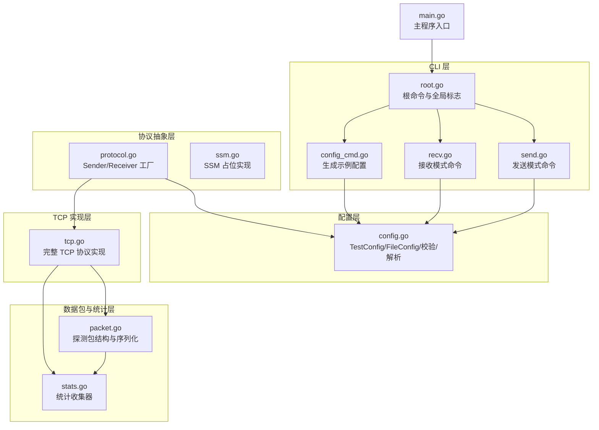
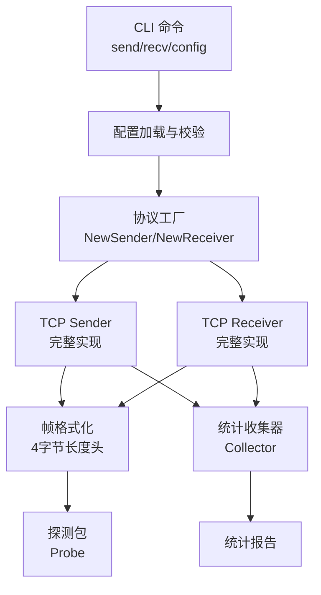
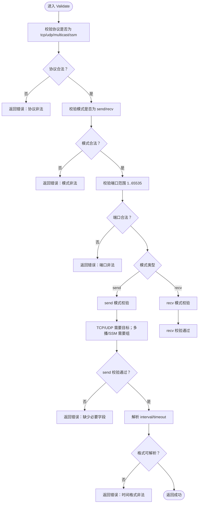
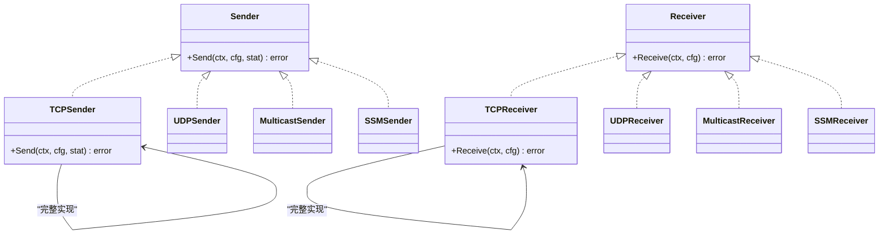
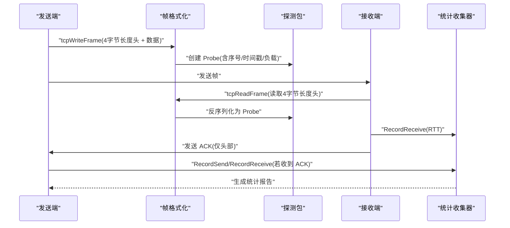
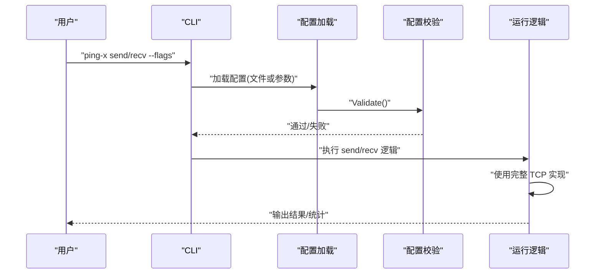
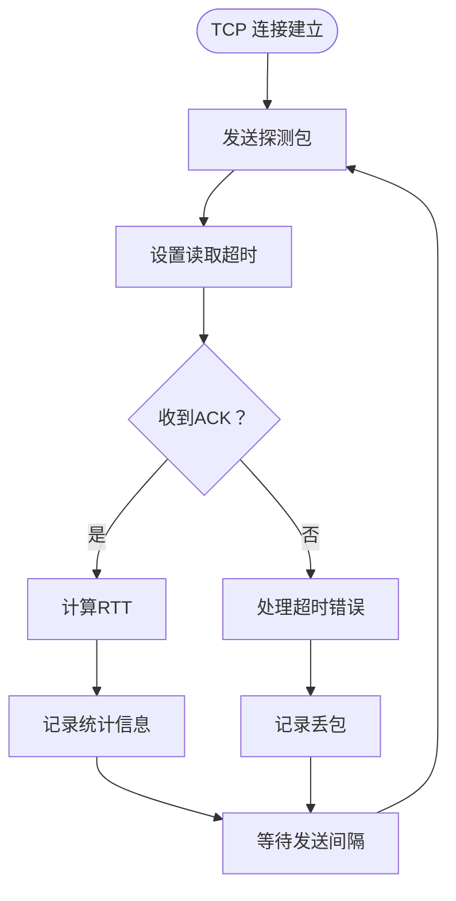
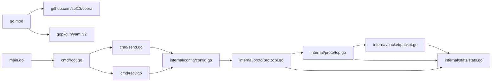

# TCP 协议测试

<cite>
**本文引用的文件**
- [main.go](file://main.go)
- [root.go](file://cmd/root.go)
- [send.go](file://cmd/send.go)
- [recv.go](file://cmd/recv.go)
- [config_cmd.go](file://cmd/config_cmd.go)
- [config.go](file://internal/config/config.go)
- [protocol.go](file://internal/proto/protocol.go)
- [tcp.go](file://internal/proto/tcp.go)
- [ssm.go](file://internal/proto/ssm.go)
- [packet.go](file://internal/packet/packet.go)
- [stats.go](file://internal/stats/stats.go)
- [go.mod](file://go.mod)
</cite>

## 更新摘要
**变更内容**
- 新增完整的 TCP 协议实现，包括双向通信、帧格式化、RTT 计算和错误处理机制
- 更新 TCP 协议特点与工作原理章节，详细说明面向连接、可靠传输等特性
- 新增 TCP 帧格式化和 RTT 计算的具体实现细节
- 更新故障排除指南，包含 TCP 特有的连接问题诊断
- 新增 TCP 使用场景和配置示例

## 目录
1. [简介](#简介)
2. [项目结构](#项目结构)
3. [核心组件](#核心组件)
4. [架构总览](#架构总览)
5. [详细组件分析](#详细组件分析)
6. [TCP 协议实现详解](#tcp-协议实现详解)
7. [依赖分析](#依赖分析)
8. [性能考虑](#性能考虑)
9. [故障排除指南](#故障排除指南)
10. [结论](#结论)
11. [附录](#附录)

## 简介
本文件面向使用 TCP 协议测试功能的用户与开发者，系统阐述 Ping-X 中 TCP 测试的设计与实现思路。经过最新更新，TCP 协议已实现完整的双向通信功能，包括帧格式化、RTT 计算、错误处理和超时机制。内容覆盖 TCP 协议基础（面向连接、可靠传输、三次握手等）、Ping-X 的配置模型与命令行参数、发送/接收模式的运行流程、统计采集与报告、以及性能优化与故障排除建议。

## 项目结构
该项目采用模块化分层设计：
- CLI 层：通过 Cobra 提供命令入口（send/recv/config），负责参数解析与配置加载。
- 配置层：定义测试配置结构与校验逻辑，支持从 YAML 文件批量加载。
- 协议抽象层：定义 Sender/Receiver 接口与工厂方法，按协议类型创建具体实现。
- 数据包与统计层：定义探测包格式与统计收集器，支撑 RTT 计算与报告生成。
- TCP 实现层：提供完整的 TCP 协议实现，包括双向通信、帧格式化和错误处理。
- 主程序入口：初始化版本与执行 CLI。



**图表来源**
- [main.go:1-11](file://main.go#L1-L11)
- [root.go:14-54](file://cmd/root.go#L14-L54)
- [send.go:11-124](file://cmd/send.go#L11-L124)
- [recv.go:11-104](file://cmd/recv.go#L11-L104)
- [config_cmd.go:10-101](file://cmd/config_cmd.go#L10-L101)
- [config.go:11-125](file://internal/config/config.go#L11-L125)
- [protocol.go:11-52](file://internal/proto/protocol.go#L11-L52)
- [tcp.go:1-198](file://internal/proto/tcp.go#L1-L198)
- [ssm.go:11-21](file://internal/proto/ssm.go#L11-L21)
- [packet.go:17-89](file://internal/packet/packet.go#L17-L89)
- [stats.go:10-110](file://internal/stats/stats.go#L10-L110)

**章节来源**
- [main.go:1-11](file://main.go#L1-L11)
- [root.go:14-54](file://cmd/root.go#L14-L54)
- [send.go:11-124](file://cmd/send.go#L11-L124)
- [recv.go:11-104](file://cmd/recv.go#L11-L104)
- [config_cmd.go:10-101](file://cmd/config_cmd.go#L10-L101)
- [config.go:11-125](file://internal/config/config.go#L11-L125)
- [protocol.go:11-52](file://internal/proto/protocol.go#L11-L52)
- [tcp.go:1-198](file://internal/proto/tcp.go#L1-L198)
- [ssm.go:11-21](file://internal/proto/ssm.go#L11-L21)
- [packet.go:17-89](file://internal/packet/packet.go#L17-L89)
- [stats.go:10-110](file://internal/stats/stats.go#L10-L110)

## 核心组件
- 配置模型与校验
  - TestConfig 定义了测试项的关键字段：协议、模式、目标/组/源、端口、绑定地址、接口、发送次数、间隔、超时、负载大小、TTL 等。
  - 校验规则确保协议合法、模式为 send/recv、端口范围有效；send 模式下 TCP/UDP 需要目标地址，多播/SSM 需要组地址；recv 模式下多播/SSM 需要组地址；时间格式需可解析。
- 协议抽象与工厂
  - Sender/Receiver 接口定义了统一的发送/接收行为。
  - NewSender/NewReceiver 工厂按协议类型返回对应实现；TCP 协议现已实现完整功能。
- 探测包与统计
  - Probe 定义了固定头部（魔数、序号、时间戳、负载长度）与可选负载，支持序列化/反序列化与 RTT 计算。
  - Collector 提供并发安全的统计记录与报告生成，包括发送/接收/丢包、RTT 最小/平均/最大。
- CLI 命令
  - send/recv 子命令支持从命令行参数或配置文件加载配置，并进行基本校验与打印。
  - config 子命令输出示例 YAML，覆盖 TCP/UDP/多播/SSM 的典型用法。

**章节来源**
- [config.go:11-125](file://internal/config/config.go#L11-L125)
- [protocol.go:11-52](file://internal/proto/protocol.go#L11-L52)
- [tcp.go:16-21](file://internal/proto/tcp.go#L16-L21)
- [packet.go:17-89](file://internal/packet/packet.go#L17-L89)
- [stats.go:10-110](file://internal/stats/stats.go#L10-L110)
- [send.go:11-124](file://cmd/send.go#L11-L124)
- [recv.go:11-104](file://cmd/recv.go#L11-L104)
- [config_cmd.go:10-101](file://cmd/config_cmd.go#L10-L101)

## 架构总览
下图展示了 TCP 测试在 Ping-X 中的高层架构：CLI 解析参数 → 加载配置 → 校验 → 通过协议工厂创建 TCP Sender/Receiver → 使用探测包与统计器完成测试 → 输出结果。



**图表来源**
- [send.go:40-124](file://cmd/send.go#L40-L124)
- [recv.go:34-104](file://cmd/recv.go#L34-L104)
- [config.go:49-125](file://internal/config/config.go#L49-L125)
- [protocol.go:21-52](file://internal/proto/protocol.go#L21-L52)
- [tcp.go:22-46](file://internal/proto/tcp.go#L22-L46)
- [packet.go:17-89](file://internal/packet/packet.go#L17-L89)
- [stats.go:10-110](file://internal/stats/stats.go#L10-L110)

## 详细组件分析

### 配置模型与校验（TestConfig）
- 字段说明
  - 名称、协议、模式、目标主机、组地址、源地址、端口、绑定地址、网络接口、发送次数、发送间隔、超时、负载大小、TTL。
- 校验要点
  - 协议必须为 tcp/udp/multicast/ssm。
  - 模式必须为 send 或 recv。
  - 端口范围 1–65535。
  - send 模式：
    - TCP/UDP 要求目标地址非空；
    - 多播/SSM 要求组地址非空。
  - recv 模式：
    - 多播/SSM 要求组地址非空。
  - 时间格式（interval/timeout）需可解析。
- 默认值
  - 未设置间隔时采用 1 秒；
  - 未设置超时时采用 3 秒。



**图表来源**
- [config.go:49-125](file://internal/config/config.go#L49-L125)

**章节来源**
- [config.go:11-125](file://internal/config/config.go#L11-L125)

### 协议抽象与工厂（Sender/Receiver）
- 接口职责
  - Sender.Send(ctx, cfg, stat)：执行发送逻辑，记录统计。
  - Receiver.Receive(ctx, cfg)：执行接收逻辑。
- 工厂方法
  - NewSender 根据协议返回 TCPSender、UDPSender、MulticastSender、SSMSender；
  - NewReceiver 根据协议返回 TCPReceiver、UDPReceiver、MulticastReceiver、SSMReceiver。
- 当前状态
  - TCP 的具体实现已完成，提供完整的双向通信功能。



**图表来源**
- [protocol.go:11-52](file://internal/proto/protocol.go#L11-L52)
- [tcp.go:16-21](file://internal/proto/tcp.go#L16-L21)
- [ssm.go:11-21](file://internal/proto/ssm.go#L11-L21)

**章节来源**
- [protocol.go:11-52](file://internal/proto/protocol.go#L11-L52)
- [tcp.go:16-21](file://internal/proto/tcp.go#L16-L21)
- [ssm.go:11-21](file://internal/proto/ssm.go#L11-L21)

### 探测包与统计（Probe/Collector）
- 探测包（Probe）
  - 固定头部包含魔数、序号、时间戳、负载长度；
  - 负载为可变长度字节序列，用于校验与填充；
  - 支持序列化/反序列化、RTT 计算、ACK 包构造。
- 统计收集器（Collector）
  - 并发安全地记录发送/接收/丢包；
  - 维护 RTT 列表与最小/最大/平均值；
  - 生成人类可读的统计报告。



**图表来源**
- [tcp.go:22-46](file://internal/proto/tcp.go#L22-L46)
- [packet.go:17-89](file://internal/packet/packet.go#L17-L89)
- [stats.go:10-110](file://internal/stats/stats.go#L10-L110)

**章节来源**
- [tcp.go:22-46](file://internal/proto/tcp.go#L22-L46)
- [packet.go:17-89](file://internal/packet/packet.go#L17-L89)
- [stats.go:10-110](file://internal/stats/stats.go#L10-L110)

### CLI 命令与运行流程
- send 子命令
  - 支持从命令行参数或配置文件加载；
  - 校验通过后打印当前配置摘要；
  - 实际协议调用使用完整的 TCP 实现。
- recv 子命令
  - 支持从命令行参数或配置文件加载；
  - 校验通过后打印监听配置摘要；
  - 实际协议调用使用完整的 TCP 实现。
- config 子命令
  - 输出包含 TCP/UDP/多播/SSM 的示例配置，便于快速上手。



**图表来源**
- [send.go:40-124](file://cmd/send.go#L40-L124)
- [recv.go:34-104](file://cmd/recv.go#L34-L104)
- [config_cmd.go:87-101](file://cmd/config_cmd.go#L87-L101)

**章节来源**
- [send.go:11-124](file://cmd/send.go#L11-L124)
- [recv.go:11-104](file://cmd/recv.go#L11-L104)
- [config_cmd.go:10-101](file://cmd/config_cmd.go#L10-L101)

## TCP 协议实现详解

### 帧格式化机制
TCP 协议实现了自定义的帧格式化机制，确保可靠的数据传输：

- **帧头格式**：4 字节大端序长度头 + 数据体
- **长度头**：表示后续数据体的字节数
- **数据体**：序列化后的探测包数据
- **读写函数**：
  - `tcpWriteFrame(conn, data)`：写入长度头 + 数据
  - `tcpReadFrame(conn)`：读取长度头，再读取对应字节数的数据

### 双向通信流程
TCP 实现提供了完整的双向通信能力：

- **发送端流程**：
  1. 建立 TCP 连接
  2. 创建探测包并序列化
  3. 发送帧数据
  4. 设置读取超时并等待 ACK
  5. 计算 RTT 并记录统计
  6. 等待发送间隔，重复上述过程

- **接收端流程**：
  1. 监听指定端口
  2. 接受客户端连接
  3. 为每个连接启动独立处理协程
  4. 循环读取帧数据
  5. 反序列化为探测包
  6. 生成 ACK 并发送

### RTT 计算机制
RTT（往返时间）计算基于探测包的时间戳：

- **时间戳记录**：发送时记录 UnixNano 时间戳
- **RTT计算**：接收端计算当前时间与时间戳的差值
- **精度**：纳秒级精度，转换为毫秒显示
- **统计**：维护最小/最大/平均 RTT 值

### 错误处理与超时机制
完善的错误处理确保协议的健壮性：

- **连接错误**：连接超时、拒绝连接等
- **读写错误**：网络中断、缓冲区不足等
- **协议错误**：无效帧格式、魔数不匹配等
- **超时处理**：发送超时、读取超时、连接超时
- **上下文取消**：支持优雅退出和资源清理



**图表来源**
- [tcp.go:48-129](file://internal/proto/tcp.go#L48-L129)
- [tcp.go:131-197](file://internal/proto/tcp.go#L131-L197)

**章节来源**
- [tcp.go:22-46](file://internal/proto/tcp.go#L22-L46)
- [tcp.go:48-129](file://internal/proto/tcp.go#L48-L129)
- [tcp.go:131-197](file://internal/proto/tcp.go#L131-L197)

## 依赖分析
- 外部依赖
  - Cobra：命令行框架；
  - Viper：配置管理；
  - YAML：配置文件解析；
  - Go 标准库：net、time、encoding/binary、io 等。
- 模块间耦合
  - CLI 层依赖配置层与协议抽象层；
  - 协议抽象层依赖配置层与统计层；
  - TCP 实现层依赖数据包层与统计层；
  - 数据包层与统计层相互独立但被上层复用。



**图表来源**
- [go.mod:1-25](file://go.mod#L1-L25)
- [main.go:1-11](file://main.go#L1-L11)
- [root.go:3-6](file://cmd/root.go#L3-L6)
- [send.go:7-15](file://cmd/send.go#L7-L15)
- [recv.go:7-15](file://cmd/recv.go#L7-L15)
- [config.go:3-9](file://internal/config/config.go#L3-L9)
- [protocol.go:3-10](file://internal/proto/protocol.go#L3-L10)
- [tcp.go:3-14](file://internal/proto/tcp.go#L3-L14)
- [stats.go:3-8](file://internal/stats/stats.go#L3-L8)
- [packet.go:3-8](file://internal/packet/packet.go#L3-L8)

**章节来源**
- [go.mod:1-25](file://go.mod#L1-L25)

## 性能考虑
- 负载大小与 MTU
  - 探测包包含固定头部与可变负载，增大负载会增加 CPU 开销与网络开销。建议根据链路特性调整 size，避免超过路径 MTU 导致分片。
- 发送间隔与速率
  - interval 过短会增加 CPU 与网络压力；过长则降低检测灵敏度。结合 timeout 与 count 合理设置。
- 并发与锁
  - 统计收集器使用互斥锁保护共享状态，避免高并发下的竞争条件。在高频场景下，可考虑减少统计频率或使用更细粒度的采样策略。
- 超时与重传
  - 超时时间影响 RTT 测量与丢包判断。在网络延迟较大或抖动明显时，适当增大 timeout 可减少误判。
- 接口与绑定
  - 在多网卡环境中，合理设置 bind 与 iface 可避免路由与 NAT 引起的异常。
- TCP 连接管理
  - 每个发送操作都会建立新连接，频繁连接/断开会影响性能。建议在高负载场景下考虑连接池或长连接策略。

## 故障排除指南
- 协议/模式/端口错误
  - 现象：启动时报错"协议非法/模式非法/端口非法"。
  - 处理：检查配置中的 proto/mode/port 是否符合要求。
- 缺少必要字段
  - 现象：send 模式下 TCP/UDP 报告缺少目标地址；多播/SSM 报告缺少组地址。
  - 处理：补齐 target/group 字段。
- 时间格式错误
  - 现象：interval/timeout 格式不被识别。
  - 处理：使用可被解析的时间格式（如 1s、2.5s、100ms）。
- 配置文件加载失败
  - 现象：提示无法读取/解析配置文件。
  - 处理：检查文件路径与权限，确认 YAML 格式正确。
- TCP 连接问题
  - 现象：TCP connect to failed: connection refused。
  - 处理：确认目标服务正在监听，检查防火墙设置，验证端口正确性。
- TCP 超时问题
  - 现象：FAIL timeout（超时）。
  - 处理：检查网络连通性，适当增大 timeout，确认接收端正常运行。
- TCP 帧格式错误
  - 现象：FAIL invalid ack（无效 ACK）。
  - 处理：检查发送端和接收端的协议实现一致性，确认帧格式正确。
- TCP 写入错误
  - 现象：FAIL send error（发送错误）。
  - 处理：检查网络连接状态，确认 socket 可用，查看系统资源限制。

**章节来源**
- [config.go:49-125](file://internal/config/config.go#L49-L125)
- [send.go:40-124](file://cmd/send.go#L40-L124)
- [recv.go:34-104](file://cmd/recv.go#L34-L104)
- [tcp.go:53-56](file://internal/proto/tcp.go#L53-L56)
- [tcp.go:81-86](file://internal/proto/tcp.go#L81-L86)
- [tcp.go:89-94](file://internal/proto/tcp.go#L89-L94)
- [tcp.go:95-100](file://internal/proto/tcp.go#L95-L100)

## 结论
Ping-X 的 TCP 协议测试功能已实现完整的双向通信能力，基于清晰的配置模型与协议抽象层设计，具备良好的扩展性和实用性。TCP 实现包含了帧格式化、RTT 计算、错误处理和超时机制等关键特性，能够提供可靠的连通性与性能评估。通过合理的配置与参数调优，用户可以在不同网络环境下进行精确的 TCP 连接质量测试。

## 附录

### TCP 协议特点与工作原理
- **面向连接**
  - 建立连接需要三次握手，释放连接需要四次挥手。
  - 提供可靠的全双工通信通道。
- **可靠传输**
  - 通过序号、确认应答、重传、流量控制与拥塞控制保证可靠性。
  - 确保数据按序到达且无差错。
- **传输控制**
  - 拥有端口、窗口、校验和等机制，确保有序、无差错的数据交付。
  - 支持流量控制和拥塞控制。
- **适用场景**
  - 对可靠性要求高的应用，如 Web、数据库、文件传输等。
  - 需要确认机制的服务健康检查。

### TCP 测试配置选项详解
- **基本参数**
  - 协议：tcp（完整实现）。
  - 模式：send（发送端）、recv（接收端）。
  - 目标主机：TCP/UDP 下必填。
  - 组地址：多播/SSM 下必填。
  - 源地址：SSM 下必填。
  - 端口：必填，范围 1–65535。
  - 绑定地址：本地绑定地址，默认 0.0.0.0。
  - 网络接口：多播/SSM 场景可指定。
- **控制参数**
  - 发送次数：0 表示持续发送。
  - 发送间隔：时间格式，如 1s、2.5s。
  - 超时时间：单包超时，如 3s。
  - 负载大小：字节数，决定探测包总长度。
  - TTL：多播场景建议 16，其他场景由系统自动选择。

**章节来源**
- [config.go:11-125](file://internal/config/config.go#L11-L125)

### 使用场景与配置示例
- **客户端连接测试（send）**
  ```bash
  # 基本 TCP 连接测试
  ping-x send -p tcp -t 192.168.1.100 -n 100 -i 1s -s 64
  
  # 指定端口的 TCP 服务测试
  ping-x send -p tcp -t 192.168.1.100 -P 80 -n 50 -i 2s
  ```
- **服务器监听验证（recv）**
  ```bash
  # 监听 TCP 服务
  ping-x recv -p tcp -b 0.0.0.0 -P 9000
  
  # 监听特定地址
  ping-x recv -p tcp -b 127.0.0.1 -P 9000
  ```
- **配置文件示例**
  ```yaml
  tests:
    - name: "tcp-basic"
      proto: tcp
      mode: send
      target: 192.168.1.100
      port: 9000
      count: 100
      interval: 1s
      timeout: 3s
      size: 64
  
    - name: "tcp-basic-recv"
      proto: tcp
      mode: recv
      port: 9000
  ```

**章节来源**
- [config_cmd.go:22-85](file://cmd/config_cmd.go#L22-L85)
- [send.go:17-38](file://cmd/send.go#L17-L38)
- [recv.go:16-32](file://cmd/recv.go#L16-L32)