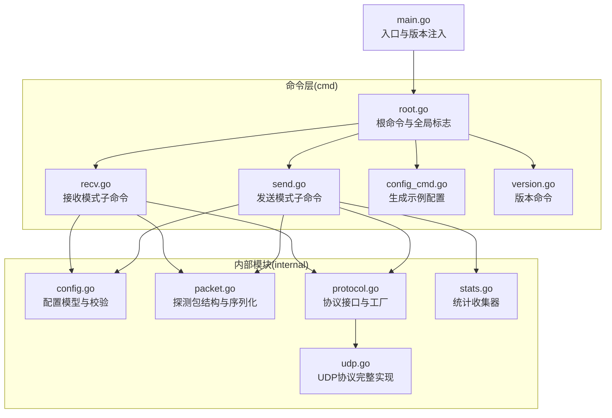
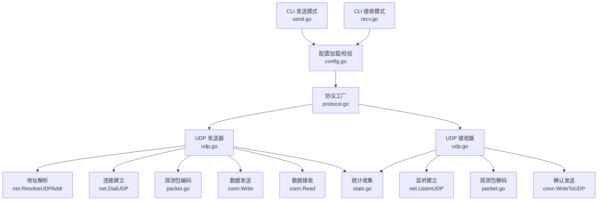
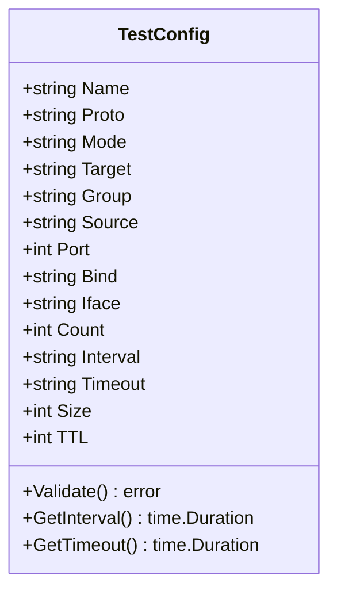
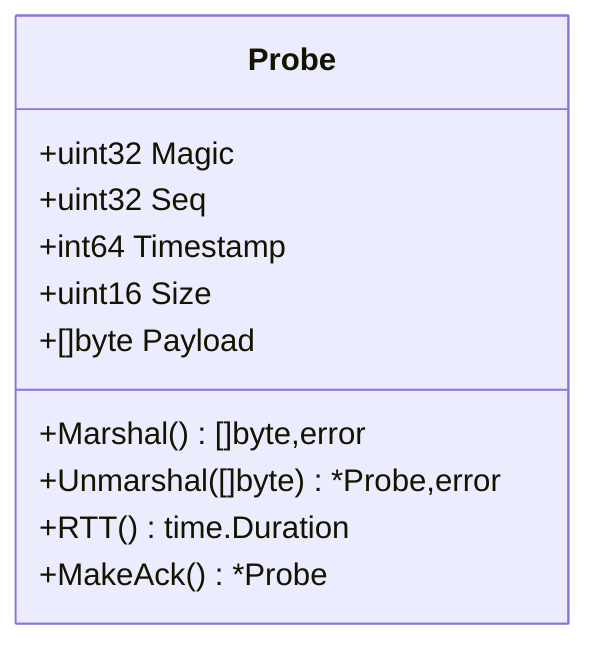
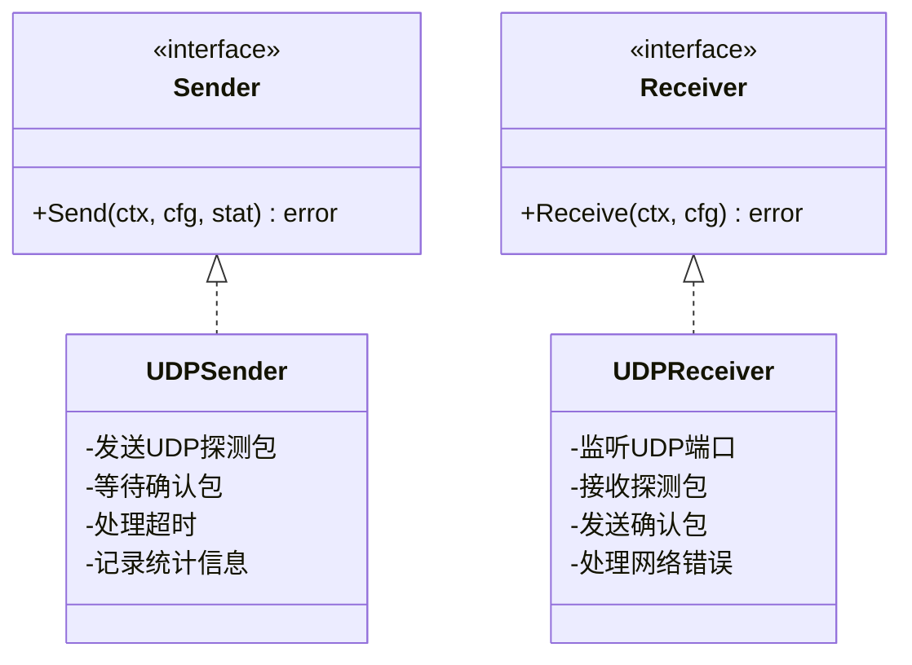
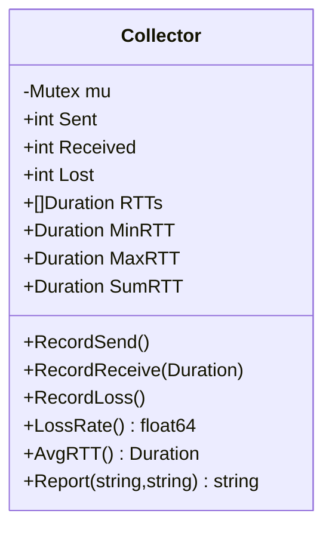
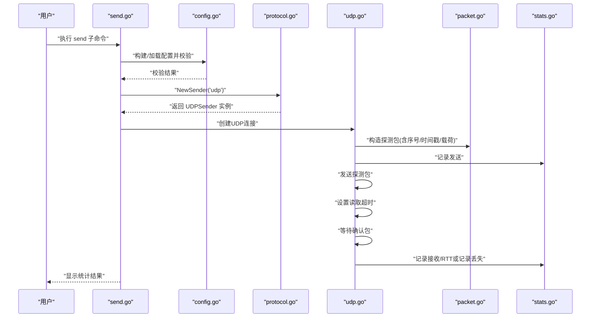
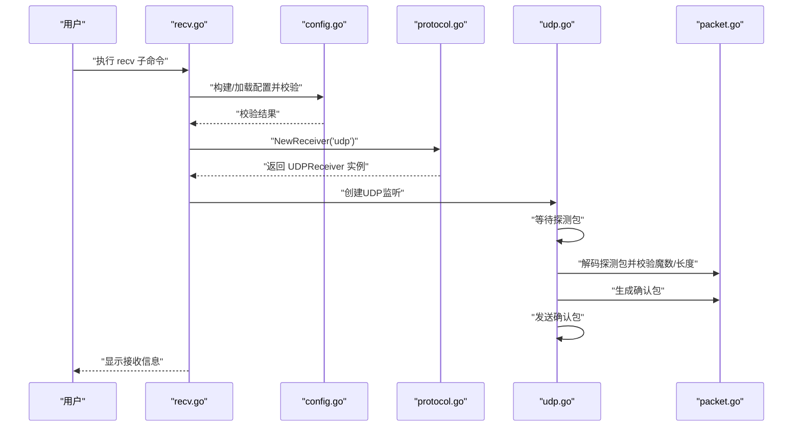
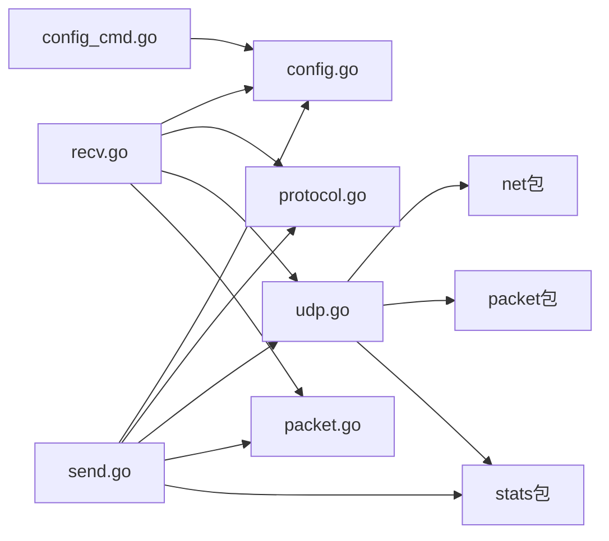

# UDP 协议测试

<cite>
**本文引用的文件**
- [main.go](file://main.go)
- [root.go](file://cmd/root.go)
- [config.go](file://internal/config/config.go)
- [protocol.go](file://internal/proto/protocol.go)
- [udp.go](file://internal/proto/udp.go)
- [packet.go](file://internal/packet/packet.go)
- [stats.go](file://internal/stats/stats.go)
- [send.go](file://cmd/send.go)
- [recv.go](file://cmd/recv.go)
- [config_cmd.go](file://cmd/config_cmd.go)
- [version.go](file://cmd/version.go)
- [go.mod](file://go.mod)
</cite>

## 更新摘要
**变更内容**
- 新增完整的UDP协议实现，包括单向探测、可选确认等待和超时处理
- 更新UDP发送器和接收器的具体实现细节
- 添加UDP协议的实际网络操作和错误处理机制
- 完善UDP测试的配置选项和使用场景

## 目录
1. [简介](#简介)
2. [项目结构](#项目结构)
3. [核心组件](#核心组件)
4. [架构总览](#架构总览)
5. [详细组件分析](#详细组件分析)
6. [依赖分析](#依赖分析)
7. [性能考虑](#性能考虑)
8. [故障排查指南](#故障排查指南)
9. [结论](#结论)
10. [附录](#附录)

## 简介
本文件面向"UDP 协议测试"功能，系统阐述其工作原理与实现机制。基于当前仓库的完整实现，UDP 测试通过命令行子命令以发送/接收两种模式运行，结合统一的配置模型与探测包格式，完成对 UDP 连通性的验证与统计。UDP 协议实现了完整的单向探测机制，包括可选确认等待和超时处理，提供可靠的网络连通性测试能力。同时，文档解释 UDP 的无连接、不可靠、低开销等特性，并提供配置项说明、典型使用场景、性能优化建议与调试技巧。

## 项目结构
项目采用模块化分层组织：
- cmd 层：命令入口与子命令（send/recv/config/version），负责参数解析与流程编排
- internal/config：配置模型与校验逻辑
- internal/packet：探测包结构与序列化/反序列化
- internal/proto：协议抽象与工厂方法（包含完整的 UDP 发送器/接收器实现）
- internal/stats：统计收集与报告
- 根目录：程序入口与版本注入

**图表来源**
- [main.go:1-11](file://main.go#L1-L11)
- [root.go:14-25](file://cmd/root.go#L14-L25)
- [send.go:11-16](file://cmd/send.go#L11-L16)
- [recv.go:11-16](file://cmd/recv.go#L11-L16)
- [config.go:11-27](file://internal/config/config.go#L11-L27)
- [packet.go:17-24](file://internal/packet/packet.go#L17-L24)
- [protocol.go:11-19](file://internal/proto/protocol.go#L11-L19)
- [udp.go:14-19](file://internal/proto/udp.go#L14-L19)
- [stats.go:10-20](file://internal/stats/stats.go#L10-L20)

**章节来源**
- [main.go:1-11](file://main.go#L1-L11)
- [root.go:14-25](file://cmd/root.go#L14-L25)

## 核心组件
- 配置模型与校验：统一的 TestConfig 结构体承载协议、模式、目标、端口、绑定、接口、计数、间隔、超时、包大小、TTL 等字段；提供 Validate 与默认间隔/超时解析
- 探测包格式：固定头部包含魔数、序号、时间戳、载荷长度，支持序列化/反序列化与 RTT 计算
- 协议工厂：按协议类型创建发送/接收器接口实例（UDP 已完全实现）
- UDP 协议实现：完整的发送器和接收器，支持单向探测、确认等待和超时处理
- 统计收集：记录发送/接收/丢包与 RTT 列表，计算最小/最大/平均 RTT 与丢包率
- 命令行：send/recv 子命令解析参数并进行配置校验；config 子命令输出示例配置；version 输出版本

**章节来源**
- [config.go:11-27](file://internal/config/config.go#L11-L27)
- [config.go:49-100](file://internal/config/config.go#L49-L100)
- [packet.go:17-24](file://internal/packet/packet.go#L17-L24)
- [packet.go:42-72](file://internal/packet/packet.go#L42-L72)
- [protocol.go:21-35](file://internal/proto/protocol.go#L21-L35)
- [udp.go:14-107](file://internal/proto/udp.go#L14-L107)
- [stats.go:10-20](file://internal/stats/stats.go#L10-L20)
- [stats.go:58-76](file://internal/stats/stats.go#L58-L76)
- [send.go:21-32](file://cmd/send.go#L21-L32)
- [recv.go:21-27](file://cmd/recv.go#L21-L27)
- [config_cmd.go:22-75](file://cmd/config_cmd.go#L22-L75)

## 架构总览
UDP 测试在命令层与内部模块之间形成清晰边界：命令层负责输入解析与流程控制，内部模块负责协议抽象、数据包格式与统计。发送/接收模式共享同一配置模型与探测包格式，通过协议工厂选择具体实现。UDP 协议实现了完整的网络通信功能，包括地址解析、连接建立、数据传输和错误处理。

**图表来源**
- [send.go:34-91](file://cmd/send.go#L34-L91)
- [recv.go:29-72](file://cmd/recv.go#L29-L72)
- [config.go:49-100](file://internal/config/config.go#L49-L100)
- [protocol.go:21-51](file://internal/proto/protocol.go#L21-L51)
- [udp.go:21-107](file://internal/proto/udp.go#L21-L107)
- [packet.go:42-72](file://internal/packet/packet.go#L42-L72)
- [stats.go:29-49](file://internal/stats/stats.go#L29-L49)

## 详细组件分析

### 配置模型与校验（UDP 关键字段）
- 协议 proto：支持 tcp/udp/multicast/ssm
- 模式 mode：send/recv
- 目标 target：仅 udp/tcp send 必填
- 组 group：仅 multicast/ssm send/recv 必填
- 端口 port：1-65535
- 绑定 bind：本地绑定地址
- 接口 iface：多播时使用
- 计数 count：发送次数（0 表示持续）
- 间隔 interval：发送间隔（支持时长格式）
- 超时 timeout：单包超时（支持时长格式）
- 包大小 size：探测包载荷大小（bytes）
- TTL：TTL（0 自动选择）

**图表来源**
- [config.go:11-27](file://internal/config/config.go#L11-L27)
- [config.go:49-100](file://internal/config/config.go#L49-L100)

**章节来源**
- [config.go:11-27](file://internal/config/config.go#L11-L27)
- [config.go:49-100](file://internal/config/config.go#L49-L100)

### 探测包格式与处理
- 固定头部：魔数、序号、时间戳、载荷长度
- 载荷：按 size 动态填充
- 编码/解码：大端序二进制序列化/反序列化
- RTT 计算：基于发送时间戳
- 确认包：保留原始序号与时间戳，载荷为空

**图表来源**
- [packet.go:17-24](file://internal/packet/packet.go#L17-L24)
- [packet.go:42-72](file://internal/packet/packet.go#L42-L72)

**章节来源**
- [packet.go:17-24](file://internal/packet/packet.go#L17-L24)
- [packet.go:42-72](file://internal/packet/packet.go#L42-L72)

### UDP 协议完整实现
- UDPSender：实现单向UDP探测，支持可选确认等待和超时处理
- UDPReceiver：实现UDP接收并自动回复确认包
- 地址解析：使用 net.ResolveUDPAddr 解析目标地址
- 连接管理：使用 net.DialUDP 建立UDP连接
- 数据传输：支持探测包发送和确认包接收
- 错误处理：完善的网络错误捕获和统计记录

**图表来源**
- [protocol.go:11-19](file://internal/proto/protocol.go#L11-L19)
- [protocol.go:21-51](file://internal/proto/protocol.go#L21-L51)
- [udp.go:14-19](file://internal/proto/udp.go#L14-L19)
- [udp.go:21-107](file://internal/proto/udp.go#L21-L107)

**章节来源**
- [protocol.go:21-51](file://internal/proto/protocol.go#L21-L51)
- [udp.go:14-19](file://internal/proto/udp.go#L14-L19)
- [udp.go:21-107](file://internal/proto/udp.go#L21-L107)

### 统计收集器
- 记录发送/接收/丢包
- 维护 RTT 列表，计算最小/最大/平均 RTT
- 生成统计报告字符串

**图表来源**
- [stats.go:10-20](file://internal/stats/stats.go#L10-L20)
- [stats.go:58-76](file://internal/stats/stats.go#L58-L76)
- [stats.go:78-93](file://internal/stats/stats.go#L78-L93)

**章节来源**
- [stats.go:10-20](file://internal/stats/stats.go#L10-L20)
- [stats.go:58-76](file://internal/stats/stats.go#L58-L76)
- [stats.go:78-93](file://internal/stats/stats.go#L78-L93)

### UDP 发送模式完整流程

**图表来源**
- [send.go:34-91](file://cmd/send.go#L34-L91)
- [config.go:49-100](file://internal/config/config.go#L49-L100)
- [protocol.go:21-35](file://internal/proto/protocol.go#L21-L35)
- [udp.go:21-107](file://internal/proto/udp.go#L21-L107)
- [packet.go:26-40](file://internal/packet/packet.go#L26-L40)
- [stats.go:29-34](file://internal/stats/stats.go#L29-L34)

### UDP 接收模式完整流程

**图表来源**
- [recv.go:29-72](file://cmd/recv.go#L29-L72)
- [config.go:49-100](file://internal/config/config.go#L49-L100)
- [protocol.go:37-51](file://internal/proto/protocol.go#L37-L51)
- [udp.go:109-164](file://internal/proto/udp.go#L109-L164)
- [packet.go:53-72](file://internal/packet/packet.go#L53-L72)

### UDP 配置选项详解
- 协议 proto：udp
- 模式 mode：send 或 recv
- 目标 target：udp/tcp send 必填
- 端口 port：必填（1-65535）
- 绑定 bind：本地绑定地址（默认 0.0.0.0）
- 接口 iface：多播时使用
- 计数 count：发送次数（0 表示持续）
- 间隔 interval：发送间隔（支持时长格式，默认 1s）
- 超时 timeout：单包超时（支持时长格式，默认 3s）
- 包大小 size：探测包载荷大小（bytes，默认 64）
- TTL：TTL（0 自动选择：unicast=64, multicast=16）

**章节来源**
- [send.go:21-32](file://cmd/send.go#L21-L32)
- [recv.go:21-27](file://cmd/recv.go#L21-L27)
- [config.go:11-27](file://internal/config/config.go#L11-L27)
- [config.go:62-65](file://internal/config/config.go#L62-L65)

### 使用场景与配置示例
- 无连接通信测试（点对点 UDP）
  - 发送端：proto=udp, mode=send, target=远端IP, port=远端端口, size=64, timeout=3s
  - 接收端：proto=udp, mode=recv, port=监听端口
- 广播/多播测试（组播）
  - 接收端：proto=multicast, mode=recv, group=多播组, port=端口, iface=网卡
  - 发送端：proto=multicast, mode=send, group=多播组, port=端口, iface=网卡, count=20
- SSM（源特定组播）测试
  - 接收端：proto=ssm, mode=recv, group=组播组, source=源地址, port=端口, iface=网卡

示例配置片段路径
- [config_cmd.go:22-75](file://cmd/config_cmd.go#L22-L75)

**章节来源**
- [config_cmd.go:22-75](file://cmd/config_cmd.go#L22-L75)

### UDP 协议特点
- 无连接：无需握手建立连接，直接发送/接收
- 不可靠：不保证到达、顺序与去重
- 低开销：无连接状态维护，报头更短
- 单向探测：支持单向网络连通性测试
- 可选确认：支持确认包机制，提高测试准确性
- 超时处理：内置超时机制，避免无限等待
- 适用场景：实时性要求高、可容忍少量丢包的应用（如音视频、监控）

## 依赖分析
- 外部依赖：Cobra/Viper/YAML 等，用于命令行与配置管理
- 内部耦合：命令层依赖配置与协议工厂；协议工厂依赖配置与统计；探测包与统计被发送/接收流程复用
- 网络依赖：标准库 net 包用于UDP网络操作

**图表来源**
- [send.go:34-91](file://cmd/send.go#L34-L91)
- [recv.go:29-72](file://cmd/recv.go#L29-L72)
- [config.go:49-100](file://internal/config/config.go#L49-L100)
- [protocol.go:21-51](file://internal/proto/protocol.go#L21-L51)
- [udp.go:21-107](file://internal/proto/udp.go#L21-L107)
- [packet.go:42-72](file://internal/packet/packet.go#L42-L72)
- [stats.go:29-49](file://internal/stats/stats.go#L29-L49)
- [config_cmd.go:22-75](file://cmd/config_cmd.go#L22-L75)

**章节来源**
- [go.mod:5-24](file://go.mod#L5-L24)

## 性能考虑
- 包大小 size：增大载荷会增加网络与 CPU 开销，需权衡吞吐与延迟
- 间隔 interval：过短会导致 CPU/带宽压力增大，过长影响检测灵敏度
- 计数 count：持续发送会占用资源，建议按场景设定上限
- TTL：合理设置可避免不必要的路由跳数
- 超时 timeout：过短可能导致误判，过长影响响应速度
- 统计开销：RTT 计算与数组追加应避免在高频路径中产生阻塞
- 并发安全：统计收集器使用互斥锁保护，避免并发访问冲突

## 故障排查指南
- 配置校验失败
  - 协议非法：确保 proto 为 tcp/udp/multicast/ssm
  - 模式非法：mode 必须为 send 或 recv
  - 端口越界：port 必须在 1-65535
  - send 必填项缺失：udp/tcp send 需要 target；multicast/ssm send 需要 group
  - recv 必填项缺失：multicast/ssm recv 需要 group
  - 时间格式错误：interval/timeout 必须是合法时长格式
- 探测包异常
  - 魔数不匹配：检查发送/接收两端探测包格式是否一致
  - 数据过短：确认包头长度与载荷长度计算正确
- 网络问题
  - 地址解析失败：检查目标地址格式和DNS解析
  - 连接建立失败：确认端口可用性和防火墙设置
  - 读取超时：调整timeout参数或检查网络质量
  - 绑定/接口：确认 bind 与 iface 配置正确
  - 多播：确认组播路由与 IGMP 配置
- UDP 特定问题
  - 无确认包：检查接收端是否正常运行
  - 丢包过多：检查网络质量，调整timeout和interval
  - RTT异常：确认系统时间同步和时钟精度
- 版本与输出
  - 使用 version 命令核对版本
  - 使用 config 子命令生成示例配置进行对照

**章节来源**
- [config.go:49-100](file://internal/config/config.go#L49-L100)
- [packet.go:53-72](file://internal/packet/packet.go#L53-L72)
- [version.go:9-19](file://cmd/version.go#L9-L19)
- [config_cmd.go:22-75](file://cmd/config_cmd.go#L22-L75)

## 结论
本项目为 UDP 协议测试提供了完整的实现，包括单向探测、可选确认等待和超时处理机制。UDP 发送器和接收器实现了完整的网络通信功能，支持地址解析、连接管理和数据传输。探测包格式与统计模块完善，协议工厂预留了扩展空间。UDP 协议的实现遵循了无连接、不可靠、低开销的特性，同时提供了可靠的网络连通性测试能力。用户可以通过简单的命令行参数配置，快速完成UDP网络测试任务。

## 附录
- 命令行参考
  - 发送模式：send 子命令，支持 proto/target/group/port/bind/iface/count/interval/timeout/size/ttl
  - 接收模式：recv 子命令，支持 proto/bind/port/group/source/iface
  - 生成示例配置：config 子命令，输出 tests 数组示例
  - 版本：version 子命令，打印版本信息
- 参考实现路径
  - 发送流程：[send.go:34-91](file://cmd/send.go#L34-L91)
  - 接收流程：[recv.go:29-72](file://cmd/recv.go#L29-L72)
  - 配置模型与校验：[config.go:11-100](file://internal/config/config.go#L11-L100)
  - 探测包格式：[packet.go:17-88](file://internal/packet/packet.go#L17-L88)
  - 协议工厂：[protocol.go:21-51](file://internal/proto/protocol.go#L21-L51)
  - UDP 实现：[udp.go:14-164](file://internal/proto/udp.go#L14-L164)
  - 统计收集：[stats.go:10-110](file://internal/stats/stats.go#L10-L110)