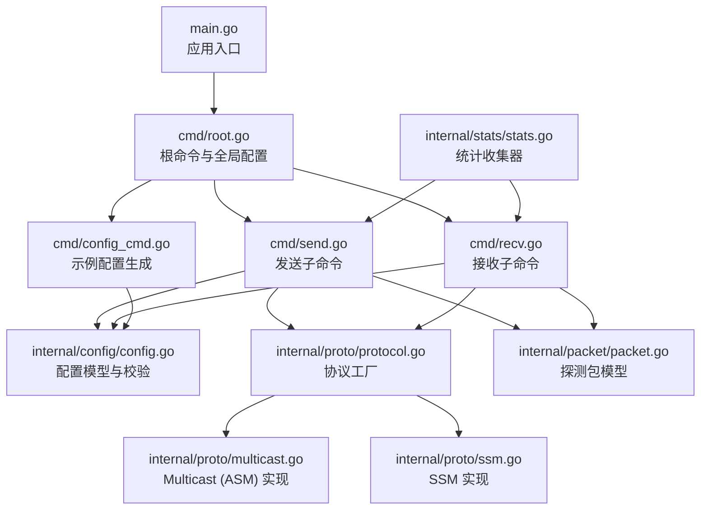
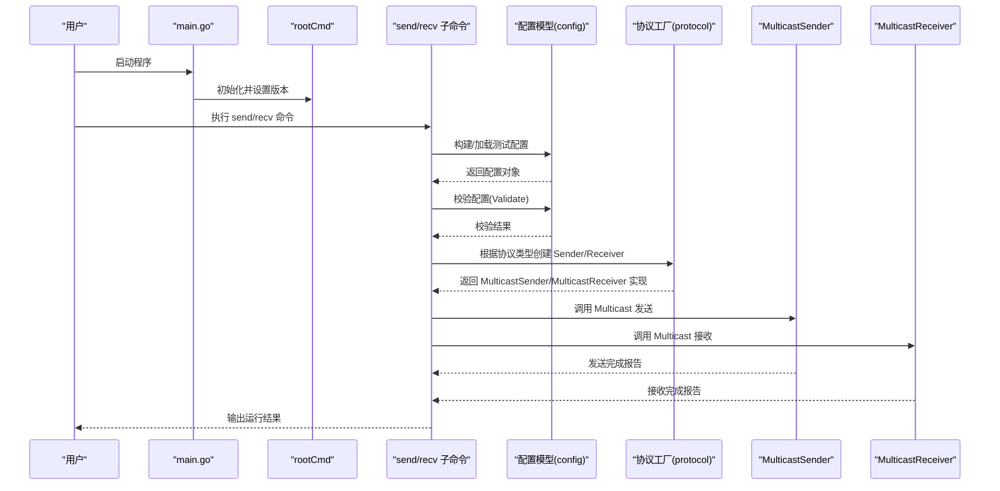
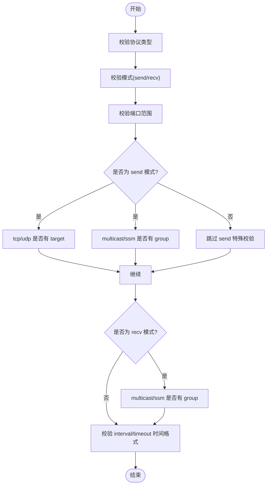
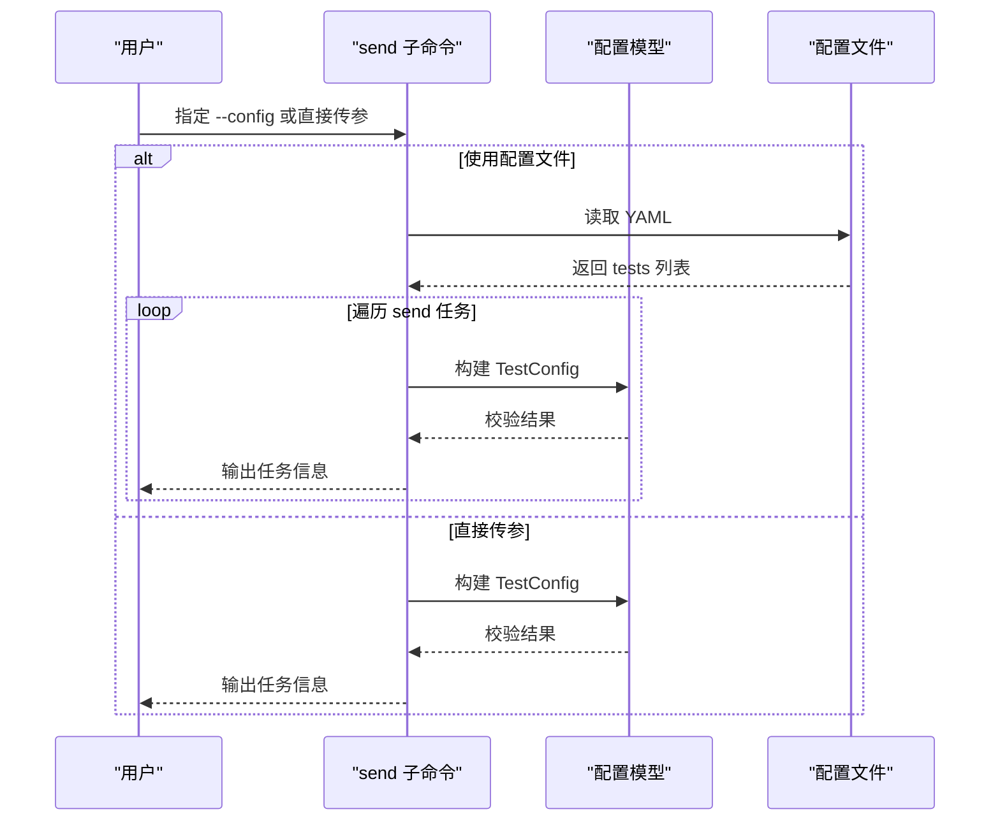
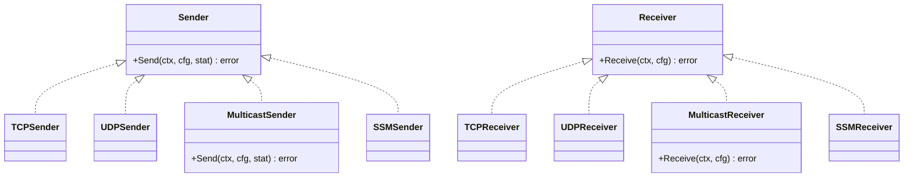
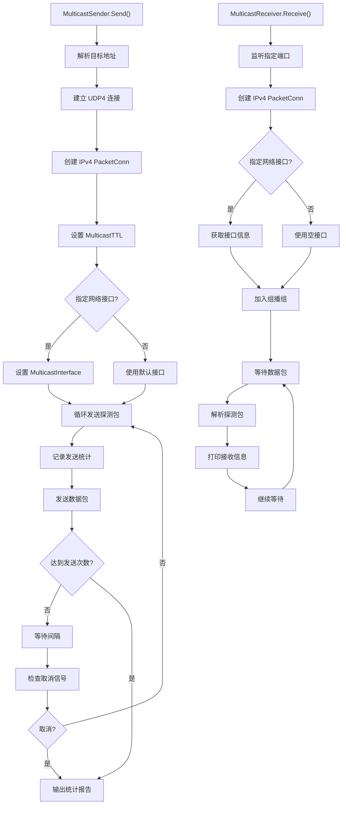
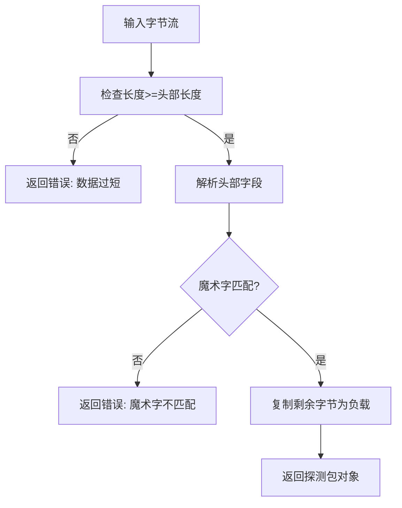
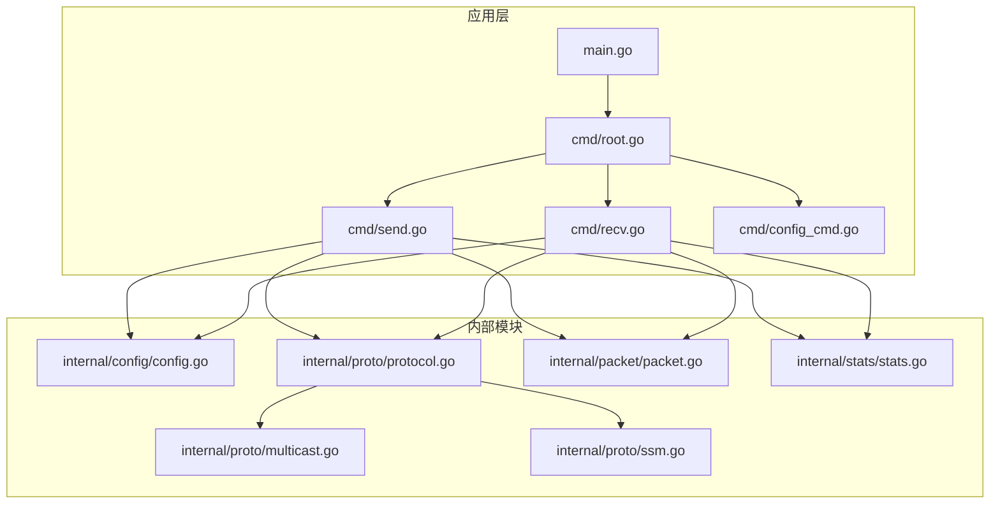

# 组播协议测试

<cite>
**本文档引用的文件**
- [main.go](file://main.go)
- [root.go](file://cmd/root.go)
- [send.go](file://cmd/send.go)
- [recv.go](file://cmd/recv.go)
- [config_cmd.go](file://cmd/config_cmd.go)
- [config.go](file://internal/config/config.go)
- [protocol.go](file://internal/proto/protocol.go)
- [multicast.go](file://internal/proto/multicast.go)
- [ssm.go](file://internal/proto/ssm.go)
- [packet.go](file://internal/packet/packet.go)
- [stats.go](file://internal/stats/stats.go)
- [go.mod](file://go.mod)
</cite>

## 更新摘要
**变更内容**
- 新增完整的 Multicast (ASM) 协议实现，包括发送端和接收端
- 添加组播管理和 TTL 设置功能
- 更新协议工厂以支持 MulticastSender 和 MulticastReceiver
- 完善组播测试的网络实现细节

## 目录
1. [简介](#简介)
2. [项目结构](#项目结构)
3. [核心组件](#核心组件)
4. [架构总览](#架构总览)
5. [详细组件分析](#详细组件分析)
6. [依赖关系分析](#依赖关系分析)
7. [性能考虑](#性能考虑)
8. [故障排除指南](#故障排除指南)
9. [结论](#结论)
10. [附录](#附录)

## 简介
本文件面向使用 ping-x 进行组播协议测试的用户与开发者，系统性阐述组播测试的配置选项、工作原理与使用方法。**最新版本已实现完整的 Multicast (ASM) 协议功能**，包括组播发送、接收、TTL 设置和网络接口管理。本文将基于现有代码，提供可操作的配置说明、典型使用场景与网络环境建议，帮助您正确配置和使用组播测试功能。

## 项目结构
项目采用模块化分层设计：
- 应用入口与命令行：main.go 负责版本注入与启动；cmd 包下的 root、send、recv、config_cmd 提供 CLI 子命令与参数解析。
- 配置模型：internal/config 定义测试配置结构与校验逻辑。
- 协议实现：internal/proto 包含完整的 Multicast (ASM) 和 SSM 协议实现，以及协议工厂。
- 数据包模型：internal/packet 定义探测包结构与序列化/反序列化能力。
- 统计收集：internal/stats 提供发送接收统计与报告功能。
- 依赖管理：go.mod 描述外部依赖，包括 Cobra（CLI）、Viper（配置）、golang.org/x/net（网络扩展）与 YAML 解析等。

**图表来源**
- [main.go:1-11](file://main.go#L1-L11)
- [root.go:15-25](file://cmd/root.go#L15-L25)
- [send.go:11-32](file://cmd/send.go#L11-L32)
- [recv.go:11-27](file://cmd/recv.go#L11-L27)
- [config_cmd.go:10-20](file://cmd/config_cmd.go#L10-L20)
- [config.go:11-27](file://internal/config/config.go#L11-L27)
- [protocol.go:21-51](file://internal/proto/protocol.go#L21-L51)
- [multicast.go:16-156](file://internal/proto/multicast.go#L16-L156)
- [ssm.go:16-166](file://internal/proto/ssm.go#L16-L166)
- [packet.go:53-88](file://internal/packet/packet.go#L53-L88)
- [stats.go:10-110](file://internal/stats/stats.go#L10-L110)

**章节来源**
- [main.go:1-11](file://main.go#L1-L11)
- [root.go:15-25](file://cmd/root.go#L15-L25)
- [send.go:11-32](file://cmd/send.go#L11-L32)
- [recv.go:11-27](file://cmd/recv.go#L11-L27)
- [config_cmd.go:10-20](file://cmd/config_cmd.go#L10-L20)
- [config.go:11-27](file://internal/config/config.go#L11-L27)
- [protocol.go:21-51](file://internal/proto/protocol.go#L21-L51)
- [multicast.go:16-156](file://internal/proto/multicast.go#L16-L156)
- [ssm.go:16-166](file://internal/proto/ssm.go#L16-L166)
- [packet.go:53-88](file://internal/packet/packet.go#L53-L88)
- [stats.go:10-110](file://internal/stats/stats.go#L10-L110)

## 核心组件
- 测试配置模型（TestConfig）：统一承载协议类型、模式（send/recv）、目标地址、组播组、源地址、端口、绑定地址、网络接口、发送次数、间隔、超时、包大小、TTL 等字段。
- 配置校验（Validate）：确保协议合法、模式合法、端口有效、send/recv 模式下必要字段齐全（如 multicast/ssm 需要 group，tcp/udp send 需要 target），并校验时间格式。
- 协议工厂（NewSender/NewReceiver）：按协议类型返回对应的 Sender/Receiver 实现，**现已完整支持 tcp、udp、multicast、ssm**。
- **Multicast (ASM) 实现**：完整的组播发送和接收功能，支持 TTL 设置、网络接口选择和组播组加入/离开。
- CLI 子命令：
  - send：支持通过命令行参数或配置文件批量运行 send 模式的测试任务。
  - recv：支持通过命令行参数或配置文件批量运行 recv 模式的测试任务。
  - config：生成示例 YAML 配置文件，包含组播与 SSM 的典型配置片段。

**章节来源**
- [config.go:11-27](file://internal/config/config.go#L11-L27)
- [config.go:49-100](file://internal/config/config.go#L49-L100)
- [protocol.go:21-51](file://internal/proto/protocol.go#L21-L51)
- [multicast.go:16-156](file://internal/proto/multicast.go#L16-L156)
- [send.go:11-32](file://cmd/send.go#L11-L32)
- [send.go:34-91](file://cmd/send.go#L34-L91)
- [recv.go:11-27](file://cmd/recv.go#L11-L27)
- [recv.go:29-72](file://cmd/recv.go#L29-L72)
- [config_cmd.go:22-85](file://cmd/config_cmd.go#L22-L85)

## 架构总览
下图展示从命令行到配置模型与协议工厂的整体流程，以及**已实现的 Multicast (ASM) 组件映射**。

**图表来源**
- [main.go:7-10](file://main.go#L7-L10)
- [root.go:15-25](file://cmd/root.go#L15-L25)
- [send.go:34-91](file://cmd/send.go#L34-L91)
- [recv.go:29-72](file://cmd/recv.go#L29-L72)
- [config.go:49-100](file://internal/config/config.go#L49-L100)
- [protocol.go:21-51](file://internal/proto/protocol.go#L21-L51)
- [multicast.go:22-156](file://internal/proto/multicast.go#L22-L156)

## 详细组件分析

### 组件一：测试配置模型与校验
- 字段覆盖：协议类型、模式、目标、组播组、源、端口、绑定地址、网络接口、计数、间隔、超时、包大小、TTL。
- 校验规则：
  - 协议必须为 tcp、udp、multicast 或 ssm。
  - 模式必须为 send 或 recv。
  - 端口范围 1-65535。
  - send 模式下：
    - tcp/udp 需要 target。
    - multicast/ssm 需要 group。
  - recv 模式下：
    - multicast/ssm 需要 group。
  - 间隔与超时需能解析为时间格式。

**图表来源**
- [config.go:49-100](file://internal/config/config.go#L49-L100)

**章节来源**
- [config.go:11-27](file://internal/config/config.go#L11-L27)
- [config.go:49-100](file://internal/config/config.go#L49-L100)

### 组件二：命令行参数与配置文件驱动
- send 子命令：
  - 支持通过命令行参数直接运行，或通过配置文件批量运行 send 任务。
  - **新增**：--ttl 参数用于设置组播 TTL 值，默认为 16。
  - 关键参数：proto、target、group、port、bind、iface、count、interval、timeout、size、ttl。
- recv 子命令：
  - 支持通过命令行参数直接运行，或通过配置文件批量运行 recv 任务。
  - 关键参数：proto、bind、port、group、source、iface。
- config 子命令：
  - 生成包含组播与 SSM 示例的 YAML 配置文件，便于快速上手。

**图表来源**
- [send.go:34-91](file://cmd/send.go#L34-L91)
- [config_cmd.go:22-85](file://cmd/config_cmd.go#L22-L85)
- [config.go:34-47](file://internal/config/config.go#L34-L47)

**章节来源**
- [send.go:11-32](file://cmd/send.go#L11-L32)
- [send.go:34-91](file://cmd/send.go#L34-L91)
- [recv.go:11-27](file://cmd/recv.go#L11-L27)
- [recv.go:29-72](file://cmd/recv.go#L29-L72)
- [config_cmd.go:22-85](file://cmd/config_cmd.go#L22-L85)
- [config.go:34-47](file://internal/config/config.go#L34-L47)

### 组件三：协议工厂与实现
- 工厂函数根据协议字符串返回对应 Sender/Receiver 实现：
  - tcp：TCPSender
  - udp：UDPSender
  - **multicast：MulticastSender**（**已完整实现**）
  - ssm：SSMSender
- **MulticastSender/MulticastReceiver**：完整的组播协议实现，支持 TTL 设置、网络接口选择和组播组管理。

**图表来源**
- [protocol.go:11-51](file://internal/proto/protocol.go#L11-L51)
- [multicast.go:16-21](file://internal/proto/multicast.go#L16-L21)

**章节来源**
- [protocol.go:21-51](file://internal/proto/protocol.go#L21-L51)
- [multicast.go:16-21](file://internal/proto/multicast.go#L16-L21)

### 组件四：Multicast (ASM) 协议实现
**新增**：完整的 Multicast (ASM) 协议实现，包括发送端和接收端功能。

#### MulticastSender 发送端实现
- **TTL 设置**：支持通过配置参数设置组播 TTL，若未设置则默认为 16
- **网络接口管理**：可选择指定的网络接口进行组播发送
- **组播发送**：使用 UDP4 连接向指定组播组发送探测包
- **统计收集**：记录发送状态并生成统计报告

#### MulticastReceiver 接收端实现
- **组播组加入**：加入指定的组播组，支持指定网络接口
- **组播组离开**：在任务结束时正确离开组播组
- **数据包处理**：接收并解析组播数据包，打印接收信息
- **上下文管理**：支持优雅关闭和信号处理

**图表来源**
- [multicast.go:22-102](file://internal/proto/multicast.go#L22-L102)
- [multicast.go:104-156](file://internal/proto/multicast.go#L104-L156)

**章节来源**
- [multicast.go:16-156](file://internal/proto/multicast.go#L16-L156)

### 组件五：数据包模型（探测包）
- 探测包包含魔术字、序号、时间戳、负载长度与可选负载。
- 反序列化时校验魔术字，计算 RTT 并支持生成确认包。

**图表来源**
- [packet.go:53-88](file://internal/packet/packet.go#L53-L88)

**章节来源**
- [packet.go:53-88](file://internal/packet/packet.go#L53-L88)

### 组件六：统计收集器
- **发送统计**：记录发送次数、接收次数、丢包数量
- **RTT 统计**：收集往返时间，计算最小、最大、平均值
- **报告生成**：格式化输出统计报告，包含丢包率和 RTT 信息

**章节来源**
- [stats.go:10-110](file://internal/stats/stats.go#L10-L110)

## 依赖关系分析
- 外部依赖主要通过 Cobra（命令行框架）、Viper（配置管理）、golang.org/x/net（网络扩展）与 YAML 解析库组成。
- **新增**：golang.org/x/net/ipv4 用于组播协议的底层网络操作。
- 项目模块与依赖关系如下：

**图表来源**
- [main.go:1-11](file://main.go#L1-L11)
- [root.go:15-25](file://cmd/root.go#L15-L25)
- [send.go:11-32](file://cmd/send.go#L11-L32)
- [recv.go:11-27](file://cmd/recv.go#L11-L27)
- [config_cmd.go:10-20](file://cmd/config_cmd.go#L10-L20)
- [config.go:11-27](file://internal/config/config.go#L11-L27)
- [protocol.go:21-51](file://internal/proto/protocol.go#L21-L51)
- [multicast.go:16-156](file://internal/proto/multicast.go#L16-L156)
- [ssm.go:16-166](file://internal/proto/ssm.go#L16-L166)
- [packet.go:53-88](file://internal/packet/packet.go#L53-L88)
- [stats.go:10-110](file://internal/stats/stats.go#L10-L110)

**章节来源**
- [go.mod:1-28](file://go.mod#L1-L28)

## 性能考虑
- **TTL 设置**：**Multicast (ASM) 实现**支持 TTL 设置，默认值为 16，可控制组播数据包在网络中的转发范围。
- **发送频率与超时**：通过 interval 与 timeout 控制发送节奏与等待确认的时间窗口，避免过度占用带宽或产生过多丢包。
- **包大小**：size 参数影响 MTU 与链路拥塞情况，建议结合网络环境调整。
- **并发与资源**：在大规模组播测试中，注意系统文件描述符与网络缓冲区限制。
- **网络接口选择**：通过 iface 参数选择特定网络接口，避免不必要的网络流量。

## 故障排除指南
- 配置校验失败：
  - 协议非法：确保 proto 为 tcp、udp、multicast 或 ssm。
  - 模式非法：确保 mode 为 send 或 recv。
  - 端口无效：确保 port 在 1-65535 范围内。
  - send 模式缺少必要字段：tcp/udp 需要 target；multicast/ssm 需要 group。
  - recv 模式缺少必要字段：multicast/ssm 需要 group。
  - 时间格式错误：interval 与 timeout 需符合 Go 的 duration 格式。
- **Multicast (ASM) 相关问题**：
  - **TTL 设置无效**：确认 TTL 值大于 0，否则使用默认值 16。
  - **网络接口不可用**：检查 iface 参数是否为有效的网络接口名称。
  - **组播组加入失败**：确认网络设备支持 IGMP，检查组播地址格式。
  - **权限问题**：某些系统可能需要管理员权限才能进行组播操作。
- 组播不可达：
  - 确认网络设备支持 IGMP 与组播转发。
  - 检查路由器/交换机是否启用组播路由与 IGMP Snooping。
  - 防火墙策略允许相应端口与组播地址的流量。
  - 确保 iface 指定正确的网络接口名称。
- SSM 场景：
  - 确保 source 参数正确指向源地址。
  - 验证组播组与源的对应关系满足 SSM 规则。

**章节来源**
- [config.go:49-100](file://internal/config/config.go#L49-L100)
- [multicast.go:39-52](file://internal/proto/multicast.go#L39-L52)
- [multicast.go:121-125](file://internal/proto/multicast.go#L121-L125)
- [send.go:68-85](file://cmd/send.go#L68-L85)
- [recv.go:55-67](file://cmd/recv.go#L55-L67)

## 结论
**最新版本已实现完整的 Multicast (ASM) 协议功能**，包括组播发送、接收、TTL 设置和网络接口管理。本仓库提供了组播测试的命令行接口、配置模型与协议实现层，能够通过命令行或配置文件驱动 send/recv 任务。MulticastSender 和 MulticastReceiver 实现了完整的组播协议栈，支持 TTL 设置、网络接口选择和组播组管理。建议在使用前先参考"附录"的配置示例与网络环境要求，确保组播通信的正确性与稳定性。

## 附录

### A. 组播协议基础与概念
- **组播地址范围**：224.0.0.0 至 239.255.255.255，其中 224.0.0.0/24 为链路本地组播地址，常用于协议通告。
- **D 类地址**：IP 地址分类中，D 类用于组播，其前四位为 1110。
- **路由器与组播**：路由器通过 IGMP（Internet Group Management Protocol）与上游路由器交换组播路由信息，实现跨网段转发。
- **网络拓扑要求**：需要支持 IGMP 的交换机与启用组播路由的路由器，确保组播报文能在不同网段间转发。
- **ASM vs SSM**：
  - **ASM (Any Source Multicast)**：任何源都可以向组播组发送数据
  - **SSM (Source Specific Multicast)**：只接受指定源的数据

### B. 配置选项详解
- **协议类型（proto）**：tcp、udp、multicast、ssm。
- **模式（mode）**：send（发送）、recv（接收）。
- **目标（target）**：tcp/udp send 模式必填。
- **组播组（group）**：multicast/ssm send/recv 模式必填。
- **源（source）**：ssm recv 模式必填。
- **端口（port）**：必填，1-65535。
- **绑定地址（bind）**：send/recv 均可使用，默认 0.0.0.0。
- **网络接口（iface）**：多播时可指定接口名。
- **计数（count）**：发送次数，0 表示持续发送。
- **间隔（interval）**：发送间隔，支持 Go duration 格式。
- **超时（timeout）**：单包超时时间，支持 Go duration 格式。
- **包大小（size）**：探测包大小（字节）。
- **TTL**：**Multicast (ASM) 实现**支持 TTL 设置，默认值为 16。

**章节来源**
- [send.go:21-38](file://cmd/send.go#L21-L38)
- [recv.go:21-32](file://cmd/recv.go#L21-L32)
- [config.go:11-27](file://internal/config/config.go#L11-L27)

### C. 使用场景与配置示例
- **本地网络组播测试**：
  - 发送端：配置 proto=multicast、mode=send、group=239.x.x.x、port=9002、iface=eth0、count=20、ttl=16。
  - 接收端：配置 proto=multicast、mode=recv、group=239.x.x.x、port=9002、iface=eth0。
- **跨网段组播通信验证**：
  - 确保路由器启用组播路由与 IGMP Snooping。
  - 在不同网段分别部署发送端与接收端，使用相同 group 与 port。
  - **TTL 设置**：根据网络拓扑设置合适的 TTL 值，控制组播数据包的转发范围。
- **SSM 场景**：
  - 接收端：配置 proto=ssm、mode=recv、group=232.x.x.x、source=源地址、port=9003、iface=eth0。
  - 发送端：配置 proto=ssm、mode=send、group=232.x.x.x、port=9003、iface=eth0、bind=源地址、count=20。

**示例配置文件**可通过 config 子命令生成，包含上述典型场景的片段。

**章节来源**
- [config_cmd.go:22-85](file://cmd/config_cmd.go#L22-L85)

### D. 网络配置与防火墙建议
- **路由器/交换机**：
  - 启用 IGMP Snooping，确保组播流量仅在需要的端口转发。
  - 配置组播路由协议（如 PIM），保证跨网段转发。
  - **TTL 配置**：根据网络拓扑设置合适的 TTL 值，控制组播数据包的传播范围。
- **防火墙**：
  - 开放相应端口与组播地址范围的入站/出站规则。
  - 对于 SSM，确保源地址与组播组的对应关系被允许。
- **主机侧**：
  - 确认网络接口名称与 IP 地址配置正确。
  - **TTL 设置**：合理设置 TTL 值以控制组播数据包的转发范围。
  - **权限要求**：确保应用程序具有进行组播操作所需的系统权限。

### E. Multicast (ASM) 实现特性
- **完整的组播协议栈**：支持组播发送和接收的完整生命周期管理。
- **TTL 管理**：支持动态设置组播 TTL，控制数据包在网络中的传播范围。
- **网络接口选择**：可选择特定网络接口进行组播通信，提高网络效率。
- **组播组管理**：自动处理组播组的加入和离开，确保资源正确释放。
- **统计报告**：提供详细的发送接收统计信息，包括丢包率和 RTT 分析。
- **上下文管理**：支持优雅关闭和信号处理，确保资源正确清理。

**章节来源**
- [multicast.go:16-156](file://internal/proto/multicast.go#L16-L156)
- [stats.go:78-93](file://internal/stats/stats.go#L78-L93)