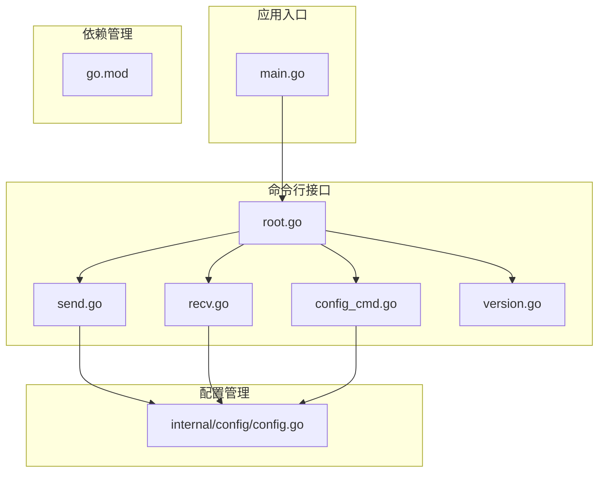
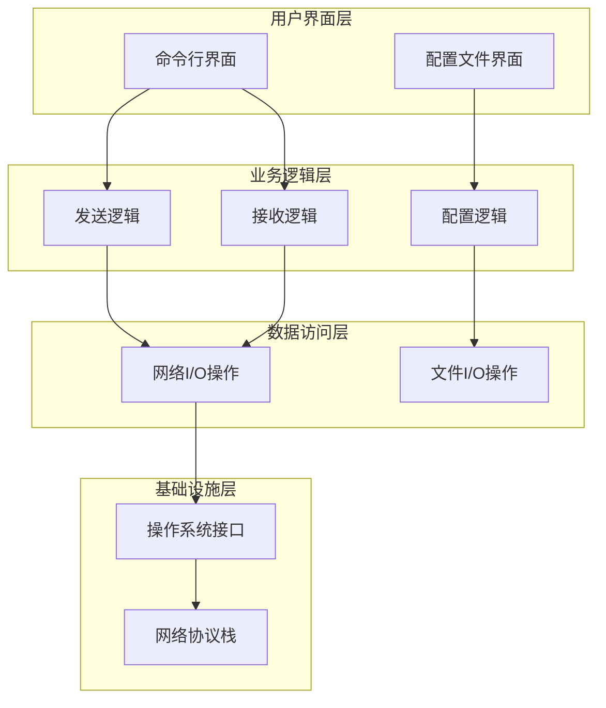
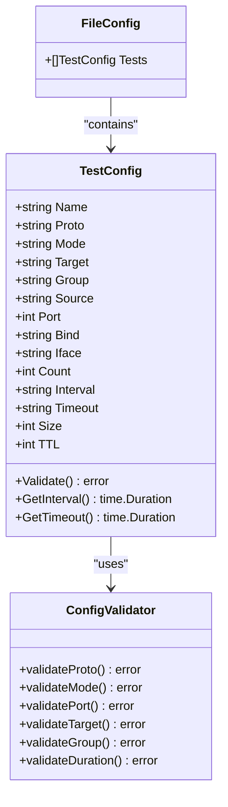
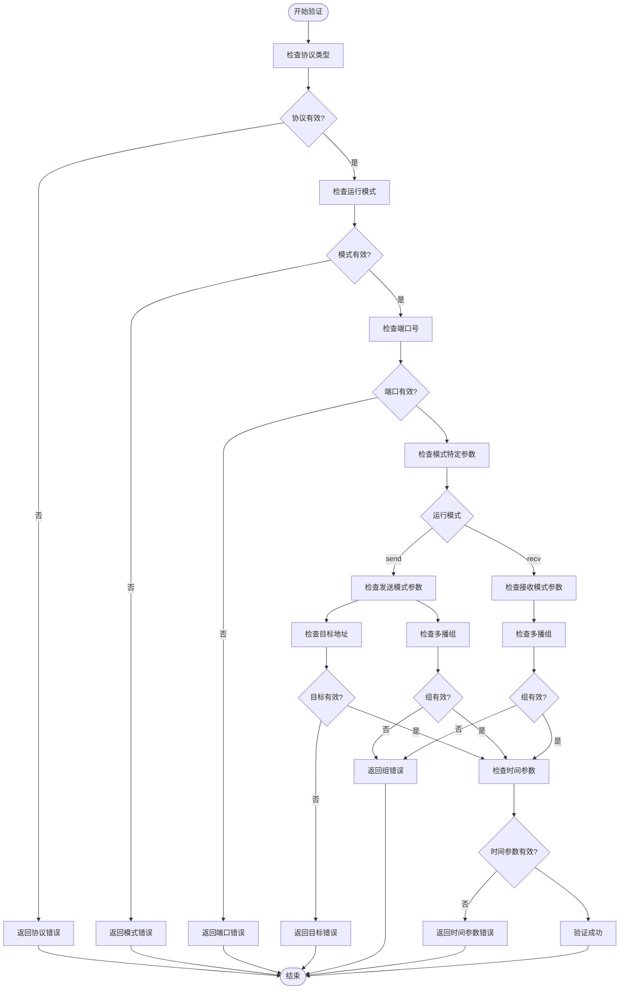
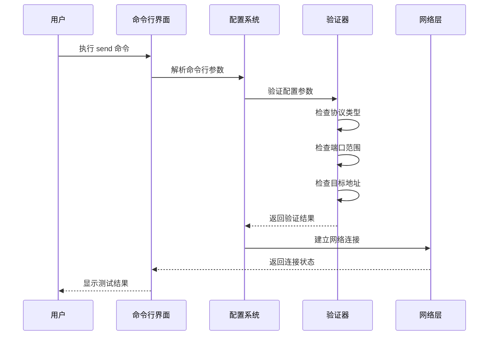
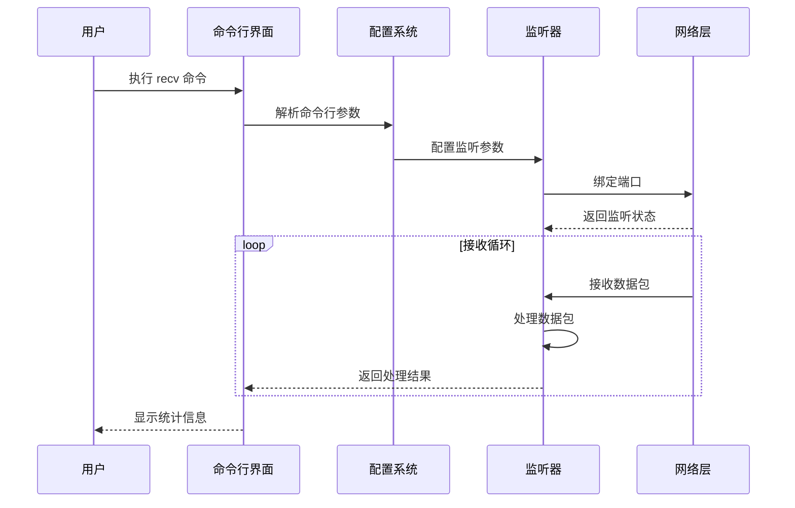
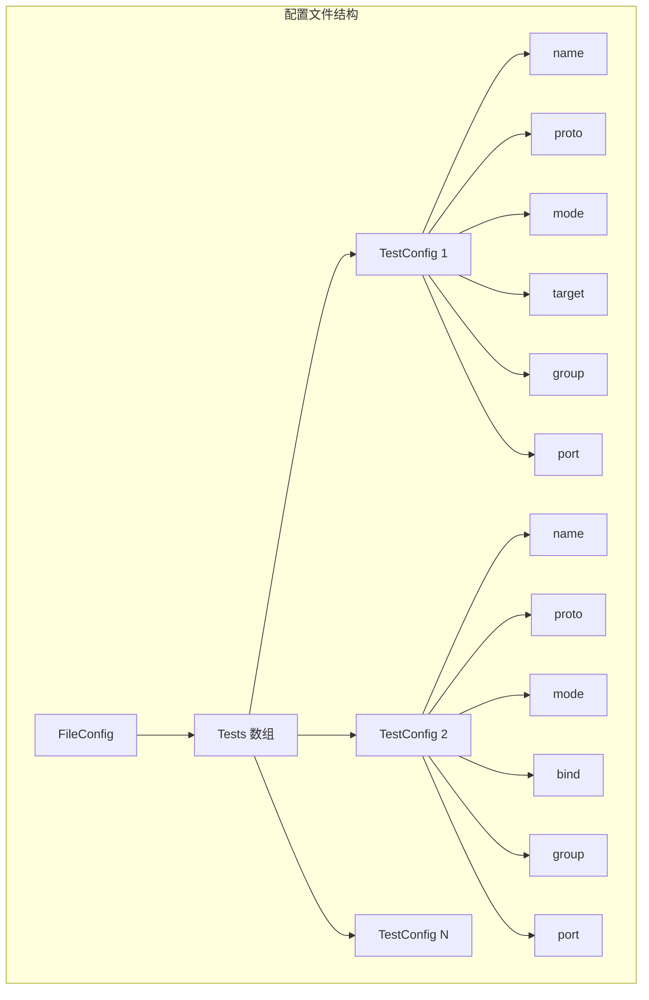

# 网络协议支持

<cite>
**本文档引用的文件**
- [main.go](file://main.go)
- [cmd/root.go](file://cmd/root.go)
- [cmd/send.go](file://cmd/send.go)
- [cmd/recv.go](file://cmd/recv.go)
- [cmd/config_cmd.go](file://cmd/config_cmd.go)
- [cmd/version.go](file://cmd/version.go)
- [internal/config/config.go](file://internal/config/config.go)
- [go.mod](file://go.mod)
</cite>

## 目录
1. [简介](#简介)
2. [项目结构](#项目结构)
3. [核心组件](#核心组件)
4. [架构概览](#架构概览)
5. [详细组件分析](#详细组件分析)
6. [协议实现规划](#协议实现规划)
7. [配置系统](#配置系统)
8. [性能考虑](#性能考虑)
9. [故障排除指南](#故障排除指南)
10. [结论](#结论)

## 简介

Ping-X 是一个跨平台网络协议联通检测工具，支持 TCP、UDP、组播（Multicast）和 SSM（Source-Specific Multicast）等多种协议的连通性测试。该项目采用模块化设计，通过命令行界面提供灵活的网络测试能力，特别适用于网络工程师进行各种网络协议的诊断和验证。

## 项目结构

项目采用清晰的分层架构，主要包含以下核心模块：

**图表来源**
- [main.go:1-11](file://main.go#L1-L11)
- [cmd/root.go:1-54](file://cmd/root.go#L1-L54)
- [internal/config/config.go:1-125](file://internal/config/config.go#L1-L125)

**章节来源**
- [main.go:1-11](file://main.go#L1-L11)
- [go.mod:1-25](file://go.mod#L1-L25)

## 核心组件

### 应用入口点
主程序负责初始化版本信息并启动命令行界面。采用简洁的设计模式，确保应用程序能够正确启动并处理用户输入。

### 命令行框架
基于 Cobra 库构建的命令行界面，提供了清晰的子命令结构：
- `send`: 发送模式，用于向目标发送探测包
- `recv`: 接收模式，用于监听和响应探测包
- `config`: 生成示例配置文件
- `version`: 显示版本信息

### 配置管理系统
实现了完整的配置文件解析和验证机制，支持 YAML 格式的配置文件，提供灵活的测试参数配置。

**章节来源**
- [cmd/root.go:14-54](file://cmd/root.go#L14-L54)
- [internal/config/config.go:11-32](file://internal/config/config.go#L11-L32)

## 架构概览

Ping-X 采用了分层架构设计，确保了良好的可维护性和扩展性：

**图表来源**
- [cmd/send.go:11-91](file://cmd/send.go#L11-L91)
- [cmd/recv.go:11-72](file://cmd/recv.go#L11-L72)
- [internal/config/config.go:34-47](file://internal/config/config.go#L34-L47)

## 详细组件分析

### 配置模型设计

配置系统采用了结构化的数据模型设计，支持多种网络协议的参数配置：

**图表来源**
- [internal/config/config.go:11-27](file://internal/config/config.go#L11-L27)
- [internal/config/config.go:49-100](file://internal/config/config.go#L49-L100)

#### 协议验证机制

配置验证系统确保了所有网络测试参数的有效性：

**图表来源**
- [internal/config/config.go:50-100](file://internal/config/config.go#L50-L100)

**章节来源**
- [internal/config/config.go:11-125](file://internal/config/config.go#L11-L125)

### 命令行接口设计

#### 发送模式命令

发送模式命令提供了丰富的网络测试参数配置：

**图表来源**
- [cmd/send.go:34-91](file://cmd/send.go#L34-L91)
- [internal/config/config.go:50-100](file://internal/config/config.go#L50-L100)

#### 接收模式命令

接收模式命令专注于监听和响应网络探测包：

**图表来源**
- [cmd/recv.go:29-72](file://cmd/recv.go#L29-L72)

**章节来源**
- [cmd/send.go:11-91](file://cmd/send.go#L11-L91)
- [cmd/recv.go:11-72](file://cmd/recv.go#L11-L72)

## 协议实现规划

### TCP 协议支持

TCP 协议作为最常用的传输层协议，具有可靠的连接特性：

#### 技术特点
- 面向连接的可靠传输
- 提供流量控制和拥塞控制
- 支持全双工通信
- 有序的数据传输保证

#### 适用场景
- 关键业务系统的连通性测试
- 需要可靠数据传输的应用
- 对延迟敏感但要求准确性的场景

#### 配置要点
- 端口必须在 1-65535 范围内
- 目标地址必须可达
- 可配置超时时间和重试次数

### UDP 协议支持

UDP 协议提供无连接的快速传输服务：

#### 技术特点
- 无连接的快速传输
- 不保证数据包的到达顺序
- 无流量控制和拥塞控制
- 低开销的传输协议

#### 适用场景
- 实时音视频传输
- DNS 查询和响应
- 游戏和实时应用
- 大量小数据包传输

#### 配置要点
- 端口配置与 TCP 相同
- 可配置探测包大小
- 支持持续发送模式

### 组播（Multicast）协议支持

组播协议支持一对多的高效数据传输：

#### 技术特点
- 一对多的高效传输
- 减少网络带宽消耗
- 支持动态组成员管理
- 基于 IP 地址的组管理

#### 适用场景
- 流媒体广播
- 在线会议系统
- 股票价格推送
- 网络公告系统

#### 配置要点
- 组播地址范围：224.0.0.0 - 239.255.255.255
- 需要指定网络接口
- 支持 TTL 控制传播范围

### SSM（Source-Specific Multicast）协议支持

SSM 协议提供更精确的组播控制：

#### 技术特点
- 基于源地址的组播
- 更好的安全性
- 精确的组播树控制
- 支持源过滤

#### 适用场景
- 安全的流媒体传输
- 受限访问的内容分发
- 企业内部的精确广播

#### 配置要点
- 需要指定源地址
- 组播地址格式：232.0.0.0 - 232.255.255.255
- 源地址必须与组播地址匹配

## 配置系统

### YAML 配置文件结构

配置文件采用 YAML 格式，提供了清晰的层次化配置：

**图表来源**
- [internal/config/config.go:29-32](file://internal/config/config.go#L29-L32)
- [internal/config/config.go:11-27](file://internal/config/config.go#L11-L27)

### 配置参数详解

#### 基本参数
- `name`: 测试任务名称，用于标识不同的测试配置
- `proto`: 协议类型，支持 tcp、udp、multicast、ssm
- `mode`: 运行模式，send 或 recv

#### 目标参数
- `target`: TCP/UDP 目标地址
- `group`: 组播组地址
- `source`: SSM 源地址

#### 网络参数
- `port`: 目标端口（1-65535）
- `bind`: 本地绑定地址
- `iface`: 网络接口名称

#### 行为参数
- `count`: 发送次数（0 表示持续发送）
- `interval`: 发送间隔时间
- `timeout`: 单包超时时间
- `size`: 探测包大小（字节）
- `ttl`: TTL 值（0 表示自动选择）

**章节来源**
- [internal/config/config.go:11-27](file://internal/config/config.go#L11-L27)
- [cmd/config_cmd.go:22-85](file://cmd/config_cmd.go#L22-L85)

## 性能考虑

### 内存管理
- 配置对象采用结构体设计，内存占用最小化
- 时间参数解析采用延迟计算策略
- 错误处理避免不必要的内存分配

### 网络性能优化
- 支持批量发送模式减少系统调用开销
- 可配置的超时机制避免长时间阻塞
- 灵活的 TTL 设置优化网络传播

### 并发处理
- 建议在生产环境中使用独立的发送和接收进程
- 避免在同一进程中同时进行大量并发测试
- 合理设置超时时间防止资源泄露

## 故障排除指南

### 常见配置错误

#### 协议类型错误
**问题**: 指定了不支持的协议类型
**解决方案**: 确保 proto 参数为 tcp、udp、multicast 或 ssm

#### 端口范围错误
**问题**: 端口号超出有效范围
**解决方案**: 端口必须在 1-65535 范围内

#### 参数缺失错误
**问题**: 发送模式缺少必要参数
**解决方案**: 
- TCP/UDP 发送模式需要 target 参数
- 组播/SSM 发送模式需要 group 参数

### 网络连接问题

#### 目标不可达
**症状**: 连接超时或拒绝连接
**排查步骤**:
1. 验证目标地址可达性
2. 检查防火墙设置
3. 确认端口开放状态

#### 组播配置问题
**症状**: 组播包无法接收
**排查步骤**:
1. 验证组播地址格式
2. 检查网络接口配置
3. 确认 IGMP 服务状态

### 性能问题

#### 高 CPU 使用率
**原因**: 过高的发送频率或过短的超时时间
**解决方案**: 调整 interval 和 timeout 参数

#### 内存泄漏
**原因**: 长时间运行的持续发送模式
**解决方案**: 定期重启或限制发送次数

**章节来源**
- [internal/config/config.go:50-100](file://internal/config/config.go#L50-L100)

## 结论

Ping-X 项目为网络工程师提供了一个功能强大且灵活的网络协议测试工具。通过模块化的架构设计和完善的配置系统，该工具能够满足各种网络测试需求。

### 主要优势
- 支持多种主流网络协议
- 灵活的配置选项
- 清晰的命令行界面
- 可扩展的架构设计

### 发展方向
- 完成各协议的具体实现
- 增加更多的网络测试功能
- 提供图形化界面支持
- 扩展到更多网络设备

### 最佳实践建议
- 根据具体应用场景选择合适的协议
- 合理配置测试参数避免对生产环境造成影响
- 定期更新和维护测试配置
- 建立完整的测试报告和分析体系

通过遵循本文档提供的指导原则和最佳实践，网络工程师可以有效地使用 Ping-X 工具进行各种网络协议的测试和验证工作。