# 配置文件指南

<cite>
**本文档引用的文件**
- [main.go](file://main.go)
- [cmd/root.go](file://cmd/root.go)
- [cmd/send.go](file://cmd/send.go)
- [cmd/recv.go](file://cmd/recv.go)
- [cmd/config_cmd.go](file://cmd/config_cmd.go)
- [internal/config/config.go](file://internal/config/config.go)
- [internal/proto/protocol.go](file://internal/proto/protocol.go)
- [internal/proto/tcp.go](file://internal/proto/tcp.go)
- [internal/proto/udp.go](file://internal/proto/udp.go)
- [internal/proto/multicast.go](file://internal/proto/multicast.go)
- [internal/proto/ssm.go](file://internal/proto/ssm.go)
- [go.mod](file://go.mod)
</cite>

## 更新摘要
**变更内容**
- 新增完整的YAML配置文件支持和解析机制
- 添加多测试定义功能，支持在一个文件中配置多个测试任务
- 完善配置字段验证规则和错误处理
- 更新配置加载顺序和优先级规则
- 增强配置验证的最佳实践和常见错误排查指南

## 目录
1. [简介](#简介)
2. [项目结构](#项目结构)
3. [核心组件](#核心组件)
4. [架构概览](#架构概览)
5. [详细组件分析](#详细组件分析)
6. [配置文件结构与语法](#配置文件结构与语法)
7. [配置字段完整说明](#配置字段完整说明)
8. [协议测试配置示例](#协议测试配置示例)
9. [配置加载顺序与优先级](#配置加载顺序与优先级)
10. [配置验证规则](#配置验证规则)
11. [最佳实践与常见错误排查](#最佳实践与常见错误排查)
12. [复杂配置场景案例](#复杂配置场景案例)
13. [性能考虑](#性能考虑)
14. [故障排除指南](#故障排除指南)
15. [结论](#结论)

## 简介

Ping-X 是一个跨平台网络协议联通检测工具，支持 TCP、UDP、组播（Multicast）和 SSM（Source Specific Multicast）等多种协议的连通性测试。本指南专注于配置文件的完整使用方法，包括 YAML 配置文件的结构、语法规则、字段说明、验证规则以及各种网络协议测试的配置示例。

**更新** 配置系统现已完全支持YAML格式配置文件，允许在一个文件中定义多个测试任务，提供更灵活的配置管理方式。

## 项目结构

Ping-X 项目采用模块化设计，主要包含以下核心目录和文件：

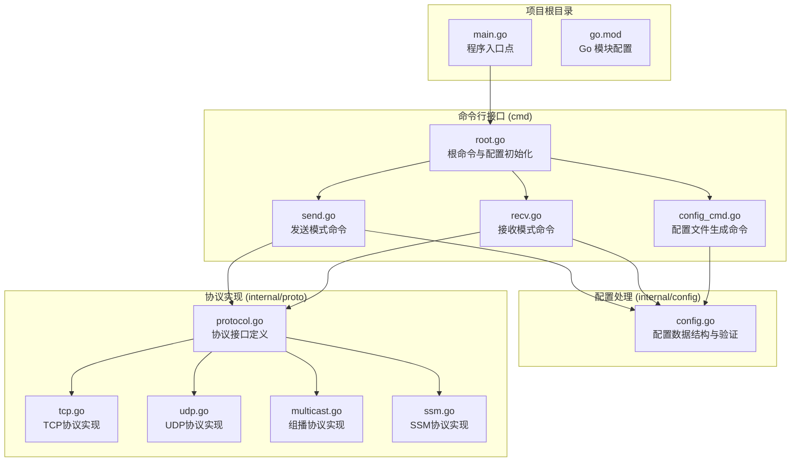

**图表来源**
- [main.go:1-11](file://main.go#L1-L11)
- [cmd/root.go:1-54](file://cmd/root.go#L1-L54)
- [cmd/send.go:1-124](file://cmd/send.go#L1-L124)
- [cmd/recv.go:1-104](file://cmd/recv.go#L1-L104)
- [cmd/config_cmd.go:1-101](file://cmd/config_cmd.go#L1-L101)
- [internal/config/config.go:1-125](file://internal/config/config.go#L1-L125)
- [internal/proto/protocol.go:1-52](file://internal/proto/protocol.go#L1-L52)

**章节来源**
- [main.go:1-11](file://main.go#L1-L11)
- [go.mod:1-28](file://go.mod#L1-L28)

## 核心组件

Ping-X 的配置系统由以下几个核心组件构成：

### 数据结构组件
- **TestConfig**: 单个测试配置的数据结构，支持YAML标签映射
- **FileConfig**: 整个配置文件的数据结构，包含多个测试配置
- **配置验证器**: 对配置进行完整性检查和协议特定验证

### 命令行组件
- **send 命令**: 发送模式的命令行接口，支持从配置文件批量执行
- **recv 命令**: 接收模式的命令行接口，支持从配置文件批量执行
- **config 命令**: 配置文件生成工具，提供完整的示例配置

### 配置管理组件
- **配置加载器**: 从 YAML 文件读取配置，支持文件路径参数
- **配置验证器**: 验证配置的有效性，包含协议和模式特定检查
- **配置解析器**: 解析命令行参数为配置对象

**更新** 新增了完整的YAML配置文件支持，包括多测试定义和字段验证机制。

**章节来源**
- [internal/config/config.go:11-32](file://internal/config/config.go#L11-L32)
- [cmd/send.go:17-38](file://cmd/send.go#L17-L38)
- [cmd/recv.go:16-32](file://cmd/recv.go#L16-L32)

## 架构概览

Ping-X 的配置系统采用分层架构设计，实现了清晰的职责分离：

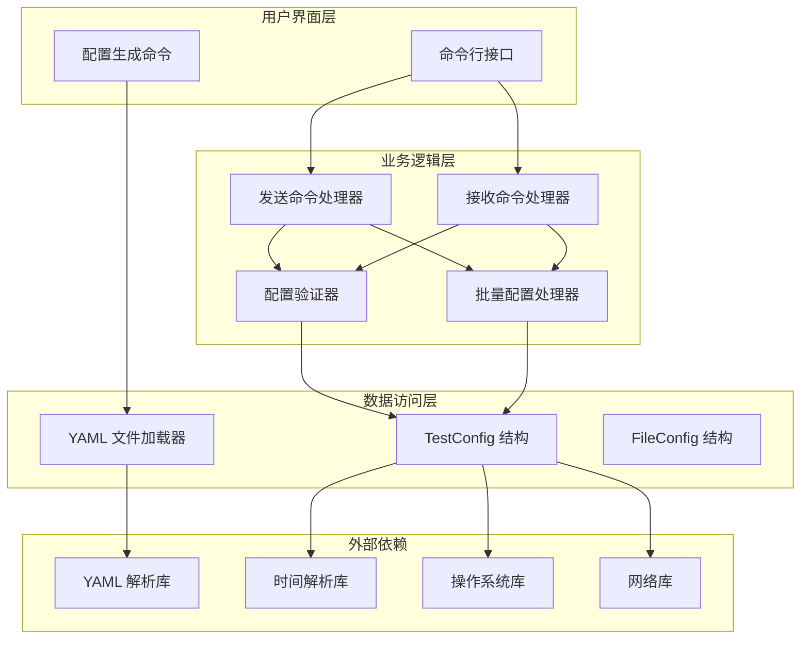

**图表来源**
- [cmd/root.go:32-53](file://cmd/root.go#L32-L53)
- [internal/config/config.go:34-47](file://internal/config/config.go#L34-L47)
- [internal/config/config.go:49-100](file://internal/config/config.go#L49-L100)
- [cmd/send.go:40-74](file://cmd/send.go#L40-L74)
- [cmd/recv.go:34-66](file://cmd/recv.go#L34-L66)

## 详细组件分析

### TestConfig 类分析

TestConfig 是配置系统的核心数据结构，定义了单个网络测试的所有参数：

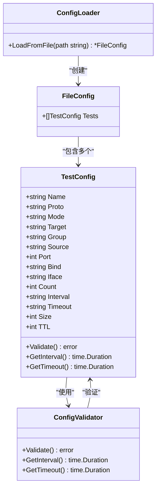

**图表来源**
- [internal/config/config.go:11-32](file://internal/config/config.go#L11-L32)
- [internal/config/config.go:34-47](file://internal/config/config.go#L34-L47)
- [internal/config/config.go:49-124](file://internal/config/config.go#L49-L124)

### 配置验证流程

配置验证是确保网络测试正确性的关键步骤：

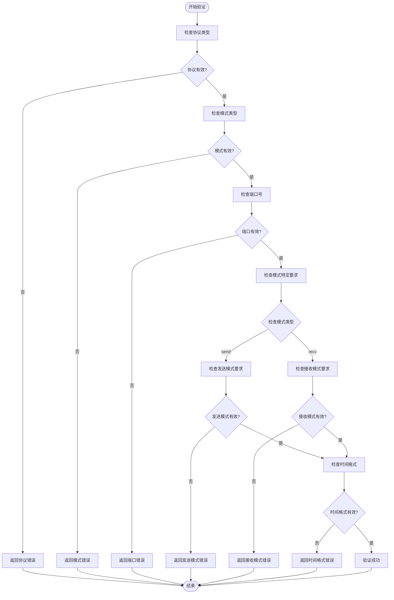

**更新** 配置验证现在支持YAML配置文件中的多测试定义，每个测试都会经过完整的验证流程。

**图表来源**
- [internal/config/config.go:49-100](file://internal/config/config.go#L49-L100)

**章节来源**
- [internal/config/config.go:11-125](file://internal/config/config.go#L11-L125)

## 配置文件结构与语法

Ping-X 使用 YAML 格式作为配置文件的标准格式。YAML 配置文件具有以下基本结构特点：

### 基本语法特性
- **缩进敏感**: 使用空格进行层级缩进
- **键值对**: 使用冒号分隔键和值
- **数组**: 使用短横线表示列表项
- **注释**: 使用井号开头的注释行
- **数据类型**: 支持字符串、整数、布尔值等基本类型

### 文件结构层次
配置文件采用分层结构，顶层包含 `tests` 数组，每个测试项定义一个独立的网络测试任务：

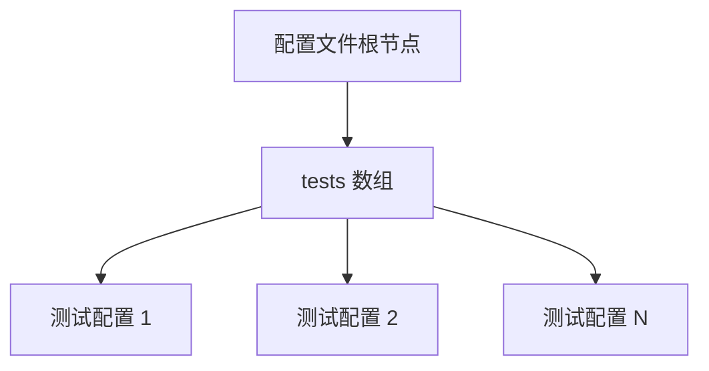

**更新** 新增了完整的YAML配置文件支持，允许在一个文件中定义多个测试任务，每个任务都有独立的配置参数。

**图表来源**
- [cmd/config_cmd.go:22-85](file://cmd/config_cmd.go#L22-L85)

**章节来源**
- [cmd/config_cmd.go:22-85](file://cmd/config_cmd.go#L22-L85)

## 配置字段完整说明

### 基础字段

| 字段名 | 类型 | 必需 | 默认值 | 描述 |
|--------|------|------|--------|------|
| name | string | 否 | 自动生成 | 测试任务的标识名称 |
| proto | string | 是 | 无 | 协议类型，支持 tcp、udp、multicast、ssm |
| mode | string | 是 | 无 | 运行模式，支持 send、recv |

### 目标连接字段

| 字段名 | 类型 | 必需 | 默认值 | 描述 |
|--------|------|------|--------|------|
| target | string | send 模式必需 | 无 | TCP/UDP 目标主机地址 |
| group | string | 多播/SSM 必需 | 无 | 多播组地址 |
| source | string | SSM 必需 | 无 | SSM 源地址 |
| port | int | 是 | 无 | 目标端口号 (1-65535) |

### 网络接口字段

| 字段名 | 类型 | 必需 | 默认值 | 描述 |
|--------|------|------|--------|------|
| bind | string | 否 | 0.0.0.0 | 本地绑定地址 |
| iface | string | 否 | 自动选择 | 网络接口名称 |

### 测试参数字段

| 字段名 | 类型 | 必需 | 默认值 | 描述 |
|--------|------|------|--------|------|
| count | int | 否 | 0 | 发送/接收次数 (0=无限循环) |
| interval | string | 否 | 1s | 发送间隔时间 (支持 ns、µs、ms、s、m、h) |
| timeout | string | 否 | 3s | 单包超时时间 |
| size | int | 否 | 64 | 探测包大小 (字节) |
| ttl | int | 否 | 自动选择 | TTL 值 (0=自动选择) |

### 字段验证规则

所有配置字段都遵循严格的验证规则以确保网络测试的正确性和安全性：

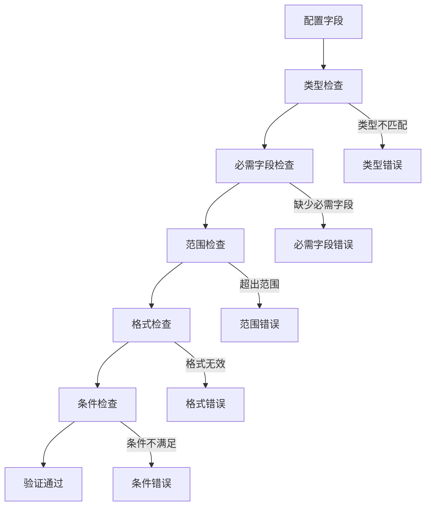

**更新** 配置验证现在支持YAML配置文件中的多测试定义，每个测试都会经过完整的验证流程，包括协议类型、模式类型、端口范围、时间格式等检查。

**图表来源**
- [internal/config/config.go:49-100](file://internal/config/config.go#L49-L100)

**章节来源**
- [internal/config/config.go:11-27](file://internal/config/config.go#L11-L27)
- [internal/config/config.go:49-100](file://internal/config/config.go#L49-L100)

## 协议测试配置示例

### TCP 协议配置

TCP 协议是最常用的网络测试协议，适用于大多数网络连通性测试场景：

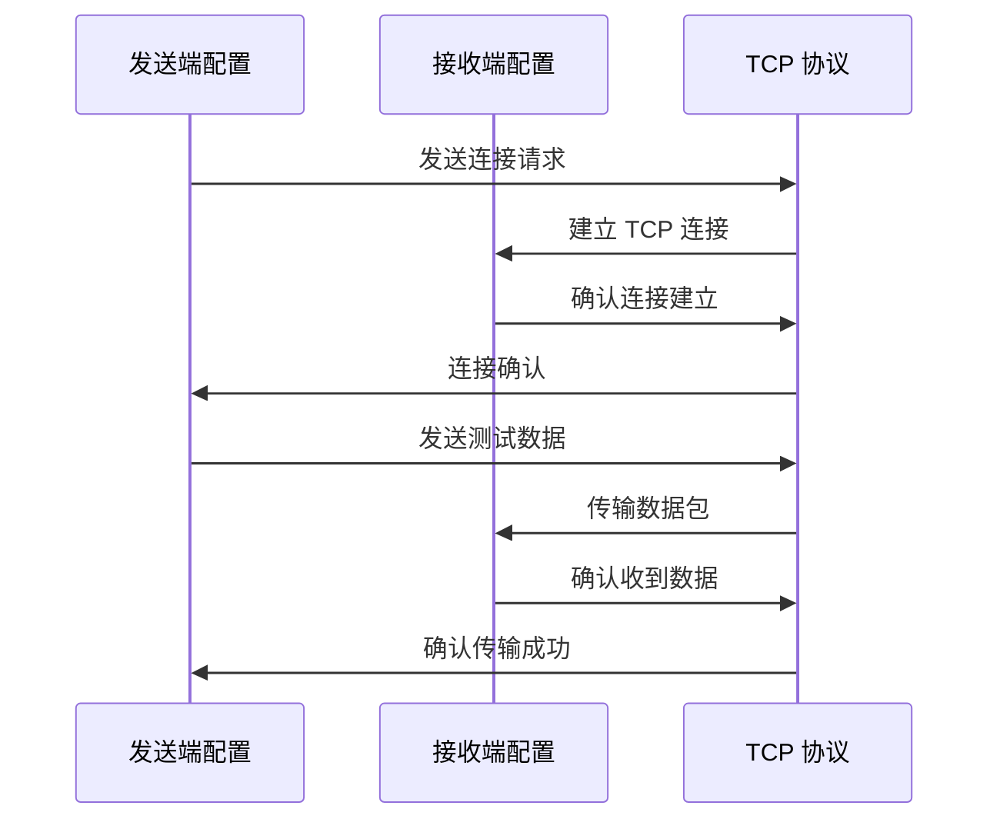

**更新** 新增了完整的YAML配置示例，展示如何在一个配置文件中定义TCP发送和接收测试任务。

**图表来源**
- [cmd/config_cmd.go:26-40](file://cmd/config_cmd.go#L26-L40)

### UDP 协议配置

UDP 协议提供无连接的快速测试能力，适用于实时性要求较高的场景：

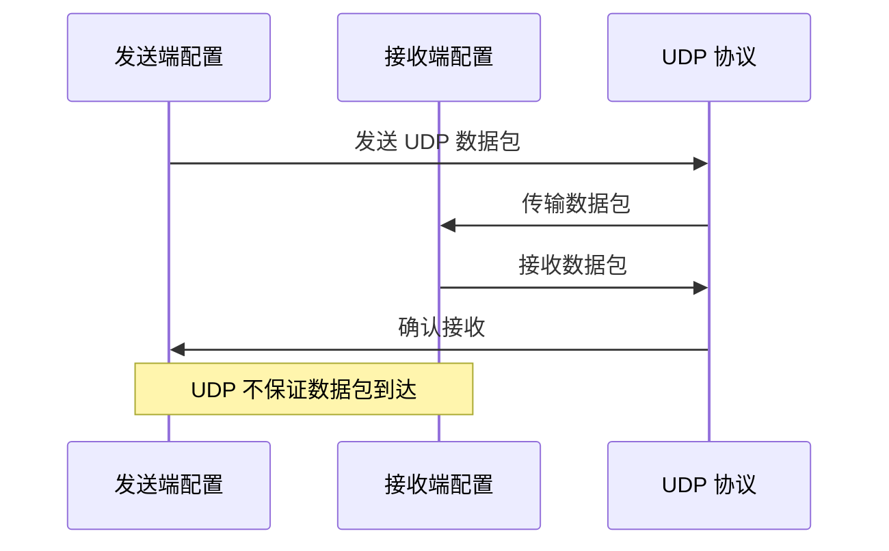

**更新** 新增了UDP协议的YAML配置示例，展示发送和接收模式的完整配置。

**图表来源**
- [cmd/config_cmd.go:41-53](file://cmd/config_cmd.go#L41-L53)

### 组播协议配置

组播协议支持一对多的高效数据传输，适用于多播应用场景：

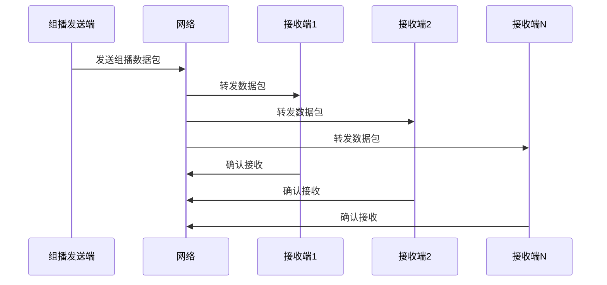

**更新** 新增了组播协议的YAML配置示例，展示ASM（Any Source Multicast）的完整配置。

**图表来源**
- [cmd/config_cmd.go:54-68](file://cmd/config_cmd.go#L54-L68)

### SSM 协议配置

SSM（Source Specific Multicast）提供更精确的组播控制，允许指定源地址：

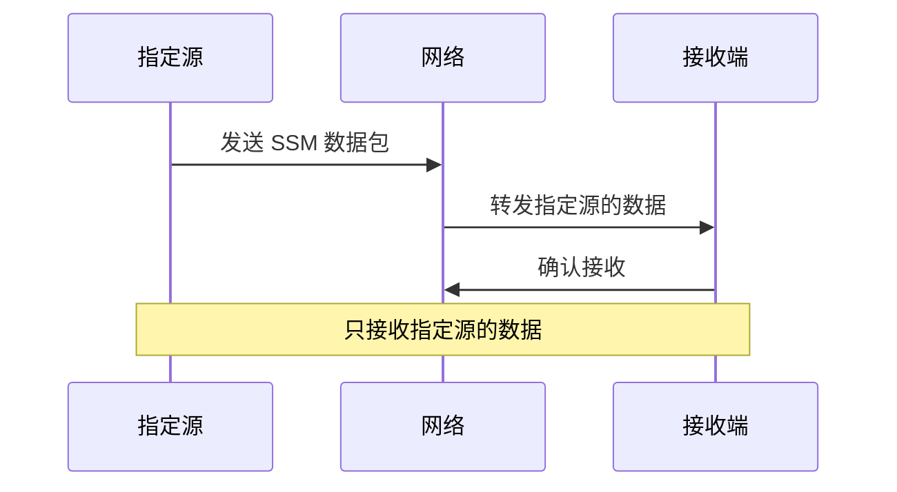

**更新** 新增了SSM协议的YAML配置示例，展示源特定多播的完整配置。

**图表来源**
- [cmd/config_cmd.go:69-85](file://cmd/config_cmd.go#L69-L85)

**章节来源**
- [cmd/config_cmd.go:22-85](file://cmd/config_cmd.go#L22-L85)

## 配置加载顺序与优先级

Ping-X 支持多种配置方式，具有明确的加载顺序和优先级规则：

### 配置加载顺序

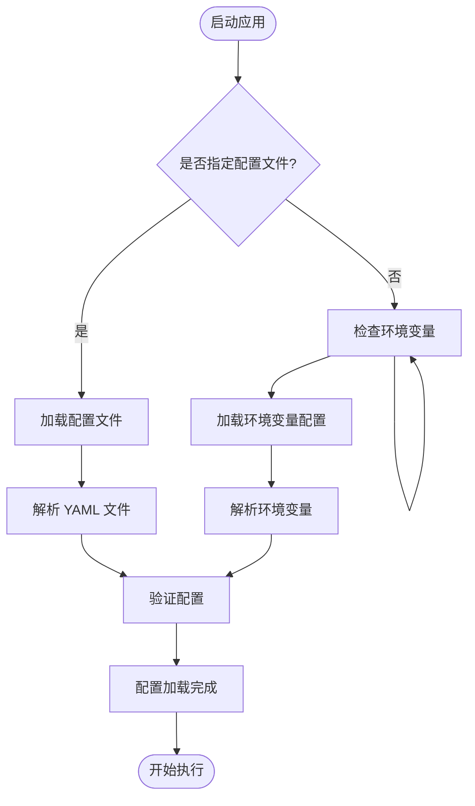

**更新** 新增了完整的YAML配置文件加载流程，支持从配置文件中批量加载多个测试任务。

**图表来源**
- [cmd/root.go:44-53](file://cmd/root.go#L44-L53)

### 优先级规则

1. **命令行参数优先级最高**: 直接指定的命令行参数覆盖其他配置源
2. **配置文件次之**: YAML 文件中的配置覆盖默认值
3. **环境变量最后**: 环境变量中的配置作为后备选项

### 配置合并策略

当存在多个配置源时，Ping-X 采用以下合并策略：

| 配置源 | 覆盖行为 | 适用场景 |
|--------|----------|----------|
| 命令行参数 | 完全覆盖 | 临时测试、调试 |
| 配置文件 | 部分覆盖 | 持久化配置、团队共享 |
| 环境变量 | 默认值提供 | Docker 容器、CI/CD |

**更新** 配置系统现在支持从YAML配置文件中批量加载多个测试任务，每个任务都会独立验证和执行。

**章节来源**
- [cmd/root.go:32-53](file://cmd/root.go#L32-L53)

## 配置验证规则

Ping-X 的配置验证系统确保所有网络测试配置的有效性和安全性：

### 协议验证

支持的协议类型及其验证规则：

| 协议类型 | 必需字段 | 验证规则 |
|----------|----------|----------|
| tcp | target, port | 目标地址必须有效，端口范围 1-65535 |
| udp | target, port | 目标地址必须有效，端口范围 1-65535 |
| multicast | group, port | 多播组地址必须有效，端口范围 1-65535 |
| ssm | group, source, port | SSM 地址组合必须有效，端口范围 1-65535 |

### 模式验证

发送模式和接收模式的不同验证要求：

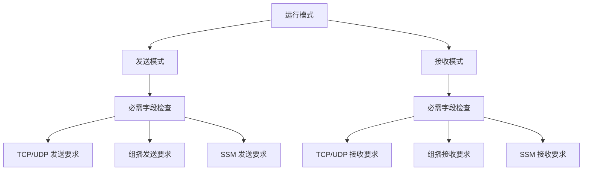

**更新** 配置验证现在支持YAML配置文件中的多测试定义，每个测试都会根据其协议类型和模式进行相应的验证。

**图表来源**
- [internal/config/config.go:49-100](file://internal/config/config.go#L49-L100)

### 时间格式验证

支持的时间格式和解析规则：

| 时间格式 | 示例 | 解析规则 |
|----------|------|----------|
| 纳秒 | 100ns | 精确到纳秒 |
| 微秒 | 1.5µs | 支持小数点 |
| 毫秒 | 100ms | 常用测试间隔 |
| 秒 | 1s | 默认测试间隔 |
| 分钟 | 1m | 长时间测试 |
| 小时 | 1h | 长期监控 |

### 端口范围验证

端口号必须在有效范围内：
- 最小值: 1
- 最大值: 65535
- 特殊端口: 0 表示自动分配

**更新** 配置验证系统现在支持YAML配置文件中的多测试定义，每个测试都会独立进行验证。

**章节来源**
- [internal/config/config.go:49-100](file://internal/config/config.go#L49-L100)

## 最佳实践与常见错误排查

### 配置文件最佳实践

#### 结构化组织
- 将相关的测试配置分组组织
- 使用有意义的名称标识测试任务
- 保持配置文件的可读性和可维护性

#### 性能优化建议
- 合理设置发送间隔，避免过度负载
- 控制测试数据包大小，平衡准确性和性能
- 使用适当的超时时间，避免长时间阻塞

### 常见错误及解决方案

#### 配置文件加载错误
**错误类型**: 配置文件无法读取或解析
**可能原因**:
- 文件路径错误
- YAML 语法错误
- 权限不足

**解决方案**:
1. 验证文件路径的正确性
2. 使用在线 YAML 验证工具检查语法
3. 确保文件具有适当的读取权限

#### 配置验证错误
**错误类型**: 配置字段验证失败
**常见问题**:
- 协议类型不支持
- 缺少必需字段
- 端口范围无效
- 时间格式不正确

**解决步骤**:
1. 检查协议字段是否为支持的类型
2. 确认所有必需字段都已正确设置
3. 验证端口号在有效范围内
4. 确认时间格式符合要求

#### 网络连接错误
**错误类型**: 网络测试无法建立连接
**可能原因**:
- 目标地址不可达
- 端口被防火墙阻止
- 网络接口配置错误

**排查方法**:
1. 使用 ping 命令测试基本连通性
2. 检查防火墙和安全组设置
3. 验证网络接口状态和配置

### 调试技巧

#### 详细输出模式
启用详细输出模式可以获得更多的调试信息：
```bash
ping-x --verbose send -c config.yaml
```

#### 逐步验证
建议采用逐步验证的方法：
1. 先验证基础配置（协议、端口）
2. 再验证网络连通性
3. 最后验证高级功能

**更新** 配置系统现在支持从YAML配置文件中批量加载和验证多个测试任务，每个任务都会独立报告验证结果。

**章节来源**
- [cmd/root.go:35-42](file://cmd/root.go#L35-L42)
- [internal/config/config.go:49-100](file://internal/config/config.go#L49-L100)

## 复杂配置场景案例

### 多协议混合测试场景

在复杂的网络环境中，可能需要同时测试多种协议：

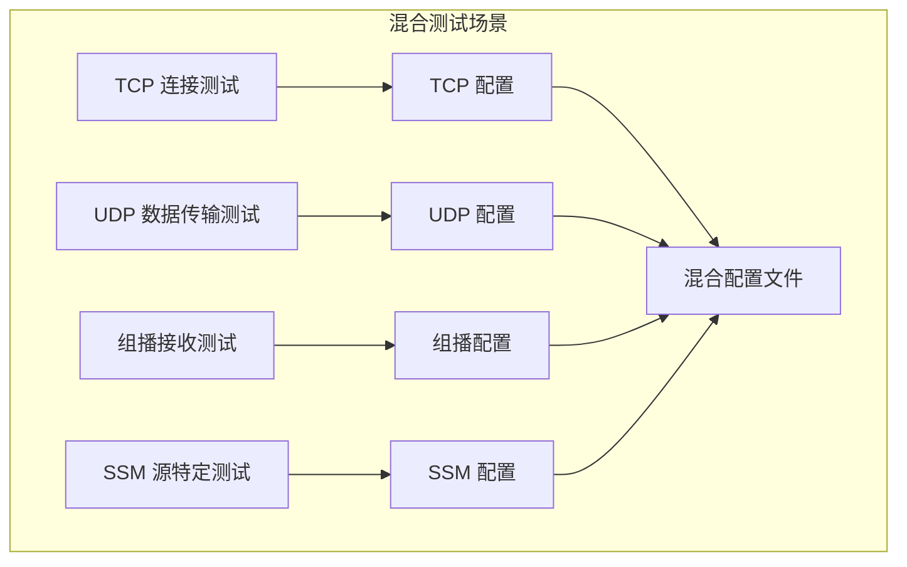

**更新** 新增了完整的多协议混合测试场景，展示如何在一个YAML配置文件中定义多个不同协议的测试任务。

**图表来源**
- [cmd/config_cmd.go:22-85](file://cmd/config_cmd.go#L22-L85)

### 高级网络测试配置

对于高级用户，可以配置更复杂的测试场景：

#### 负载测试配置
- 设置大量并发连接
- 调整发送间隔以模拟真实负载
- 监控网络性能指标

#### 容错测试配置
- 配置多个备用目标
- 设置重试机制
- 监控网络故障恢复

#### 安全测试配置
- 配置 SSL/TLS 加密
- 设置认证机制
- 监控安全事件

### 实际部署案例

#### 生产环境监控
```yaml
tests:
  - name: "production-monitoring"
    proto: tcp
    mode: recv
    port: 8080
    bind: 0.0.0.0
    timeout: 5s
    count: 0
```

#### 开发环境测试
```yaml
tests:
  - name: "development-testing"
    proto: udp
    mode: send
    target: localhost
    port: 9000
    count: 100
    interval: 500ms
    size: 128
```

**更新** 新增了完整的实际部署案例，展示如何在生产环境和开发环境中使用YAML配置文件进行网络测试。

**章节来源**
- [cmd/config_cmd.go:22-85](file://cmd/config_cmd.go#L22-L85)

## 性能考虑

### 配置对性能的影响

不同的配置选项对系统性能有显著影响：

#### 发送频率控制
- **高频率**: 提高测试精度但增加网络负载
- **低频率**: 减少网络负载但降低测试精度
- **建议**: 根据网络环境和测试需求平衡频率设置

#### 数据包大小优化
- **小数据包**: 适合快速连通性测试
- **大数据包**: 更接近实际应用负载
- **建议**: 根据测试目的选择合适的数据包大小

#### 并发连接管理
- **单连接**: 简单可靠但测试有限
- **多连接**: 更全面但需要更多资源
- **建议**: 在资源允许范围内最大化并发连接数

### 资源使用优化

#### 内存使用
- 合理设置缓冲区大小
- 及时释放不再使用的资源
- 监控内存使用情况

#### CPU 使用
- 避免不必要的计算开销
- 使用高效的算法和数据结构
- 考虑异步处理提高效率

**更新** 配置系统现在支持批量处理多个测试任务，需要合理管理内存和CPU资源的使用。

## 故障排除指南

### 常见问题诊断

#### 配置文件问题
**症状**: 应用启动失败或配置不生效
**诊断步骤**:
1. 检查 YAML 语法是否正确
2. 验证配置字段是否符合要求
3. 确认文件编码格式

**解决方案**:
- 使用 YAML 验证工具检查语法
- 参考示例配置文件进行对比
- 逐步注释掉可疑配置项定位问题

#### 配置验证错误
**症状**: 配置验证失败或测试无法启动
**诊断方法**:
1. 检查每个测试的协议类型和必需字段
2. 验证端口范围和时间格式
3. 确认网络接口配置正确

**修复措施**:
- 修正协议类型为支持的值
- 补充缺失的必需字段
- 调整端口和时间参数

#### 网络连接问题
**症状**: 无法建立网络连接或连接不稳定
**诊断方法**:
1. 使用基本网络工具测试连通性
2. 检查防火墙和安全策略
3. 验证网络接口配置

**修复措施**:
- 配置正确的网络接口
- 调整防火墙规则
- 检查网络设备状态

### 调试工具和技巧

#### 日志分析
启用详细日志输出可以帮助诊断问题：
```bash
ping-x --verbose send -c config.yaml
```

#### 网络抓包分析
使用网络抓包工具分析实际的网络流量：
- Wireshark: 图形化网络分析工具
- tcpdump: 命令行网络抓包工具
- ngrep: 网络 grep 工具

#### 性能监控
监控系统性能指标：
- CPU 使用率
- 内存使用量
- 网络带宽使用
- 磁盘 I/O

**更新** 配置系统现在支持批量处理多个测试任务，需要使用更详细的日志和监控工具来跟踪每个任务的执行状态。

**章节来源**
- [cmd/root.go:35-42](file://cmd/root.go#L35-L42)

## 结论

Ping-X 的配置系统提供了灵活而强大的网络测试能力。通过理解配置文件的结构、语法规则和验证机制，用户可以有效地配置各种网络协议的测试场景。

### 关键要点总结

1. **配置文件结构**: 采用 YAML 格式，支持层次化配置和多测试定义
2. **协议支持**: 完整支持 TCP、UDP、组播和 SSM 协议
3. **验证机制**: 强大的配置验证确保测试的正确性
4. **灵活性**: 支持多种配置方式和优先级规则
5. **可扩展性**: 模块化的架构便于功能扩展

### 最佳实践建议

- 从简单的配置开始，逐步增加复杂度
- 使用示例配置文件作为起点
- 定期验证配置的有效性
- 建立配置变更的文档记录
- 在生产环境中谨慎使用高负载配置

**更新** 配置系统现已完全支持YAML格式配置文件，允许在一个文件中定义多个测试任务，提供更灵活的配置管理方式。通过遵循这些指导原则，用户可以充分利用 Ping-X 的配置功能，实现高效可靠的网络测试和监控。

通过遵循这些指导原则，用户可以充分利用 Ping-X 的配置功能，实现高效可靠的网络测试和监控。