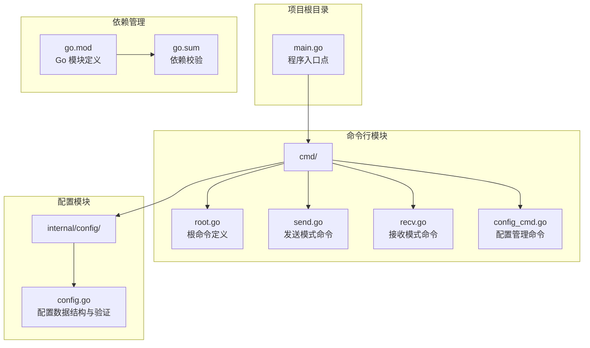
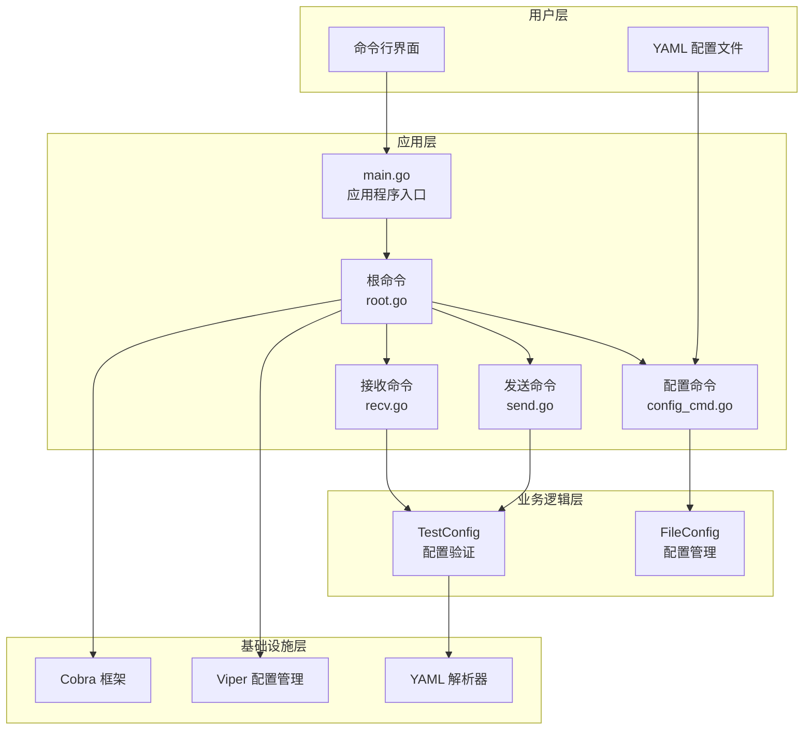
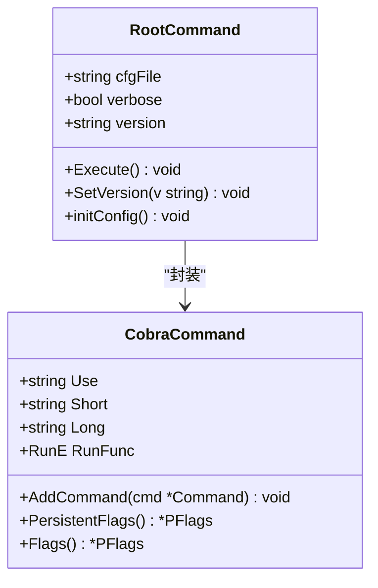
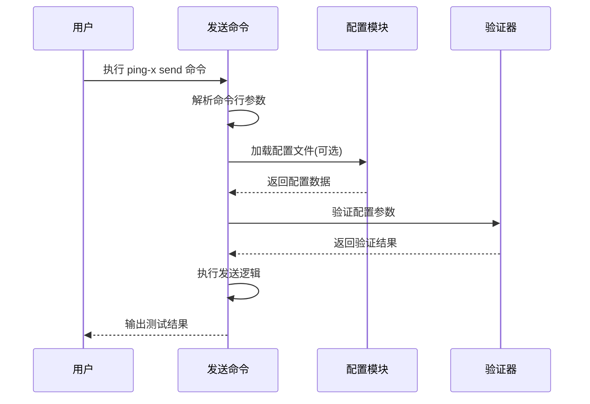
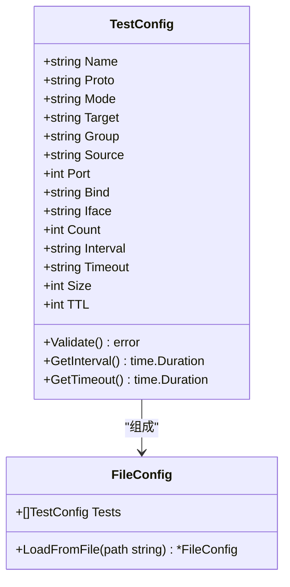
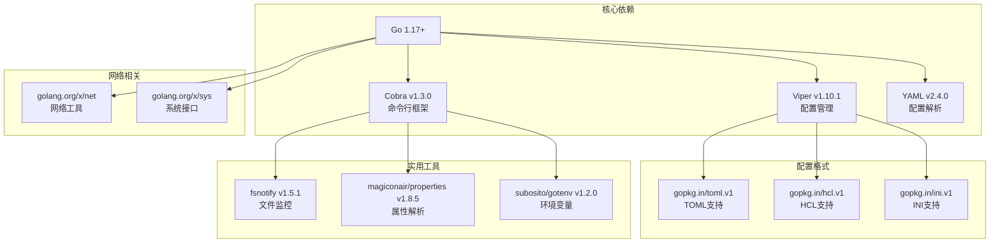
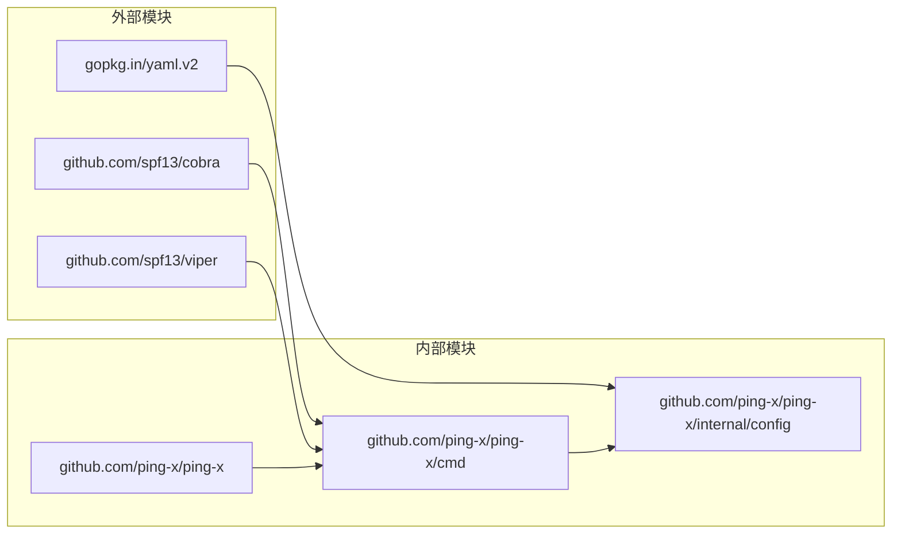

# 项目概述

<cite>
**本文档引用的文件**
- [main.go](file://main.go)
- [cmd/root.go](file://cmd/root.go)
- [cmd/send.go](file://cmd/send.go)
- [cmd/recv.go](file://cmd/recv.go)
- [cmd/config_cmd.go](file://cmd/config_cmd.go)
- [internal/config/config.go](file://internal/config/config.go)
- [go.mod](file://go.mod)
</cite>

## 目录
1. [引言](#引言)
2. [项目结构](#项目结构)
3. [核心组件](#核心组件)
4. [架构总览](#架构总览)
5. [详细组件分析](#详细组件分析)
6. [依赖关系分析](#依赖关系分析)
7. [性能考虑](#性能考虑)
8. [故障排除指南](#故障排除指南)
9. [结论](#结论)

## 引言

Ping-X 是一个基于 Go 语言开发的跨平台命令行网络协议联通检测工具。该项目旨在为网络工程师和系统管理员提供一个统一的解决方案，用于测试和验证各种网络协议的连通性状态。

### 项目核心价值

- **多协议支持**：同时支持 TCP、UDP、组播（Multicast）和 SSM（Source-Specific Multicast）协议的连通性测试
- **跨平台兼容**：基于 Go 语言开发，可在 Windows、Linux、macOS 等多个操作系统上运行
- **配置驱动**：采用 YAML 配置文件驱动的方式，支持批量测试任务的管理和执行
- **命令行友好**：提供简洁直观的命令行界面，便于自动化脚本集成

### 主要功能特性

- **协议测试能力**：
  - TCP 连接测试：验证 TCP 服务的可达性和响应时间
  - UDP 数据包测试：检测 UDP 服务的连通性和丢包率
  - 组播测试：支持 IGMP 协议的组播组加入和数据传输测试
  - SSM 测试：支持精确源地址的组播通信测试

- **双模式操作**：
  - Sender 模式：主动向目标发送探测包
  - Receiver 模式：被动监听并响应探测包

- **灵活的配置管理**：
  - 支持命令行参数直接配置
  - 支持 YAML 配置文件批量管理
  - 内置配置模板生成功能

## 项目结构

Ping-X 项目采用模块化的目录结构设计，主要包含以下核心目录：

**图表来源**
- [main.go:1-11](file://main.go#L1-L11)
- [cmd/root.go:1-54](file://cmd/root.go#L1-L54)
- [internal/config/config.go:1-125](file://internal/config/config.go#L1-L125)

**章节来源**
- [main.go:1-11](file://main.go#L1-L11)
- [cmd/root.go:1-54](file://cmd/root.go#L1-L54)
- [internal/config/config.go:1-125](file://internal/config/config.go#L1-L125)

## 核心组件

### 应用程序入口点

主程序入口位于 `main.go` 文件中，负责初始化应用程序并启动命令行界面：

- **版本管理**：通过全局变量管理应用程序版本信息
- **命令执行**：调用命令模块的执行函数启动 CLI 界面
- **生命周期管理**：作为整个应用程序的启动器和协调者

### 根命令定义

`cmd/root.go` 文件定义了应用程序的根命令，这是所有子命令的基础：

- **应用描述**：提供简短和详细的项目描述
- **全局标志**：定义配置文件路径和详细输出模式等全局选项
- **配置初始化**：集成 Viper 框架进行配置管理
- **版本控制**：支持动态设置应用程序版本

### 配置管理系统

`internal/config/config.go` 文件实现了完整的配置管理功能：

- **数据结构定义**：定义了 `TestConfig` 和 `FileConfig` 结构体
- **配置验证**：实现严格的配置参数验证逻辑
- **文件解析**：支持 YAML 格式的配置文件解析
- **默认值处理**：提供合理的默认值和格式化方法

**章节来源**
- [main.go:1-11](file://main.go#L1-L11)
- [cmd/root.go:14-54](file://cmd/root.go#L14-L54)
- [internal/config/config.go:11-125](file://internal/config/config.go#L11-L125)

## 架构总览

Ping-X 采用了经典的 CLI + 配置驱动架构模式，结合现代 Go 语言的最佳实践：

**图表来源**
- [main.go:7-10](file://main.go#L7-L10)
- [cmd/root.go:15-42](file://cmd/root.go#L15-L42)
- [cmd/send.go:11-32](file://cmd/send.go#L11-L32)
- [cmd/recv.go:11-27](file://cmd/recv.go#L11-L27)
- [cmd/config_cmd.go:10-20](file://cmd/config_cmd.go#L10-L20)
- [internal/config/config.go:11-47](file://internal/config/config.go#L11-L47)

### 架构设计原则

- **分层架构**：清晰的层次分离，便于维护和扩展
- **模块化设计**：每个功能模块职责单一，耦合度低
- **配置驱动**：通过外部配置文件实现行为控制
- **框架集成**：合理利用成熟的第三方框架提升开发效率

## 详细组件分析

### 命令行接口组件

#### 根命令模块 (root.go)

根命令模块是整个 CLI 系统的核心，负责：

- **命令树构建**：定义应用程序的整体命令结构
- **全局配置**：管理全局标志和配置项
- **初始化流程**：协调各子系统的初始化过程

**图表来源**
- [cmd/root.go:8-25](file://cmd/root.go#L8-L25)
- [cmd/root.go:15-25](file://cmd/root.go#L15-L25)

#### 发送模式命令 (send.go)

发送模式命令负责实现主动探测功能：

- **参数验证**：确保发送模式所需的必要参数完整
- **配置构建**：从命令行参数或配置文件构建测试配置
- **模式切换**：支持从命令行参数直接运行或从配置文件批量执行

**图表来源**
- [cmd/send.go:34-91](file://cmd/send.go#L34-L91)
- [internal/config/config.go:49-100](file://internal/config/config.go#L49-L100)

#### 接收模式命令 (recv.go)

接收模式命令负责实现被动监听功能：

- **监听配置**：设置监听地址、端口和多播组
- **模式适配**：支持不同协议的接收模式配置
- **接口绑定**：支持指定网络接口进行多播监听

**章节来源**
- [cmd/root.go:14-54](file://cmd/root.go#L14-L54)
- [cmd/send.go:11-92](file://cmd/send.go#L11-L92)
- [cmd/recv.go:11-73](file://cmd/recv.go#L11-L73)

### 配置管理组件

#### 配置数据结构

配置管理模块提供了完整的数据结构定义：

**图表来源**
- [internal/config/config.go:11-32](file://internal/config/config.go#L11-L32)
- [internal/config/config.go:34-47](file://internal/config/config.go#L34-L47)

#### 配置验证逻辑

配置验证模块实现了严格的参数验证机制：

- **协议验证**：确保协议类型在允许范围内
- **模式验证**：验证操作模式的有效性
- **端口验证**：检查端口号的合法性
- **条件验证**：根据不同模式验证必需参数

**章节来源**
- [internal/config/config.go:11-125](file://internal/config/config.go#L11-L125)

### 配置生成组件

配置生成命令提供了便捷的配置模板生成功能：

- **示例配置**：内置丰富的示例配置，覆盖所有协议类型
- **灵活输出**：支持输出到标准输出或指定文件
- **快速入门**：帮助用户快速了解配置格式和参数含义

**章节来源**
- [cmd/config_cmd.go:10-101](file://cmd/config_cmd.go#L10-L101)

## 依赖关系分析

### 外部依赖框架

Ping-X 项目集成了多个成熟的 Go 语言框架：

**图表来源**
- [go.mod:3-24](file://go.mod#L3-L24)

### 模块间依赖关系

项目内部模块之间的依赖关系相对简单，体现了良好的模块化设计：

**图表来源**
- [go.mod:5-24](file://go.mod#L5-L24)
- [main.go:3](file://main.go#L3)

**章节来源**
- [go.mod:1-25](file://go.mod#L1-L25)

## 性能考虑

### 架构性能特点

- **内存效率**：采用按需加载的配置策略，避免不必要的内存占用
- **并发处理**：支持多任务并行执行，提高测试效率
- **资源管理**：合理管理网络连接和系统资源

### 优化建议

- **连接池**：对于频繁的网络测试，可以考虑实现连接复用
- **异步处理**：对于大量并发测试，可以采用异步处理模式
- **缓存机制**：对重复的配置验证结果进行缓存

## 故障排除指南

### 常见问题诊断

#### 配置文件相关问题

- **配置文件格式错误**：检查 YAML 格式是否正确
- **参数缺失**：确保必需参数在配置文件中完整
- **权限问题**：确认配置文件的读取权限

#### 网络连接问题

- **端口冲突**：检查目标端口是否被占用
- **防火墙阻拦**：确认防火墙规则允许相应协议通信
- **网络接口**：验证指定的网络接口是否存在且可用

#### 权限相关问题

- **管理员权限**：某些网络操作可能需要管理员权限
- **多播权限**：多播测试可能需要特殊的系统权限

**章节来源**
- [cmd/root.go:44-53](file://cmd/root.go#L44-L53)
- [internal/config/config.go:49-100](file://internal/config/config.go#L49-L100)

## 结论

Ping-X 项目展现了现代 Go 语言应用开发的最佳实践。通过采用 CLI + 配置驱动的架构模式，结合成熟的第三方框架，项目实现了功能完整、易于使用的网络协议测试工具。

### 技术优势

- **架构清晰**：分层设计使得代码结构清晰，易于维护
- **功能完整**：支持多种网络协议的测试需求
- **配置灵活**：既支持命令行直接操作，也支持配置文件批量管理
- **扩展性强**：模块化设计为后续功能扩展奠定了良好基础

### 发展方向

随着项目的演进，可以在以下方面进一步完善：
- 实现具体的协议测试功能
- 增加更丰富的统计和报告功能
- 提供更多的配置选项和自定义能力
- 增强错误处理和日志记录功能

该项目为网络工程师提供了一个强大而灵活的工具，能够有效简化网络连通性测试工作，提高网络运维效率。