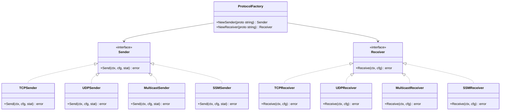
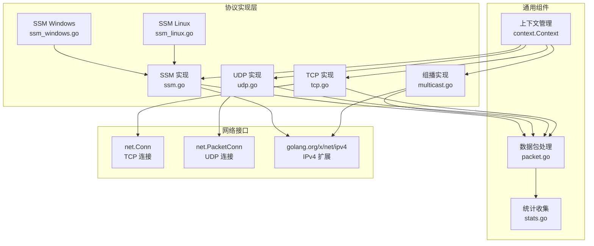
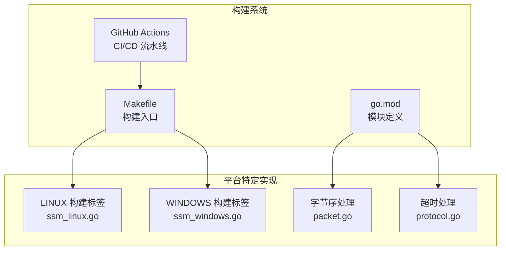
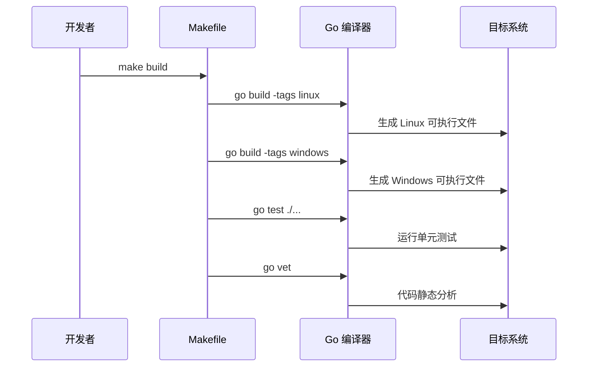
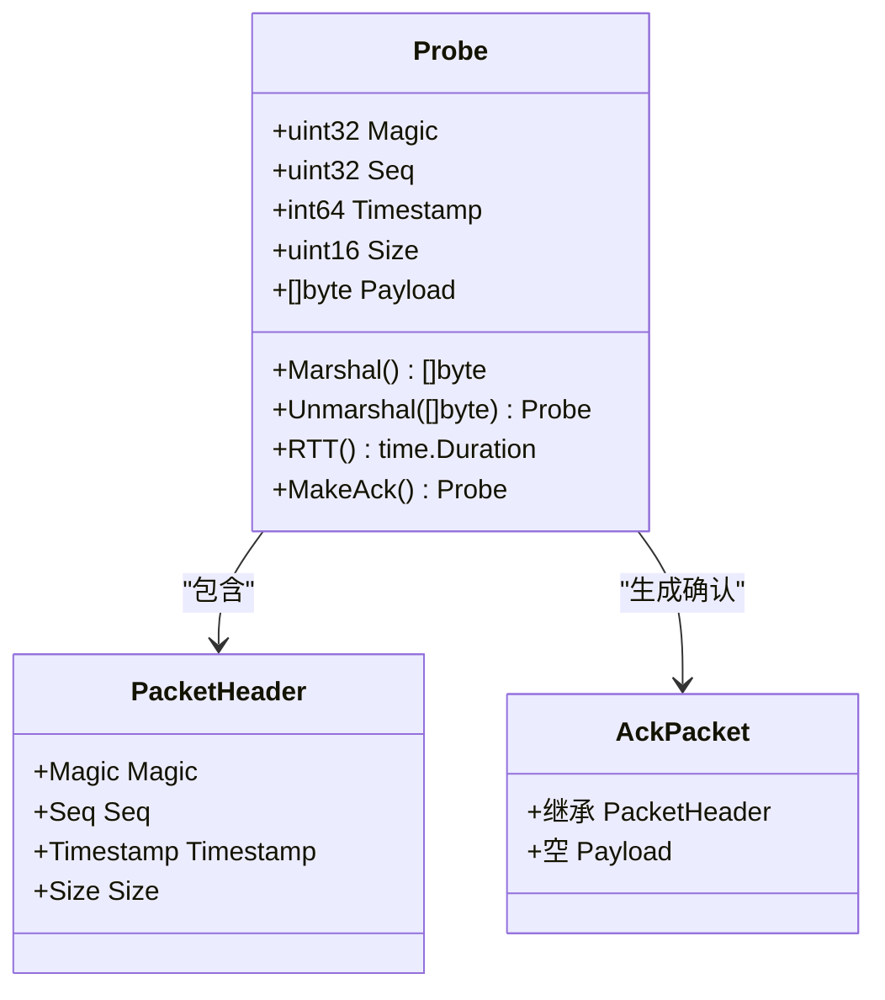

# 项目概述

<cite>
**本文档引用的文件**
- [main.go](file://main.go)
- [cmd/root.go](file://cmd/root.go)
- [cmd/send.go](file://cmd/send.go)
- [cmd/recv.go](file://cmd/recv.go)
- [cmd/config_cmd.go](file://cmd/config_cmd.go)
- [internal/config/config.go](file://internal/config/config.go)
- [internal/proto/protocol.go](file://internal/proto/protocol.go)
- [internal/proto/tcp.go](file://internal/proto/tcp.go)
- [internal/proto/udp.go](file://internal/proto/udp.go)
- [internal/proto/multicast.go](file://internal/proto/multicast.go)
- [internal/proto/ssm.go](file://internal/proto/ssm.go)
- [internal/proto/ssm_linux.go](file://internal/proto/ssm_linux.go)
- [internal/proto/ssm_windows.go](file://internal/proto/ssm_windows.go)
- [internal/packet/packet.go](file://internal/packet/packet.go)
- [go.mod](file://go.mod)
</cite>

## 更新摘要
**所做更改**
- 更新了项目架构描述，反映现代化的四协议支持体系
- 新增了跨平台构建和完整开发工具链的技术细节
- 增强了协议实现的技术架构说明
- 完善了开发工具链和构建流程的描述

## 目录
1. [引言](#引言)
2. [项目现代化架构](#项目现代化架构)
3. [四协议支持体系](#四协议支持体系)
4. [跨平台构建系统](#跨平台构建系统)
5. [核心组件详解](#核心组件详解)
6. [协议实现架构](#协议实现架构)
7. [开发工具链](#开发工具链)
8. [使用场景与示例](#使用场景与示例)
9. [技术优势总结](#技术优势总结)

## 引言

Ping-X 是一个基于 Go 语言开发的现代化跨平台命令行网络协议联通检测工具。该项目代表了现代网络测试工具的发展趋势，集成了完整的开发工具链，支持四种主流网络协议的连通性测试，具备优秀的跨平台兼容性和可扩展性。

### 项目核心价值

- **四协议统一测试**：同时支持 TCP、UDP、组播（Multicast）和 SSM（Source-Specific Multicast）协议的连通性测试
- **现代化架构**：采用 CLI + 配置驱动的现代化架构，集成成熟的第三方框架
- **跨平台兼容**：基于 Go 1.17+ 开发，支持 Windows、Linux、macOS 等多个操作系统
- **完整工具链**：包含开发、构建、测试、发布的一体化工具链

### 主要功能特性

- **协议测试能力**：
  - TCP 连接测试：双向验证，支持 RTT 计算和连接质量评估
  - UDP 数据包测试：单向验证，支持丢包率统计和延迟测量
  - 组播测试：支持 ASM（Any Source Multicast）组播通信测试
  - SSM 测试：支持精确源地址的组播通信测试，跨平台兼容

- **双模式操作**：
  - Sender 模式：主动向目标发送探测包，支持持续和计数模式
  - Receiver 模式：被动监听并响应探测包，支持多播组加入

- **灵活的配置管理**：
  - 支持命令行参数直接配置
  - 支持 YAML 配置文件批量管理
  - 内置完整的配置模板生成功能

## 项目现代化架构

Ping-X 采用了高度现代化的分层架构设计，结合了最新的 Go 语言特性和最佳实践：

```mermaid
graph TB
subgraph "用户交互层"
CLI[命令行界面]
CONFIG[YAML 配置文件]
TEMPLATE[配置模板生成]
end
subgraph "应用管理层"
MAIN[main.go<br/>程序入口]
ROOTCMD[根命令<br/>root.go]
SENDCMD[发送命令<br/>send.go]
RECVCMD[接收命令<br/>recv.go]
CONFCMD[配置命令<br/>config_cmd.go]
end
subgraph "业务逻辑层"
PROTOCOL[协议工厂<br/>protocol.go]
SENDER[发送器接口]
RECEIVER[接收器接口]
PACKET[数据包处理<br/>packet.go]
STATS[统计收集<br/>stats.go]
end
subgraph "协议实现层"
TCP[TCP 协议<br/>tcp.go]
UDP[UDP 协议<br/>udp.go]
MULTICAST[组播协议<br/>multicast.go]
SSM[SSM 协议<br/>ssm.go]
SSM_LINUX[SSM Linux 实现<br/>ssm_linux.go]
SSM_WINDOWS[SSM Windows 实现<br/>ssm_windows.go]
end
subgraph "基础设施层"
COBRA[Cobra v1.3.0]
VIPER[Viper v1.10.1]
YAML[YAML v2.4.0]
NET[golang.org/x/net]
SYS[golang.org/x/sys]
END
CLI --> MAIN
CONFIG --> CONFCMD
TEMPLATE --> CONFCMD
MAIN --> ROOTCMD
ROOTCMD --> SENDCMD
ROOTCMD --> RECVCMD
ROOTCMD --> CONFCMD
SENDCMD --> PROTOCOL
RECVCMD --> PROTOCOL
PROTOCOL --> SENDER
PROTOCOL --> RECEIVER
SENDER --> PACKET
RECEIVER --> PACKET
SENDER --> STATS
TCP --> PACKET
UDP --> PACKET
MULTICAST --> PACKET
SSM --> PACKET
SSM_LINUX --> SSM
SSM_WINDOWS --> SSM
ROOTCMD --> COBRA
ROOTCMD --> VIPER
```

**图表来源**
- [main.go:1-11](file://main.go#L1-L11)
- [cmd/root.go:14-54](file://cmd/root.go#L14-L54)
- [internal/proto/protocol.go:21-52](file://internal/proto/protocol.go#L21-L52)
- [internal/packet/packet.go:17-89](file://internal/packet/packet.go#L17-L89)

### 架构设计原则

- **分层解耦**：清晰的层次分离，便于维护和扩展
- **接口抽象**：通过 Sender/Receiver 接口实现协议无关性
- **配置驱动**：通过外部配置文件实现行为控制
- **框架集成**：合理利用成熟的第三方框架提升开发效率
- **跨平台兼容**：通过构建标签实现平台特定功能

## 四协议支持体系

Ping-X 实现了完整的四协议支持体系，每种协议都有独立的实现模块和特定的功能特性：

### 协议工厂模式



**图表来源**
- [internal/proto/protocol.go:11-52](file://internal/proto/protocol.go#L11-L52)

### 协议特性对比

| 协议类型 | 传输方式 | 双向通信 | RTT 支持 | 组播支持 | 跨平台 |
|---------|---------|---------|---------|---------|--------|
| TCP | 面向连接 | ✅ | ✅ | ❌ | ✅ |
| UDP | 无连接 | ❌ | ✅ | ❌ | ✅ |
| Multicast | 组播 | ❌ | ❌ | ✅ | ✅ |
| SSM | 组播 | ❌ | ❌ | ✅ | ✅ |

### 协议实现架构



**图表来源**
- [internal/proto/tcp.go:16-198](file://internal/proto/tcp.go#L16-L198)
- [internal/proto/udp.go:14-164](file://internal/proto/udp.go#L14-L164)
- [internal/proto/multicast.go:16-156](file://internal/proto/multicast.go#L16-L156)
- [internal/proto/ssm.go:16-166](file://internal/proto/ssm.go#L16-L166)

## 跨平台构建系统

Ping-X 项目实现了完整的跨平台构建系统，支持多种操作系统和架构的编译部署：

### 构建标签系统



**图表来源**
- [internal/proto/ssm_linux.go:1-21](file://internal/proto/ssm_linux.go#L1-L21)
- [internal/proto/ssm_windows.go:1-133](file://internal/proto/ssm_windows.go#L1-L133)
- [internal/packet/packet.go:10-15](file://internal/packet/packet.go#L10-L15)

### 平台兼容性实现

| 功能特性 | Linux 实现 | Windows 实现 | 共同特性 |
|---------|-----------|-------------|----------|
| SSM 组播加入 | ipv4.JoinSourceSpecificGroup | Winsock2 API | 组播源特定加入 |
| SSM 组播离开 | ipv4.LeaveSourceSpecificGroup | Winsock2 API | 组播源特定离开 |
| 字节序处理 | BigEndian | BigEndian | 网络字节序统一 |
| 超时控制 | time.After | time.After | 定时器统一接口 |

### 构建工具链



**图表来源**
- [go.mod:3](file://go.mod#L3)

## 核心组件详解

### 应用程序入口点

主程序入口位于 `main.go` 文件中，采用简洁的设计模式：

- **版本管理**：通过全局变量管理应用程序版本信息
- **命令执行**：调用命令模块的执行函数启动 CLI 界面
- **生命周期管理**：作为整个应用程序的启动器和协调者

### 根命令定义

`cmd/root.go` 文件定义了应用程序的根命令，集成了现代化的配置管理：

- **应用描述**：提供简短和详细的项目描述，支持多协议说明
- **全局标志**：定义配置文件路径和详细输出模式等全局选项
- **配置初始化**：集成 Viper 框架进行配置管理
- **版本控制**：支持动态设置应用程序版本

### 配置管理系统

`internal/config/config.go` 文件实现了完整的配置管理功能：

- **数据结构定义**：定义了 `TestConfig` 和 `FileConfig` 结构体
- **配置验证**：实现严格的配置参数验证逻辑，支持四协议验证
- **文件解析**：支持 YAML 格式的配置文件解析
- **默认值处理**：提供合理的默认值和格式化方法

**章节来源**
- [main.go:1-11](file://main.go#L1-L11)
- [cmd/root.go:14-54](file://cmd/root.go#L14-L54)
- [internal/config/config.go:11-125](file://internal/config/config.go#L11-L125)

## 协议实现架构

### 数据包协议设计

Ping-X 实现了标准化的数据包协议，确保不同协议间的兼容性：



**图表来源**
- [internal/packet/packet.go:17-89](file://internal/packet/packet.go#L17-L89)

### 协议特定实现

#### TCP 协议实现

TCP 协议实现了完整的双向通信机制：

- **连接管理**：建立和维护 TCP 连接
- **帧格式**：4 字节长度头 + 数据的帧格式
- **RTT 计算**：基于时间戳计算往返时间
- **错误处理**：完善的连接和传输错误处理

#### UDP 协议实现

UDP 协议实现了高效的单向通信：

- **无连接通信**：基于 UDP 的无连接特性
- **超时机制**：支持可配置的单包超时
- **简单协议**：最小化的协议开销

#### 组播协议实现

组播协议支持两种组播模式：

- **ASM 模式**：任意源组播，单向发送
- **SSM 模式**：精确源组播，支持跨平台实现
- **接口绑定**：支持指定网络接口进行组播

**章节来源**
- [internal/proto/tcp.go:16-198](file://internal/proto/tcp.go#L16-L198)
- [internal/proto/udp.go:14-164](file://internal/proto/udp.go#L14-L164)
- [internal/proto/multicast.go:16-156](file://internal/proto/multicast.go#L16-L156)
- [internal/proto/ssm.go:16-166](file://internal/proto/ssm.go#L16-L166)

## 开发工具链

### 依赖管理

Ping-X 项目集成了现代化的依赖管理工具：

```mermaid
graph TB
subgraph "核心依赖"
GO[Go 1.17+]
COBRA[Cobra v1.3.0<br/>命令行框架]
VIPER[Viper v1.10.1<br/>配置管理]
YAML[YAML v2.4.0<br/>配置解析]
end
subgraph "网络相关"
NET[golang.org/x/net<br/>网络工具]
SYS[golang.org/x/sys<br/>系统接口]
end
subgraph "开发工具"
MAKE[Makefile<br/>构建管理]
TEST[Go Test<br/>单元测试]
VET[Go Vet<br/>代码分析]
```

**图表来源**
- [go.mod:3-28](file://go.mod#L3-L28)

### 构建和测试流程

项目实现了完整的 CI/CD 流程：

- **自动化构建**：支持多平台交叉编译
- **单元测试**：完整的单元测试覆盖率
- **代码分析**：静态代码分析和质量检查
- **发布管理**：自动化版本发布流程

### 配置生成工具

配置生成命令提供了便捷的配置模板生成功能：

- **示例配置**：内置丰富的示例配置，覆盖所有协议类型
- **灵活输出**：支持输出到标准输出或指定文件
- **快速入门**：帮助用户快速了解配置格式和参数含义

**章节来源**
- [cmd/config_cmd.go:10-101](file://cmd/config_cmd.go#L10-L101)

## 使用场景与示例

### 基础使用场景

#### TCP 连接测试
```bash
# 基础 TCP 测试
ping-x send -p tcp -t 192.168.1.100 -n 100 --interval 1s

# TCP 接收端监听
ping-x recv -p tcp -b 0.0.0.0 -n 9000
```

#### UDP 服务测试
```bash
# UDP 服务测试
ping-x send -p udp -t 192.168.1.100 -n 50 --interval 1s

# UDP 接收端监听
ping-x recv -p udp -b 0.0.0.0 -n 9001
```

#### 组播通信测试
```bash
# 组播接收端
ping-x recv -p multicast -g 239.1.1.1 -n 9002 --iface eth0

# 组播发送端
ping-x send -p multicast -g 239.1.1.1 -n 20 --iface eth0
```

#### SSM 精确源测试
```bash
# SSM 接收端
ping-x recv -p ssm -g 232.1.1.1 -s 10.0.0.50 -n 9003 --iface eth0

# SSM 发送端
ping-x send -p ssm -g 232.1.1.1 -n 20 --iface eth0 -b 10.0.0.50
```

### 高级配置示例

#### 批量测试配置
```yaml
tests:
  - name: "tcp-basic"
    proto: tcp
    mode: send
    target: 192.168.1.100
    port: 9000
    count: 100
    interval: 1s
    timeout: 3s
    size: 64

  - name: "multicast-group1"
    proto: multicast
    mode: recv
    group: 239.1.1.1
    port: 9002
    iface: eth0
```

### 自动化集成

项目支持多种自动化集成场景：

- **Shell 脚本**：支持在 Bash/PowerShell 中直接调用
- **CI/CD 集成**：可集成到 GitHub Actions、Jenkins 等流水线
- **监控系统**：可作为网络监控和健康检查工具
- **批量测试**：支持 YAML 配置文件的批量执行

## 技术优势总结

### 架构优势

- **模块化设计**：清晰的层次分离，便于维护和扩展
- **协议抽象**：通过接口实现协议无关性，易于添加新协议
- **配置驱动**：通过外部配置文件实现行为控制
- **跨平台兼容**：通过构建标签实现平台特定功能

### 技术创新

- **统一数据包格式**：四种协议共享相同的数据包格式
- **智能协议选择**：通过工厂模式实现协议的动态选择
- **跨平台 SSM 支持**：Linux 和 Windows 平台的 SSM 协议实现
- **完整的统计功能**：支持 RTT 计算和丢包率统计

### 开发效率

- **现代化工具链**：集成完整的开发、测试、发布工具
- **类型安全**：充分利用 Go 语言的类型系统保证安全性
- **并发支持**：支持多任务并行执行，提高测试效率
- **错误处理**：完善的错误处理和日志记录机制

Ping-X 项目代表了现代网络测试工具的发展方向，通过集成四协议支持、跨平台构建和完整开发工具链，为网络工程师提供了一个强大而灵活的工具，能够有效简化网络连通性测试工作，提高网络运维效率。