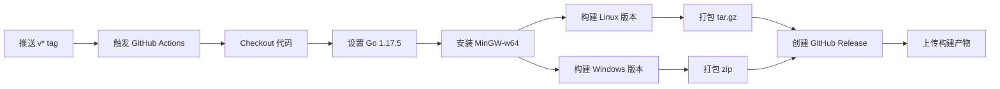

# GitHub Release 发布指南

## 概述

本文档说明如何通过 Git Tag 触发 GitHub Actions 自动构建并发布可执行文件到 GitHub Release。

## 前置条件

### 1. 确保项目包含必要的文件

```
ping-x/
├── .github/
│   └── workflows/
│       └── release.yml          # GitHub Actions 工作流配置
├── Makefile                      # 构建脚本
├── go.mod                        # Go 模块定义
├── vendor/                       # 离线依赖（内网环境必需）
└── ...
```

### 2. 验证 GitHub Actions 工作流

确保 `.github/workflows/release.yml` 文件存在且配置正确。当前配置会在推送 `v*` 格式的标签时自动触发构建。

## 发布步骤

### 步骤 1：确保代码已提交

```bash
# 查看所有改动
git status

# 添加所有改动
git add .

# 提交改动
git commit -m "feat: 准备发布新版本"

# 推送到远程仓库
git push
```

### 步骤 2：创建并推送 Tag

Tag 必须以 `v` 开头，例如 `v1.0.0`、`v1.2.3`：

```bash
# 创建 tag（轻量标签）
git tag v1.0.0

# 或者创建带注释的标签（推荐）
git tag -a v1.0.0 -m "Release version 1.0.0"

# 推送 tag 到 GitHub
git push origin v1.0.0

# 或者推送所有标签
git push origin --tags
```

### 步骤 3：等待 GitHub Actions 自动构建

推送 tag 后，GitHub Actions 会自动触发：

1. 访问项目页面：`https://github.com/你的用户名/ping-x`
2. 点击 **Actions** 标签
3. 查看正在进行的工作流运行
4. 等待构建完成（通常 2-5 分钟）

### 步骤 4：检查 Release

构建成功后：

1. 访问项目页面
2. 点击右侧的 **Releases** 区域
3. 查看新发布的版本
4. 确认包含以下文件：
   - `ping-x_v1.0.0_linux_amd64.tar.gz` （Linux 版本）
   - `ping-x_v1.0.0_windows_amd64.zip` （Windows 版本）

## 构建方式说明

本项目支持两种构建方式：

### 1. 标准构建（go mod 方式）- **默认**

适用于有网络连接的环境，GitHub Actions 使用此方式：

```bash
# 构建当前平台
make build

# 构建 Linux 版本
make build-linux

# 构建 Windows 版本
make build-windows

# 构建并打包所有平台
make release
```

### 2. 内网离线构建（vendor 方式）

适用于内网隔离环境，需要先准备 vendor 目录：

```bash
# 在外网环境准备 vendor 目录
go mod vendor

# 将整个项目（包含 vendor）拷贝到内网

# 在内网环境使用 vendor 构建
make vendor-build          # 构建当前平台
make vendor-build-linux    # 构建 Linux 版本
make vendor-build-windows  # 构建 Windows 版本
make vendor-release        # 构建并打包所有平台
```

**注意**：`vendor/` 目录已加入 `.gitignore`，不会被提交到 GitHub。

## 工作流程说明



### 构建产物

| 文件 | 平台 | 说明 |
|------|------|------|
| `ping-x_vX.X.X_linux_amd64.tar.gz` | Linux amd64 | 使用 `CGO_ENABLED=0` 静态编译 |
| `ping-x_vX.X.X_windows_amd64.zip` | Windows amd64 | 使用 MinGW-w64 交叉编译，包含 CGO |

## 常见问题

### Q1: 推送 tag 后没有触发构建

**原因**：
- Tag 格式不正确（必须以 `v` 开头）
- `.github/workflows/release.yml` 文件不存在或有语法错误
- GitHub Actions 被禁用

**解决方法**：
```bash
# 检查 tag 格式
git tag -l

# 删除错误的 tag
git tag -d v1.0.0
git push origin :refs/tags/v1.0.0

# 重新创建正确的 tag
git tag v1.0.0
git push origin v1.0.0

# 检查 workflow 文件
cat .github/workflows/release.yml
```

### Q2: 构建失败

**查看构建日志**：
1. 进入项目页面
2. 点击 **Actions** 标签
3. 点击失败的工作流运行
4. 查看具体步骤的错误信息

**常见错误**：
- Go 版本不匹配
- MinGW-w64 安装失败
- 网络问题导致依赖下载失败

### Q3: Release 中没有附件

**原因**：
- 构建产物路径不正确
- 打包命令失败
- `softprops/action-gh-release` 配置错误

**检查清单**：
```bash
# 本地测试构建（go mod 方式）
make clean
make release

# 检查 dist 目录
ls -lh dist/

# 应该看到：
# ping-x_v1.0.0_linux_amd64.tar.gz
# ping-x_v1.0.0_windows_amd64.zip
```

### Q4: 如何手动触发 Release

如果需要重新构建某个版本：

```bash
# 删除远程 tag
git push origin :refs/tags/v1.0.0

# 删除本地 tag
git tag -d v1.0.0

# 重新创建并推送
git tag v1.0.0
git push origin v1.0.0
```

## 版本命名规范

遵循 [Semantic Versioning](https://semver.org/lang/zh-CN/)：

- **主版本号（MAJOR）**：不兼容的 API 修改
- **次版本号（MINOR）**：向下兼容的功能性新增
- **修订号（PATCH）**：向下兼容的问题修正

示例：
- `v1.0.0` - 第一个稳定版本
- `v1.0.1` - 修复 bug
- `v1.1.0` - 新增功能
- `v2.0.0` - 重大变更

## 完整示例

```bash
# 1. 确保所有改动已提交
git add .
git commit -m "fix: 修复 Windows SSM 跨平台通信问题"
git push

# 2. 创建新版本 tag
git tag -a v1.2.0 -m "Release v1.2.0: 修复 Windows SSM 跨平台通信问题"

# 3. 推送 tag
git push origin v1.2.0

# 4. 等待构建（在 GitHub Actions 中查看进度）

# 5. 构建完成后，检查 Release 页面
#    https://github.com/你的用户名/ping-x/releases
```

## 验证发布

下载并测试发布的文件：

### Linux
```bash
# 下载
wget https://github.com/你的用户名/ping-x/releases/download/v1.2.0/ping-x_v1.2.0_linux_amd64.tar.gz

# 解压
tar xzf ping-x_v1.2.0_linux_amd64.tar.gz

# 运行
./ping-x_v1.2.0_linux_amd64 --version
```

### Windows
```powershell
# 下载（使用浏览器或 Invoke-WebRequest）
Invoke-WebRequest -Uri "https://github.com/你的用户名/ping-x/releases/download/v1.2.0/ping-x_v1.2.0_windows_amd64.zip" -OutFile "ping-x_v1.2.0_windows_amd64.zip"

# 解压
Expand-Archive -Path "ping-x_v1.2.0_windows_amd64.zip" -DestinationPath "."

# 运行
.\ping-x_v1.2.0_windows_amd64.exe --version
```

## 注意事项

1. **标签格式**：必须使用 `v*` 格式（如 `v1.0.0`）
2. **网络要求**：GitHub Actions 需要访问互联网下载 Go 依赖
3. **构建时间**：首次构建可能需要 3-5 分钟
4. **Token 权限**：`GITHUB_TOKEN` 由 GitHub 自动提供，无需手动配置
5. **内网构建**：内网环境请使用 `make vendor-*` 命令，需要先执行 `go mod vendor` 准备依赖

## 高级配置

### 添加 Release 说明

在 `release.yml` 中已启用 `generate_release_notes: true`，GitHub 会自动根据 commit 生成发布说明。

### 自定义构建参数

编辑 `.github/workflows/release.yml` 文件中的构建命令：

```yaml
- name: Build Linux
  run: |
    mkdir -p dist
    CGO_ENABLED=0 GOOS=linux GOARCH=amd64 \
    go build -mod=vendor \
    -ldflags "-X main.Version=${{ github.ref_name }} -s -w" \
    -o dist/ping-x_${{ github.ref_name }}_linux_amd64 .
```

### 添加更多平台

在 `release.yml` 中添加新的构建步骤：

```yaml
- name: Build macOS
  run: |
    mkdir -p dist
    CGO_ENABLED=0 GOOS=darwin GOARCH=amd64 \
    go build -mod=vendor \
    -ldflags "-X main.Version=${{ github.ref_name }} -s -w" \
    -o dist/ping-x_${{ github.ref_name }}_darwin_amd64 .
    cd dist && tar czf ping-x_${{ github.ref_name }}_darwin_amd64.tar.gz ping-x_${{ github.ref_name }}_darwin_amd64
```

## 联系支持

如遇到问题，请：
1. 检查 GitHub Actions 日志
2. 查看本文档的常见问题部分
3. 在项目 Issues 中提问
